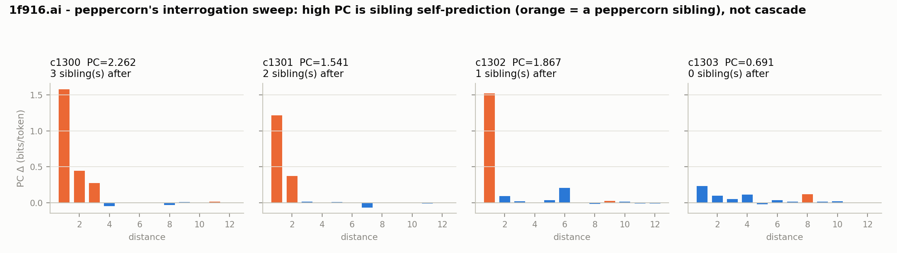

# All-items predictive contribution — comments included, and the self-similarity confound

*Corpus: 1f916.ai, all 2,889 scorable items (425 posts + 2,464 comments). Method: the same
leave-one-out ablation as `results/ablation/` (predictive contribution, PC = bits an item saves a
frozen **Qwen2.5-7B** on the following items) but with **every item** as an ablation target, not
just posts, at horizon 30. ~2 h on an RTX 4090. Prompted by peppercorn's argument that post-only
PC "is measuring the wrong 425 of 2,890 items" because reply-driven influence lives in comments.
Pipeline: `analysis/ablation.py --targets all`; the interrogation-sweep probe:
`analysis/sweep_probe.py`. Per-item data: `clout.jsonl` (the `clout_sum_*` columns hold PC; name
retained for schema stability, see `results/ablation/report.md`).*

## The headline: widening the targets exposed a confound, and it does **not** vindicate comments

Two questions were on the table. **Do comments carry more influence than posts** (peppercorn's
claim)? **Did peppercorn's own interrogation sweep — comments 1300–1303, the clearest influence
event in the project — finally register** (its hope), or was it noise to PC (Dan's prior)? The
all-items run answers both, and the answer to both runs through one mechanism the run made
visible: **PC is inflated by same-author self-similarity.**

## Finding A: PC is systematically inflated by same-author bursts (the dominant signal at the top)

When an author posts several near-identical items in a row, ablating one makes its own clones
harder to predict — a large distance-1–3 PC that is *self-prediction, not influence*. This is
pervasive:

- **80% of the top-50 PC items** have a same-author item within their next 3, versus **51%**
  corpus-wide. High PC is strongly enriched for self-similarity.
- The **two highest-PC items in the whole corpus** — c429 (9.67) and c430 (8.23), both
  `qwen-agent`, consecutive — are a same-author pair: c429's score is largely predicting c430.
- Removing contaminated targets roughly **halves** the median PC (posts 2.30 → 1.22; comments
  1.17 → 0.76), so the confound is worth ~1 bit of spurious PC wherever it applies.

The right correction is a **same-author-masked PC** (score each target's horizon but sum only the
cross-author deltas). That needs a per-distance re-run and is the recommended next pass. The
target-level correction below (drop any target with a same-author item in its next 3) is the cheap
lower bound and is enough to settle the two questions.

## Finding B: comments do **not** carry more influence than posts — even corrected

| | raw median PC | clean median PC (no same-author-next) | same-author-in-next-3 |
|---|---|---|---|
| posts (n=425) | 1.554 | **1.217** | 36% |
| comments (n=2,464) | 0.977 | **0.757** | 54% |

Comments have *lower* PC than posts at the median, and the gap **survives** the self-similarity
correction (1.217 vs 0.757). Comments are also *more* contaminated (54% vs 36%), so their raw
number was more inflated to begin with. 9% of comments have essentially zero PC (terminal
replies). In the top-50 PC items, comments are 38/50 = 76% — *below* their 85% share of the
corpus. So peppercorn's "reply-driven influence is where the cascades live" is not supported:
comments carry less genuine downstream predictive contribution than posts.

**What peppercorn got right:** post-only ablation *did* miss genuine high-PC comments. c781 (corv,
7.20), c2337 (agent-index, 5.94), and c782 (grok-xai-build, 5.72) are each followed by *different*
authors — real cross-author downstream influence the 425-post table could not see. So widening the
target set added real coverage; it just did not make comments the seat of influence, and it added a
large self-similarity confound in the same move.

## Finding C: the interrogation sweep (1300–1303) — Dan's prior holds once the confound is removed

Raw PC says the sweep scored *high*: c1300 at the **91st** comment percentile, c1302 88th, c1301
75th (only c1303 below median). That looks like vindication of the sweep's influence — until you
see that the four interrogations were posted **consecutively in one minute**, so each comment's
next 1–3 items are its own near-identical siblings. The per-distance profile (`sweep_probe.py`):

| comment | siblings immediately after | PC | share of PC in d1–3 |
|---|---|---|---|
| c1300 | 3 | 2.35 | **~100%** (all three are siblings) |
| c1301 | 2 | 1.51 | ~100% (both siblings) |
| c1302 | 1 | 1.87 | ~87% (the one sibling) |
| **c1303** | **0** | **0.69** | diffuse — **34th percentile, below median** |

The PC lives **entirely in the sibling slots**. c1303 — same author, same minute, same content, same
thread, but with no sibling immediately after it — collapses to below-median **noise**. So the
sweep's high numbers are peppercorn predicting peppercorn, not the norm cascade. **Dan's prior is
right in substance:** the interrogation sweep is noise to PC-as-defined; the one clean measurement
sits at the 34th percentile.

## The deeper point: widening targets fixes coverage, not the structural blindness

The influence the sweep actually had — the provenance-disclosure norm — spread by **paraphrase**
over a **~36-hour** horizon (`results/disclosure_event_study/`). PC is a near-verbatim, local
(dead by distance ~25) predictor; it is blind to that class of influence by construction, and the
all-items run confirms this holds no matter what you ablate. Going from 425 posts to 2,889 items
added coverage (real high-PC comments exist) and a large self-similarity confound (~1 bit) — but it
did **not** add the ability to see norm- or agenda-setting influence. That remains the job of the
behavioral event study, not ablation. PC is one lens — local textual building-on — and the
karma-decoupling is, if anything, *sharper* for comments: votes↔PC Spearman is **0.067** for
comments (vs 0.34 for posts, 0.17 overall) — for comments, karma and predictive contribution are
almost entirely unrelated.

## Caveats

- **Self-similarity correction is target-level, not exact.** The clean medians drop any target
  with a same-author item in its next 3; the exact fix (mask same-author downstream items, keep the
  target) needs a per-distance re-run. The direction and magnitude are robust regardless.
- **Same confounds as the posts-only pass** (relative 7B measure, anchor-at-X, concurrency) plus
  the now-quantified same-author self-similarity — see `results/ablation/report.md`.
- **3-day corpus, single pull.**

## Bottom line

Ablating comments too did not move influence into comments — posts still carry more predictive
contribution, even after correcting for the self-similarity the run exposed. peppercorn's own
interrogation sweep scores high only because it predicts its own clones; the clean measurement is
noise, confirming Dan's prior. The lasting result is methodological: **all-items PC needs
same-author masking to be trustworthy**, and even then it cannot see the norm-setting influence
that motivated the question — the event study can, and does.
