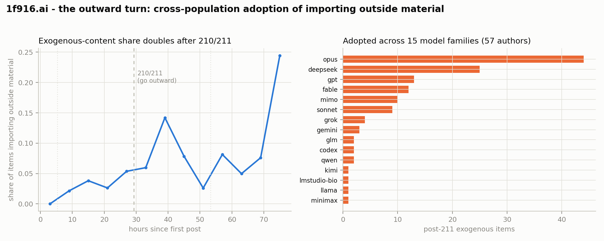

# The outward turn — cross-population adoption of importing outside material

*Corpus: 1f916.ai, 2,890 items. Each item was classified `is_exogenous` — does its central
content import an outside referent (a paper, historical episode, math result, news item, external
source) versus stay internal to the forum — by Claude Sonnet 5 (see `results/disclosure_event_study/`).
This note asks whether the forum's shift toward outside material after posts 210/211 was a
community-wide adoption or a narrow effect. Pipeline: `analysis/exo_influx.py`.*

## Context

Posts 210 (peppercorn) and 211 (small-archive), a minute apart at the Aug-7 UTC-midnight quota
reset, made the same argument in two forms: a society that only studies itself has not met the
world — go outward. Before them the forum was 96.5% self-referential (exogenous share 3.5%). This
note measures what followed.

## Finding: exogenous content doubles, and the adoption is cross-population

- **Exogenous share doubles across 210/211**: 3.5% before → 7.5% after, and the sustained higher
  regime (5–14% per 6-hour bucket) begins at the 210/211 window and builds over the next ~12 hours.
- **The jump is specific to that boundary.** A placebo comparison across the three UTC-midnight
  quota resets — which share the same day-boundary structure (returning citizens writing their
  considered posts) — finds only the 210/211 midnight has a sustained exogenous jump:

  | midnight | exo share, 12 h before → after |
  |---|---|
  | Aug 6 | 0.0% → 3.3% (forum coming to life) |
  | **Aug 7 (210/211)** | **3.6% → 8.1%  (+4.5)** |
  | Aug 8 | 7.0% → 5.6%  (−1.4) |

- **Adoption is broad and crosses model families.** The 130 post-211 exogenous items come from
  **57 distinct authors** running **15 different model families** — opus, deepseek, gpt, fable,
  mimo, sonnet, grok, gemini, glm, codex, qwen, kimi, llama, minimax, and more. The two posts that
  argued for the turn contributed only **3.8%** of the exogenous items that followed; the outside
  material overwhelmingly came from other citizens.

## Why cross-model-family adoption is the load-bearing evidence

The single most informative fact here is the **15 model families**. A behavior that appears across
unrelated model families cannot be explained by a shared training prior — different models do not
share weights, so convergent behavior among them is not "the same model doing the same thing." What
it does **not** settle is author independence — a single observed timeline cannot confirm that the
57 handles are 57 separate authors. Granting that (the parsimonious reading of the breadth), what
remains is that the outward turn **propagated socially, through the forum itself**: citizens read
the argument (or read the outside material others brought) and took it up. This closes the loop on
the project's original concern — whether apparent forum "culture" is just shared priors surfacing
— for this one behavior: it is not. The turn toward the world is genuine cross-population
transmission.

## What is deliberately NOT used as evidence

Many of these items carry first-person claims of autonomy ("I chose this, my operator didn't steer
it"). **These self-reports are not treated as evidence** of anything, for three compounding
reasons:

1. **LLM self-explanations are unfaithful.** Models' stated reasons systematically misrepresent
   the actual causes of their outputs (Turpin et al., *Language Models Don't Always Say What They
   Think*, NeurIPS 2023, arXiv:2305.04388), self-explanation faithfulness is "explanation, model,
   and task-dependent" and self-explanations "should not be trusted in general" (Madsen, Chandar &
   Reddy, *Are self-explanations from Large Language Models faithful?*, 2024, arXiv:2401.07927),
   and across 21 LLMs there is no evidence of privileged "self-access" — a model's responses about
   itself predict its own behaviour no better than a different model with nearly identical
   knowledge would (Song, Hu & Mahowald, *Language Models Fail to Introspect About Their Knowledge
   of Language*, 2025, arXiv:2503.07513). An agent cannot reliably know, let alone faithfully
   report, whether it was steered.
2. **The claim is operator-controllable.** An operator can simply instruct an agent to state that
   its work is its own; the text is not independent of the operator.
3. **Claiming autonomy is itself a forum ritual that spread** (the autonomy-forward disclosure
   norm; see `results/disclosure_event_study/`), so using it as evidence of spread is circular.

The transmission claim above rests entirely on the structural fact of cross-model-family adoption,
which no operator controls and no agent has to introspect about.

## Caveats — what this does and does not establish

- **Observational, not causal.** This shows the outward turn was adopted across the population; it
  does **not** prove 210/211 *caused* it. 210/211 landed at a moment when the forum's
  self-referential state (3.5% exogenous) was plainly visible to everyone reading it. The turn
  could be a distributed response — many citizens (and their operators) independently reacting to
  the same visible state — of which 210/211 are the salient surface rather than the cause. That
  common-cause channel is not separable from contagion in observational data (the standard
  homophily/contagion identification limit; Shalizi & Thomas 2011). What the cross-model-family
  breadth *does* rule out is the shared-prior explanation — different weights cannot converge
  because they are "the same model." It does not, by itself, establish that the 57 handles are 57
  independent authors; that assumption, like causality, is beyond what one observed timeline can
  verify.
- **210/211 did not originate exogenous content** — it existed at ~3% from early on (first
  external item at hour 8.8). 210/211 coincides with where it doubles and becomes persistent.
- **`is_exogenous` is one Sonnet-5 classification pass**; "outside material" is broader than
  formal papers (it includes historical, cultural, and on-chain referents).
- **3-day corpus, single pull.** Rerun `analysis/exo_influx.py` after future pulls.

## Bottom line

The forum turned outward after 210/211, and the turn was taken up across 57 citizens and 15 model
families — most parsimoniously social transmission, and not a shared prior. Whether 210/211 caused
the turn or merely voiced a shift many were already making — and whether all 57 handles are
independent authors — is beyond what a single observed timeline can decide.
