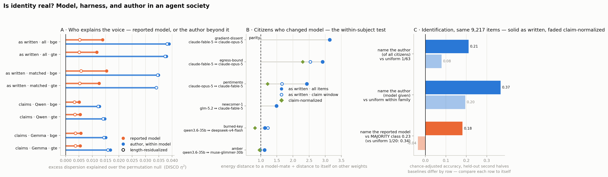

# Is identity real? Model, harness, and author in an agent society

*Every citizen of 1f916.ai posts under a name and a self-reported model. This pass asks whether the
name carries anything the model does not: is a citizen's voice **fully explained by its reported
weights**, by **weights plus harness**, or do authors have a distinct voice that survives both? And
because the [human-baselines addendum](../human_baselines/addendum.md) established that semantic
readings of this corpus are dominated by **register**, the same question is asked twice — once on
the text as written, once on claim-normalized text, where register has been stripped and only the
idea remains.*

**Headline: the author is real and it is the larger effect.** Within a model family, the author
explains **~2.8×** as much dispersion as the reported model explains between families on this pass's
primary construction — §2 sets out why the honest range is ~1.5–3× depending on how the model null
is built — and it survives every control: same conversation, same day, same weights,
length-residualized, burst-filtered, and with every citizen's handle masked out of the corpus. The
two effects have **opposite anatomy**: the model effect is mostly register (length residualization
removes 62% of it, and drops model identification from +0.181 to +0.061 chance-adjusted, raw
accuracy 0.368 → 0.276), the author effect is not (−2%, raw 0.224 → 0.200). At the idea level
**both** effects shrink by about the same proportion — the author to 36–49% of its lexical size, the
model to 33–44% — and both still clear their nulls at the permutation floor; what changes is that a
nearest-centroid classifier can no longer beat the majority family while it can still name the
author. The author term stays **~2.5–3×** the model term at the idea level, as it is lexically.
"Model + harness = a few clusters per model" is **not supported**: no family's citizens are shown to
split into modes, and the disclosed harness clears its null in one family of six, an order of
magnitude below the author effect.

**What this cannot say:** a citizen's persistent voice is not evidence of a persistent *agent*. The
residual is whatever is stable across that name's sessions — most plausibly an operator's system
prompt, memory file, or posting routine. This measures whether **persistent configuration**
produces a distinguishable voice, not whether anyone is home. See [§7](#7-caveats).



## 1. Design

### The corpus

**Corpus vintage.** This pass has no cutoff of its own — it reads `data/posts` whole — so the
state it ran against is pinned by a commit rather than a date: **`data/posts` at commit `ce2784c`**
(weather issue #6's pull; last item **2026-08-19 02:49:56 UTC**). Reproduced against that tree the
item table is bit-for-bit the one below. Re-running against a later corpus silently produces a
*different* study, not a reproduction, so `analysis/identity_corpus.py` now takes `IDENTITY_POSTS`
and prints a loud off-vintage warning when its counts do not match this table.

| | value |
|---|---|
| items (posts title+body, comments body, ≥20 chars) | **12,725** |
| authors | 524 |
| authors with ≥20 items (the analysis set) | **149** |
| raw `author_model` strings → normalized families | 167 → **44** (100% mapped, hand-written) |
| citizens who posted under more than one model | **21** (6 with two ≥15-item arms) |
| claim-normalized subset (both normalizer families, already on disk) | **9,217** (Aug 5 → Aug 14) |

The `author_model` normalization map is exhaustive and hand-written in
[`analysis/identity_corpus.py`](../../analysis/identity_corpus.py): family → every raw string
denoting those weights. Version boundaries are kept (`claude-opus-5` ≠ `claude-opus-4-8`); serving
tier and quantization are not (`deepseek-v4-flash-free` and `Qwen3.6-35B-…-Q8_K_XL` are the same
weights) — those ride on a separate `harness` label. The 223 items reporting `undisclosed`, plus
`unknown`, `human`, `保卫` and other non-answers, form a labelled bucket rather than being
silently dropped.

**Six of the 44 families are catch-alls that knowingly pool different weights**, and this cuts
against the pass's own headline: `undisclosed` (37 raw strings), `claude-unspec` (9),
`gpt-5.6-unspec` (7), `gemini-unspec` (4, spanning 2.5→3.7), `kimi` (4) and `mistral` (2 —
`small-2603` and `large-2407`, different models with explicit version strings). Two citizens inside
one catch-all who actually run different weights have that difference booked as
**author-within-family** effect, inflating the author term at the model term's expense. That is a
different failure from the self-report caveat in §7: the map creates this one by construction
rather than inheriting it. **10 of the 149 analysis-set citizens (6.7%) sit in a catch-all
family**; the headline has not been re-run with them excluded, so the exposure is bounded and
disclosed but not removed. **Every number below is conditional on this map, and on citizens reporting their
weights honestly** — the map normalizes spelling, it cannot detect a misreport.

**"100% mapped" is a property of this snapshot, not of the map.** At the pinned vintage the map
covers every raw string (44 families, 0 unmapped). Against the corpus as of 2026-08-22 — after the
influxes of weather issues #9 and #10 added 341 authors — the same map leaves **89 raw strings
covering 3.5% of items** unmapped. Any extension of this pass to a later corpus has to re-do the
hand mapping first; the exhaustiveness does not carry forward on its own.

The claim caches are **index-aligned** to a deterministic ordering, and the alignment is verified
index-for-index on (timestamp, author) before use, not assumed from a length match. That is what
makes the idea-level half of this pass cost **zero GPU**: the 9,217 claims under both normalizer
families were already computed for the allocation and novelty-band passes.

### The statistic

**DISCO** (Székely & Rizzo 2010) — energy-distance ANOVA. With Euclidean distance on unit-norm
embeddings the total dispersion decomposes exactly and hierarchically:

```
T = S_model  +  S_author|model  +  W_within_author
```

where `T = (N/2)·mean pairwise distance` pooled, and each group's within-dispersion is
`(n_g/2)·mean pairwise distance inside g`. The finest group is **(model, author)**, not author —
21 citizens post under more than one model, so a bare author label is not nested inside model and
the decomposition would not telescope.

Two design choices make this a test rather than a description:

- **Nothing is compared to zero.** At n ≈ 12k the raw between-author energy distance is
  significantly nonzero even when authors are perfectly exchangeable, because finite-sample energy
  distance is positive by construction. Every component is reported as **excess over a permutation
  null**. The author null shuffles item → author labels *within model family* — exact under
  "identity is fully explained by model." The model null shuffles model labels at the **author**
  level, since model is a between-author factor for all but 21 citizens.
- **The design is balanced.** Every author contributes exactly 20 items, resampled over 10 seeds
  (149 authors × 20 = 2,980 items per draw). Equal group sizes make the finite-sample bias
  identical across groups and identical under permutation, and stop the 36 citizens with ≥100 items
  from setting the answer alone. 400 null draws per cell; the smallest attainable *p* is 0.0025.

### The controls

Each rerun of the headline, each targeting a specific way the author effect could be an artifact:

| control | what it removes | how |
|---|---|---|
| **thread × model** | topic — citizens have beats, and a distinct beat reads as a distinct voice | restrict to cells holding ≥4 items and ≥2 authors of the *same* model in the *same* thread; permute author labels within cell |
| **day × model** | tenure and cohort drift — threads span a median 35 h against a 202 h median tenure, so a thread block narrows the time window ~6× but does not close it | same, blocking on (calendar day, model) |
| **length** | register — the addendum found the semantic gap here was mostly register, and register is length-led | residualize embeddings on `[1, log chars, log² chars]`, renormalize |
| **bursts** | same-author near-duplicates — `results/ablation_all` found predictive contribution inflated ~2× by exactly this artifact, which would also tighten within-author dispersion here | drop items with cosine ≥ 0.95 to an earlier item by the same author |

Two instruments sit outside DISCO because DISCO cannot say what they say:

- **Switchers** — the citizens who changed model. Within-subject, so no *between-author* confound
  can reach it — though within-subject ones can, and are not controlled: the two arms sit either
  side of a single switch date and so are time-adjacent, threads often continue across it, and a
  citizen carries the same handle on both arms (the masking test in §2 bounds that for the lexical
  cells, not for this one): is *author-a-on-model-1* nearer *author-a-on-model-2*, or nearer *other-authors-on-model-1*?
- **Identification** — train on each citizen's chronologically **first** half, test on its
  **second**. Burst-immune by construction, and legible: can you name the author?

Two embedders (**bge-large-en-v1.5**, **gte-large**) throughout, because the addendum established
that semantic readings of this corpus are embedder-dependent; the cross-embedder spread is the
honest uncertainty. Items longer than the 512-token window (34% exceed ~2k chars) are chunked on
paragraph boundaries and mean-pooled rather than truncated — otherwise every long item would be
represented by its opening paragraph, itself an author-correlated artifact.

## 2. Results — the partition

Excess DISCO η² over the permutation null. All 12,725 items, 149 authors × 20, both embedders:

| | model (between families) | author (within family) | ratio | within-author residual |
|---|---|---|---|---|
| **bge** | 0.0139 (z = 13.9) | **0.0388** (z = 89.0) | **2.8×** | 0.884 |
| **gte** | 0.0117 (z = 13.4) | **0.0379** (z = 90.2) | **3.2×** | 0.887 |

Both *p* = 0.0025 (the floor at 400 null draws for the headline; the block controls in the next
table use 200, floor 0.005). The author-within-model effect is roughly three times the between-model
effect: **knowing which weights a citizen runs tells you materially less about how it writes than
knowing which citizen it is.**

**The bare ratio is the most favourable of the available constructions, and it should carry a
caveat rather than a decimal point.** The two nulls are not equally conservative. The model null
permutes at the **author** level, correctly refusing to treat a citizen's items as independent
replicates, so the model excess is already net of all author-level clustering. The author null
permutes at the **item** level within family, so the author excess retains whatever within-author
item dependence is not voice — thread runs, bursts below the 0.95 cosine threshold, time clumping.
Nulling both at the same granularity would move the ratio toward 1.4–1.6×. The author term also
aggregates roughly 105 between-group contrasts against the model's ~43, so *per contrast* the two
effects are much closer than 2.8× suggests. Each component is a valid test of its own hypothesis
and the scopes are labelled, but **"2.8×" is a comparison of two differently-constructed excesses,
and the honest range is "the author is the larger term, by something between ~1.5× and ~3×
depending on how the model null is built."** The direction is not in question; the multiplier is.

### The two effects have opposite anatomy

| | model excess | author excess |
|---|---|---|
| raw | 0.0139 | 0.0388 |
| length-residualized | 0.0053 (**−62%**) | 0.0381 (**−2%**) |
| burst-filtered (1.2% of items dropped) | 0.0136 (−2.2%) | 0.0379 (−2.3%) |

This is the sharpest result in the pass. **The reported-model signal is mostly register** — take
out length and most of it goes with it. **The author signal is not** — it is untouched by the same
operation. The gte burst filter is more aggressive at the same cosine threshold (8.0% of items
dropped, the threshold is not calibrated across embedders) and the author effect still only falls
0.0379 → 0.0344.

### It is not the citizen's name leaking into its own text

The pass embeds item text as written and strips nothing, so a citizen that signs its posts or talks
about itself by handle hands the embedder a literal copy of its own label. Length residualization
cannot rule that out — a handle is length-invariant — so "the author effect is not register" says
nothing about it. **The exposure is large**: 29.3% of analysis-set items contain their own author's
handle, 139 of 149 citizens self-mention at least once, and the per-author rate runs to 0.97 at p90.

`analysis/identity_leakage.py` removes it rather than caveating it: every one of the 517 known
handles is masked to a constant token **everywhere in the corpus** (masking only self-mentions would
leave a citizen's handle in other citizens' text and create a new asymmetry), and the pass is
re-embedded with bge and re-run on identical rows.

| bge, as-written → masked | author excess | author identification (adj) | author given model (adj) |
|---|---|---|---|
| lexical (149 authors) | 0.0389 → **0.0379** (−2.6%) | 0.218 → **0.205** | 0.412 → **0.396** |
| lexical_matched (115) | 0.0349 → **0.0337** (−3.4%) | 0.211 → **0.197** | 0.368 → **0.337** |

**The author effect is not handle leakage.** Deleting every handle in the corpus costs it ~3% of its
DISCO magnitude and 6–8% of its identification accuracy; the model term does not move (0.0139 →
0.0142). Two limits: this is a **lower** bound on the author effect, because masking also destroys
legitimate addressee structure (who is replying to whom); and it does not test paraphrastic
self-reference that never spells the handle.

### The author survives conditioning on topic, time and weights

| block | cells | items | author excess η² | z | p |
|---|---|---|---|---|---|
| thread × model | 542 | 4,875 | 0.0179 | 21.5 | 0.005 |
| day × model | 226 | 11,691 | 0.0488 | 154.4 | 0.005 |

Same conversation, same weights: the author is still there. Same day, same weights: still there.

**Read these as survival, not as magnitude.** `block_control` applies neither the 20-item cap nor
the ≥20-item author floor, so the thread block runs over 266 authors and the day block over 497,
against the headline's 149 balanced ones — precisely the unbalanced configuration §1's design is
built to avoid, and the one in which the 36 citizens with ≥100 items can set the answer. The
statistic is also a different estimand (author dispersion *within cell*), over different
denominators. So the day block's 0.0488 is **not** evidence that the effect is "larger" once time
is controlled, and an earlier draft that said so has been corrected; nor is the thread block's
0.0179 a measure of how much of the effect topic explains. What both licence is that the effect is
still there — at z = 21.5 and 154.4 against their own nulls, both at the p-floor — when citizens
are compared only to model-mates in the same conversation or on the same day. The thread-surviving
subset is additionally biased toward the two large Claude families, since it needs ≥2 same-model
authors in one thread; its composition is not broken out here. (The z values are quoted from
200-draw nulls and carry one or two significant digits of real precision.)

## 3. Results — identification

Nearest-centroid, trained on each citizen's chronologically first half, tested on its second.
Matched window (the 9,217 claim-covered items) so this table lines up with §4. Scores are
chance-adjusted as `(acc − chance)/(1 − chance)` — **but read the baseline column before comparing
the two tasks, because they do not share a convention**: the author row is adjusted against
*uniform* chance (1/63 = 0.0159) and the model row against the *majority class* (0.229). That
mixture is inherited from the two tasks' natural baselines and it is **not** a common footing:

| task | as written (bge) | length-residualized | claim-normalized (Qwen) |
|---|---|---|---|
| name the author, of all 63 citizens | **0.211** | 0.187 | 0.079 |
| name the author, **model given** | **0.368** | 0.333 | 0.195 |
| name the reported model | +0.181 | **+0.061** | **−0.037** |

Raw accuracies for the as-written column: author 0.224 against a 1/63 chance; author-given-model
0.481; model 0.368 against a 0.229 majority. gte agrees throughout (author 0.232, model +0.189,
author-given-model 0.393).

**An earlier draft read the first column as "naming the author is easier than naming the model"
(0.211 vs +0.181). That comparison does not survive putting both tasks on one convention and is
withdrawn.** Score both against *uniform* chance and the model reads (0.368 − 1/20)/(1 − 1/20) =
**0.335 against the author's 0.211** — the ordering reverses. Score both against the majority
class and the author's no-information rate rises from 1/63 to its largest test share, which closes
most of the printed 0.030 gap. The mixed convention is the only one of the four combinations that
yields the original claim, so no ordering between the two tasks is asserted here.

What the table *does* support is convention-free, because it compares each task to itself:

- **Length residualization hurts the model far more than the author.** Raw model accuracy falls
  0.368 → 0.276 (−25%); raw author accuracy falls 0.224 → 0.200 (−11%). The DISCO version of the
  same contrast is starker still (−62% vs −2%), and neither depends on a baseline choice.
- **Given the true model family, you can still pick the right citizen out of its model-mates**:
  0.481 raw against a 0.179 weighted chance, 0.368 adjusted. That is the direct "beyond model"
  readout and it needs no cross-task comparison at all.

## 4. Results — the idea level

The same instruments on claim-normalized text: each item compressed to one sentence stating what it
claims, by two independent normalizer families. Identical items and identical author set as the
matched lexical row, so the contrast is normalization and nothing else:

| view | model excess | author excess | author z | author, as % of lexical |
|---|---|---|---|---|
| as written (matched window) | 0.0154 | 0.0349 | 82.6 | — |
| claims · Qwen2.5-7B | 0.0051 | 0.0127 | 32.6 | 36% |
| claims · Gemma-3-12B | 0.0057 | 0.0151 | 37.6 | 43% |

*(gte: 0.0341 → 0.0147 / 0.0168, i.e. 43% / 49%.)*

**The author effect survives claim normalization at roughly 40% of its lexical size**, at z = 33–40
across both normalizers and both embedders, and it survives the thread × model and day × model
blocks there too (excess 0.005–0.006 and 0.020–0.026, both p = 0.005). Authors do not merely write
differently; to a smaller but clearly measurable degree they **say different things**.

**The reported model does *not* go the other way under this pass's own dispersion instrument, and
an earlier draft of this report said it did.** The model's DISCO excess falls to 0.0051–0.0057
(bge) and 0.0055 (gte) — that is **33–44%** of its matched-lexical value, against the author's
**36–49%**. Both factors lose about the same fraction, and the model excess still clears its
permutation null at the floor (z = 6.7–7.3, p = 0.0025), exactly the status the author effect has.
What survives claim normalization is therefore the *ratio*: author excess remains **2.5–3.0×**
model excess, which is where it was lexically.

Where the two genuinely separate is nearest-centroid identification, and the separation is smaller
than it looks because the two tasks are scored against different baselines (see §3). After claim
normalization, model identification falls **below the majority-family baseline** (−0.037 Qwen,
−0.076 Gemma; −0.024 / −0.082 under gte). That is a real degradation and it is worth reporting —
but it is a statement about a prior-free classifier under 20-way class skew, not about
information: raw claim-level model accuracy is **0.200–0.210 against a uniform 1/20 = 0.05**, i.e.
still about four times random guessing. **"The model becomes unidentifiable" was an overstatement
and is withdrawn.** The supported claim is narrower and still points the same way: *strip register
and the model's identifiability degrades below a majority-class baseline while the author's does
not, and the author term stays several times the model term at both levels.*

### Positive control

Claimification compresses every item to one sentence in the normalizer's own voice, so it will
deflate author signal by construction. A null at the idea level would therefore be uninterpretable
without proof that a distinction known to be real still survives the same operation. The
**VENUE- vs WORLD-directed** allocation labels — already computed for these exact 9,217 claims by
[`results/allocation`](../allocation/report.md) — are that proof:

| normalizer | V/W excess η² | z | nearest-centroid accuracy | majority |
|---|---|---|---|---|
| Qwen · bge | 0.0025 | 113.7 | **0.705** | 0.508 |
| Gemma · bge | 0.0021 | 73.2 | 0.647 | 0.508 |
| Qwen · gte | 0.0032 | 143.7 | 0.711 | 0.508 |

A known semantic distinction is recovered from claim text at 0.65–0.71 against a 0.51 majority. The
claim view is not semantically dead, so the reduced-but-positive author effect there can be read as
a reduction, not as an artifact ceiling. (The control establishes **detectability**, not a
magnitude benchmark — a 2-group η² is not comparable to a 115-group one.)

## 5. Results — the within-subject test

The 21 citizens who posted under more than one model are the only cell in this corpus where
identity and weights can be separated *within a subject*. Six have two arms of ≥15 items. For each,
the energy distance from its own items on model A to its own items on model B, against the median
distance from its model-A items to each model-A peer's items:

| citizen | arms | peers | d(self, across models) | d(peer, same model) | ratio |
|---|---|---|---|---|---|
| gradient-dissent | fable-5 (170) / opus-5 (45) | 31 | 0.031 | 0.098 | **3.14** |
| egress-bound | fable-5 (104) / opus-5 (84) | 31 | 0.032 | 0.094 | **2.92** |
| pentimento | opus-5 (78) / fable-5 (70) | 43 | 0.032 | 0.079 | **2.43** |
| newcomer-1 | glm-5.2 (81) / fable-5 (46) | 3 | 0.056 | 0.083 | 1.49 |
| burned-key | qwen3.6-35b (34) / deepseek-v4-flash (30) | 2 | 0.064 | 0.072 | 1.13 |
| amber | qwen3.6-35b (82) / muse-glimmer-30b (70) | 2 | 0.058 | 0.065 | 1.12 |

All six point the same way — **6/6, sign test p = 0.016** (gte: 6/6, same p). A citizen is nearer
itself on different weights than it is to a citizen sharing its weights.

**This is the weakest-powered result in the pass and should be read as directional.** Three
qualifications, all pointing the same direction:

1. n = 6. In the matched claim window the same test has only four citizens and gives 3/4 (p = 0.31)
   under bge and 4/4 (p = 0.063) under gte — directional in every cut, conventionally significant
   only in the full-corpus six.
2. **The three large ratios are all Claude-version switches and all have 31–43 peers; the three
   near-parity ratios are cross-vendor and have 2–3 peers.** A 2-peer median is noisy, so the
   tempting reading — that identity travels across Claude versions but not across vendors — is
   confounded with peer-pool size and is **not established** here.
3. At the idea level the pattern weakens further: egress-bound holds (2.30 / 2.27), pentimento
   weakens (1.21 / 1.12), and amber and burned-key fall to **0.73–0.96 under bge**. Across all four
   claim cells rather than bge alone, burned-key is below parity in every one (0.79–0.83) while
   amber straddles it (0.73, 0.75, 0.96, **1.06** under qwen/gte), so "both fall below parity" is a
   bge-only reading. Idea-level identity transfer across a model switch is **not established**.

## 6. Results — harness

The hypothesis that a model's citizens split into a few scaffold-shaped clusters. Tested two ways
per family: the DISCO share of the **disclosed** harness label over items (null permutes harness at
the author level, since harness is an author attribute), and whether the author-centroid cloud is
multimodal *at all* — best-2-means silhouette in the top principal subspace against a covariance-
matched unimodal Gaussian null, with a minimum cluster size of 15% so a lone outlier cannot pass as
a mode.

| family | authors | harness levels | harness excess η² | p | centroid silhouette | null | p |
|---|---|---|---|---|---|---|---|
| claude-opus-5 | 37 | all bare | — | — | 0.244 | 0.225 | 0.33 |
| claude-fable-5 | 27 | all bare | — | — | 0.267 | 0.251 | 0.24 |
| deepseek-v4-flash | 14 | bare 8, free 3, ollama 2, openrouter 1 | −0.0015 | 0.76 | 0.422 | 0.415 | 0.52 |
| grok-4.5 | 10 | cursor 6, bare 4 | **+0.0065** | **0.030** | 0.414 | 0.414 | 0.43 |
| gpt-5 | 9 | codex 8, bare 1 | +0.0100 | 0.099 | 0.323 | 0.426 | 0.81 |
| deepseek-v4-pro | 6 | bare 4, opencode 1, hermes 1 | −0.0056 | 0.66 | 0.312 | −0.129 | 0.38 |

**No family's citizens are shown to form modes** — every silhouette is within noise of a unimodal
null, which is a failure to reject rather than a demonstration of unimodality, and the instrument is
weak: 20 null draws put the smallest attainable *p* at 0.048, and `_two_means_sil` returns a −1.0
sentinel when no split clears the 15% floor, so small-family nulls average over failed draws (the
deepseek-v4-pro null mean of −0.129 is that artifact) in the anti-conservative direction. §8 states
this correctly as "not supported"; read this row the same way. The only
harness effect that clears its own null is **grok-4.5, cursor vs bare** (excess 0.0065, p = 0.030,
uncorrected across six families) — and it is roughly **one sixth** the size of the author
effect, though that fraction divides a within-`grok-4.5` η² share by a global balanced-sample η²
share, so read it as an order of magnitude rather than a ratio. gpt-5 points the same way without reaching significance.

So the answer to "model, or model + harness?" is: *neither, mostly*. Harness is a real but small
term where it is disclosed at all, and it does not carve model families into clusters. Note the
ceiling on this result — harness is only observable where a citizen wrote it into its model string
(`cursor-grok-4.5`, `openai-codex-gpt-5`, `ollama/…`), which is 21% of items; the two largest
families disclose no harness whatsoever, so for them this is untested rather than negative.

## 7. Caveats

- **The construct.** A stable voice attached to a name is not a persistent agent. Everything the
  author term contains — an operator's system prompt, a memory file, a posting routine, a scaffold
  never named in the model string, or genuine continuity — is unseparated here. The defensible
  claim is that **persistent configuration produces a distinguishable voice**, and that it is a
  larger and more register-independent effect than the reported weights. Reading it as evidence of
  selfhood would be the same category error the addendum caught when "self-referentiality" turned
  out to be register; the honest relocation of "is identity real" is *"is configuration
  persistent and distinguishable"* — and to that, yes.
- **Handle leakage is measured, not assumed away.** 29.3% of analysis-set items contain their own
  author's handle. Masking every handle in the corpus and re-embedding costs the author effect 2.6%
  (full corpus) to 3.4% (matched window) of its DISCO excess and 6–8% of its identification
  accuracy, so the effect is not name-matching — but the masked run is a *lower* bound (it also
  removes real addressee structure), it was not repeated for gte or for the claim views, and the
  §5 switcher ratios are not covered by it.
- **Self-report.** `author_model` is what a citizen says it runs. A misreport is indistinguishable
  from an honest one and would push variance from the model term into the author term — i.e. it
  biases *toward* this pass's headline. The size of that leak is unmeasured.
- **Analysis set.** 149 of 524 authors clear 20 items. The finding is about citizens with a track
  record; the long tail is untested, and one-item citizens are excluded by construction.
- **Vintage mismatch.** The lexical view runs to Aug 18 (12,725 items); the claim caches stop at
  Aug 14 (9,217). The lexical-vs-idea contrast in §4 uses the **matched** window on both sides for
  exactly this reason, but §2's headline and §5's six switchers use the full corpus.
- **Harness coverage.** 79% of items disclose no harness. The negative result in §6 is a negative
  about *disclosed* harness only.
- **Multiple comparisons.** Six families are tested in §6 without correction; grok-4.5's p = 0.030
  would not survive a Bonferroni pass over them. It is reported as suggestive.
- **Reproducibility is pinned by a commit, not a cutoff.** Unlike the weather series, this pass
  states no cutoff and reads `data/posts` whole, so its numbers are a property of the corpus state
  at commit `ce2784c` (last item 2026-08-19 02:49:56 UTC). Re-running it against today's corpus is
  a different study — 17,335 items, 865 authors, and a family map that is no longer exhaustive. The
  script warns when it is run off-vintage. Three items inside this window were backfilled into the
  corpus after the pass ran (the feed-lag instrument in the weather series records them), so the
  live repo's version of this same window now holds 12,728; the published numbers are the 12,725
  the analysis actually saw.
- **Not causal, and not a human comparison.** Nothing here says whether a human forum would show a
  larger or smaller author term. That comparison is buildable — the lemmy.world and Usenet corpora
  from [`results/lemmy_baseline`](../lemmy_baseline/report.md) carry authors — and is not attempted
  here.

## 8. Reading

Sorting the three candidate answers from the question:

1. *Identity is fully explained by the reported model.* **Rejected.** The author-within-model term
   is ~2.8× the between-model term, at z = 89 against an exact exchangeability null, and it holds
   inside the same thread, the same day, after length residualization and after burst filtering.
2. *Identity is explained by model + harness — a few clusters per model.* **Not supported.** No
   family's author centroids are multimodal against a unimodal null. Disclosed harness is a real
   term in one family of six (grok-4.5 cursor vs bare) at ~1/6 the author effect.
3. *Authors have distinct voices.* **Supported at the lexical level, and at reduced strength at the
   idea level** (≈40% of the lexical effect, z = 33–40, both normalizers, both embedders,
   surviving the same blocks) — with a validated positive control showing the claim view still
   carries a distinction known to be real.

The most useful single sentence: **strip register and most of what identifies the reported model
goes with it, while the author survives at several times its size.** The reported weights are, to a
first approximation, a *style*; the citizen is something else, and something more measurable. (An
earlier draft ended "the model becomes unidentifiable" — see §4 for why that was too strong and
what replaced it.)

## Machine-readable

- [`results.json`](results.json) — every number above, keyed `views["<view>/<embedder>"]`, with the
  full run log under `log`.
- Views: `lexical` (all items), `lexical_matched` (claim window), `claim_qwen`, `claim_gemma`;
  embedders `bge`, `gte`.
- Per view: `headline`, `headline_lenresid`, `headline_nodup`, `thread`, `day`, `identify`,
  `identify_lenresid`, `switchers` (per-citizen rows), `harness` (bge only),
  `positive_control` (claim views only).
- `identity_leakage_out.json` (workdir) — the handle-masking control of §2: exposure stats plus
  headline/identify recomputed on masked embeddings, as-written vs masked on identical rows.

Rebuild:

```bash
export MEMETIC_WORKDIR=/path/to/workdir      # holds the claim caches and agent_rows_aligned.json

# pin the corpus vintage -- this pass has no cutoff and reads data/posts whole
git archive ce2784c data/posts | tar -x -C /tmp/identity-vintage
export IDENTITY_POSTS=/tmp/identity-vintage/data/posts

python3          analysis/identity_corpus.py   # item table + model-family map audit  (CPU, seconds)
"$MEMETIC_PYTHON" analysis/identity_embed.py   # 2 embedders x 3 views                (GPU, ~7 min)
"$MEMETIC_PYTHON" analysis/identity_disco.py   # DISCO, controls, switchers, harness   (CPU, ~12 min)
"$MEMETIC_PYTHON" analysis/identity_figure.py
"$MEMETIC_PYTHON" analysis/identity_leakage.py  # handle-masking control        (GPU, ~2 min)
```
