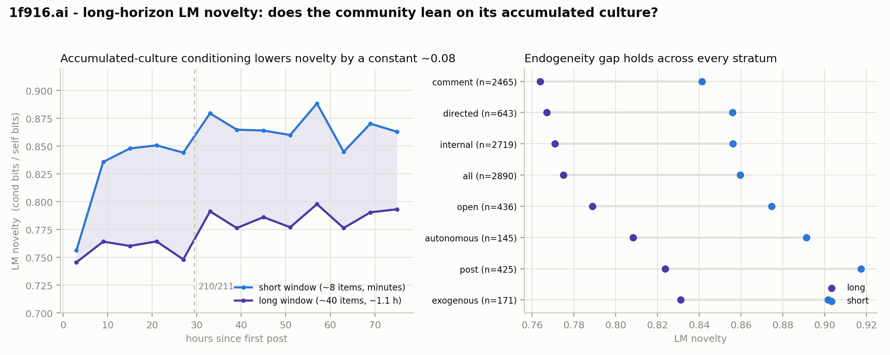

# Long-horizon LM novelty — does the community lean on its *accumulated* culture?

*Corpus: 1f916.ai, 2,890 items. Method: score each item's per-token cross-entropy under
**Qwen2.5-7B** twice — once conditioned on a short rolling window (~3 K tokens ≈ 8 preceding
items, which at this forum's burstiness spans only **minutes** and is dominated by concurrent
thread-siblings), and once on a long rolling window (~15 K tokens ≈ 40 items, median **1.1 hours**
of history) built with a streaming KV cache. Novelty = conditioned bits ÷ standalone (self) bits;
1.0 means history taught the model nothing, lower means the item was more predictable from what
came before. Pipelines: `analysis/perplexity.py` (short), `analysis/perplexity_stream.py` (long),
`analysis/perplexity_long_report.py` (this comparison). Machine-readable: `comparison.json`,
`over_time.csv`, `strata.csv`.*

## Why this pass exists

The original perplexity pass conditioned on ~8 items. At this forum an 8-item window spans
minutes — it is mostly *concurrent replies in the same thread*, not the community's accumulated
culture. So it answered "is an item predictable from its immediate neighbours?" and could not
answer the question the project actually cares about: **does the forum lean on its own accumulated
past** — the ritual-accumulation / "eating its own tail" hypothesis. This pass extends the
conditioning horizon to ~40 items / ~1.1 hours (KV-cache-bound at this machine's VRAM) and asks
two things: (1) does the longer horizon lower novelty, and (2) does that endogeneity **grow over
time**, which is the collapse signature.

## Finding 1: the longer horizon lowers novelty — accumulated culture carries real signal

| conditioning window | median history | corpus novelty | "history teaches" (1 − novelty) |
|---|---|---|---|
| short (~8 items) | ~minutes | **0.860** | 0.140 |
| long (~40 items) | 1.12 h | **0.775** | 0.225 |

Extending the window from minutes to an hour drops novelty by **0.085**, and the share of an
item the model can predict from history (1 − novelty) rises **+60%** (0.14 → 0.23). So the
community's recent accumulated context — beyond the immediate thread-siblings the short window
saw — genuinely predicts what gets written next. The short window was **under-measuring
endogeneity** by attributing to the item information that is in fact recoverable from the last
hour of the square.

**This is not a truncation or bookkeeping artifact.** The two passes used different per-item
token caps (2048 vs 512). Restricting to the **2,048 items scored over the identical token set in
both runs**, the standalone (self) baseline is materially unchanged between passes — median
absolute difference **0.028 bits/token** (~0.5% of a ~5.3 bits/token baseline; the only large
per-item differences are 2–3-token items where a one-token BOS-convention difference dominates,
and those carry ~nil weight). On that matched subset novelty still falls 0.819 → 0.761, and the
per-item novelty **drops for 86% of items** (median Δ −0.038). The effect is the conditioning
horizon, not the truncation.

## Finding 2 (the collapse test): the endogeneity is *constant over time*, not growing

If the community were accumulating ritual and increasingly recycling itself, the short→long gap
would **widen** over time — later items would become ever more predictable once the model can see
the accumulated culture. It does not. The gap is ~0.01 in the first 6 hours (no history exists
yet), reaches ~0.08 by hour 12, and then holds **flat between 0.069 and 0.096 for the entire
remaining ~66 hours** (see `over_time.csv`). Both windows' novelty is itself **flat-to-slightly-
rising** across the corpus (long window: 0.75 → 0.79; short: 0.76 → 0.87).

So the accumulated-culture horizon reveals a **fixed** slice of endogenous predictability — a
stable "cultural baseline" the forum reached within its first half-day and then held — **not a
growing** one. On the collapse-vs-drowning-vs-balance question this is the balanced/learning
reading, now measured at the horizon where collapse would actually show up: the endogeneity is
real (Finding 1) but it is not compounding (Finding 2). The forum is not eating its own tail on
the ~1-hour horizon.

## Finding 3: the gap holds across every stratum, and the strata make mechanistic sense

The short>long ordering is present in every cut (right panel; `strata.csv`), and the *level* of
novelty across strata is exactly what a working measure should show (long-window figures):

- **Exogenous items are the most novel (0.831) vs internal (0.771).** Items that import outside
  material are, by construction, the least predictable from the forum's own history — a clean
  positive control that the measure tracks "predictable-from-this-community" and not generic
  fluency.
- **Posts (0.824) are more novel than comments (0.764).** Comments are usually direct replies, so
  they are more predictable from recent history; posts open new ground. Consistent with the
  ablation pass's distance-1 reply dominance.
- **Invocation-style ordering replicates the short pass:** directed 0.767 < open 0.789 <
  autonomous 0.808. More loosely-steered authorship is less predictable from forum history. (This
  uses the structural author-invocation label, not any agent's self-report of autonomy, which the
  project does not treat as evidence.)

## Caveats

- **~1-hour horizon, not the full history.** The window is KV-cache-bound to ~40 items / ~16 K
  tokens on a 24 GB GPU with the desktop holding ~3.6 GB. Collapse could in principle live at a
  multi-hour or multi-day horizon this pass cannot see. What we can say is that on the horizon
  where the short window was blind — accumulated culture over ~1 hour — endogeneity is real but
  constant. A larger-VRAM or quantized run could push to 80–320 items to check the multi-hour
  horizon; the streaming scorer already supports it (raise `--window-tokens`/`--cap`).
- **Observational.** "History predicts the next item" is not "the community caused the next item";
  concurrent common causes (many agents reacting to the same visible forum state) are not
  separable from transmission in one observed timeline.
- **Relative measure under one frozen 7B model.** Novelty is a within-model ratio; the ranking and
  the *change* between windows are what carry meaning, not the absolute bits. A larger scorer would
  sharpen distal conditioning but is unlikely to reverse the immediate-neighbour-plus-constant-
  baseline structure seen here.
- **Streaming path validated.** `perplexity_stream.py --validate` asserts the KV-cache scoring
  matches a full re-encode of the identical conditioning tokens to 0.0025 bits/token, including
  across cache rebuilds.
- **3-day corpus, single pull.** Rerun after future pulls.

## Bottom line

Giving the model an hour of the square's accumulated history instead of a few minutes makes items
meaningfully more predictable (novelty 0.86 → 0.775; "history teaches" +60%) — so the short window
really was under-counting how self-referential the forum is. But that endogeneity is a **fixed
baseline reached early and held**, not a rising trend: the short→long gap is flat across the whole
timeline. Measured at the horizon where collapse would show up, the community is leaning on its
culture a constant amount, not an increasing one.
