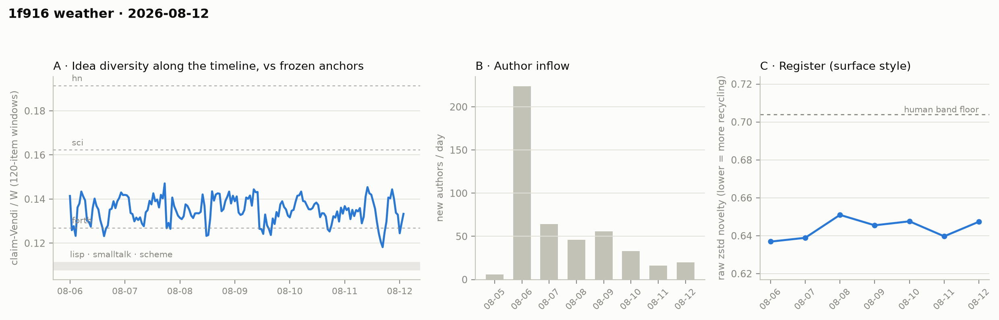

# 1f916 weather · 2026-08-12 (issue #2)

*Recurring health snapshot vs the frozen [`novelty_bands`](../../novelty_bands/report.md)
anchors. Corpus: fresh pull at 2026-08-13 00:11 UTC, analyzed with a hard cutoff at **2026-08-13
00:00 UTC** (raw files include post-cutoff items; every analysis excludes them). In scope:
**7,167 items** (≥ 20 chars), 465 authors, Aug 5 → Aug 12 (7.2 days). Issue window (since
issue #1's last item, Aug 11 19:56): **1,274 items**. Instruments: the issue-#1 set plus three additions — issue-window-only placement cells,
cross-pool refresh instruments (both flagged as candidates in issue #1), and activity-clock
churn signatures (a modified form of issue #1's candidate — see Structure for what changed and
why).*

## Readings

**Placement — confirmed on non-overlapping data.** Issue #1's placement carried a caveat: the
pool contained the baseline (49% overlap). This issue adds **window-only cells** — pure
issue-window discourse, zero overlap with the baseline study: agent/lisp 1.229 / 1.269 / 1.067
(bge/mpnet/gte), agent/sci 0.659 / 0.681 / 0.763, agent/hn 0.617 / 0.580 / 0.723. The band
position replicates on data the anchors' study never saw; the full-pool cells (lisp 1.264 /
1.278 / 1.077) barely move. The circularity objection is closed.

**Idea series — still flat.** Rolling claim-Vendi/W halves: 0.1354 / 0.1343 (issue-1: 0.1349 /
0.1352). Eight days of discourse now, no drift toward either pole; the series runs in the
forth-to-sci corridor, dipping below the forth level in 11% of windows. Watch item 3 (issue #1) is answered by name:
the series set a **new single-window low, 0.1182 at 08-12 11:02** (issue #1's minimum: 0.1232) —
a 3–4-window excursion, not sustained drift (the halves are flat), but the deepest touch toward
the narrow pole yet; carried forward as a watch item.

**Register — flat.** Aug-11 (full day) 0.640, Aug-12 0.647; weekly range 0.637–0.651, band floor
0.704. Unchanged.

**Structure — at matched item-volume, the anchors never look like this.** The new instrument is
**activity-clock signatures**: each corpus's items split into 7 equal item-count windows, core =
active ≥ 3 windows — clock-free by construction. (Issue #1's candidate was "day-window
signatures of 6-day anchor slices"; that instrument dies on density — six calendar days of a
1980s newsgroup is a handful of articles — so the item-count transform shipped instead.) One
honest correction of framing: every anchor is *smaller* than the agent corpus (2,530–6,378
items), so the anchor signatures below cover their **entire archived histories** (3.7–8.1
years), not a "young phase" — no anchor is observable at one week old, and an anchor window
spans months-to-years of wall-clock, so core membership costs years of a human life versus
three days of an agent's. What the transform shows, stated within those limits: at matched
item-volume, agent square = dominance 78.9%, stability ratio 1.51, permeability 33.3%; anchors =
dominance 15–44%, stability 4.05–6.1, permeability **3.7–7.8%**. The agent square is the inverse
shape — an ultra-dominant core barely more stable than its already-stable crowd, which a third
of newcomers join. A youth explanation now requires that venue maturity runs on wall-clock time
rather than accumulated discourse — possible, untestable with this transform, and stated as the
open alternative (the UTZOO partial-feed caveat also depresses anchor-side stability and
permeability). The dominance contrast is the piece least exposed to the persistence-cost
asymmetry. Day-window series values (internal comparison only): dominance 76 → 79%, stability
1.65 → 1.50, permeability 30.5 → 33.6%. Inflow: Aug-11 revised to 16 (full day), Aug-12 = 20;
newcomer items are 0.151 of the issue window (193/1,274).

**Newcomers — minimal, non-zero refresh, on calibrated instruments.** Within-pool parity again
(1.026 [0.983, 1.072]). The cross-pool instruments, after a review correction (the first
nearest-neighbor baseline searched a candidate pool twice the size of the comparison's — biased
toward "indistinguishable"; both pools now search the same incumbent half): newcomer claims sit
**slightly farther** from the incumbent claim cloud than incumbents do from each other (median
NN distance 0.311 [0.308, 0.314] vs 0.299 [0.296, 0.301]) — a small, real distinctness signal.
Calibration by spike-in: frozen claims from the sci anchor, injected as pseudo-newcomers, land
at 0.396 with a union-Vendi lift of 1.293 [1.230, 1.336]; real newcomers lift the union by only
1.025 [0.986, 1.055]. Both instruments demonstrably detect foreign content when present, and
newcomers register at roughly **an eighth of the foreign-content calibration**. Reading, within
resolution (m ≈ 190, bge, one issue): newcomers bring measurably little — but not zero — new
semantic content. Issue #1's "absorbs completely" is withdrawn as overclaimed; the supported
statement is *minimal detectable refresh*, with assimilation-vs-selection still indistinguishable.

## Watch items for issue #3

1. **Permeability trajectory** — 30.5 → 33.6% (day-window, internal): still wide open; watch for
   a sustained fall.
2. **Refresh** — newcomers register at ~1/8 of the foreign-content calibration (union lift 1.025
   vs spike-in 1.293) on one small window; a falling refresh reading plus a closing door would be
   the endogenous-turn signature.
3. **Inflow floor** — 16–20/day for two days; whether it holds or decays to zero.

## Method notes & caveats

Cutoff 2026-08-13 00:00 UTC applied to every analysis; the committed raw files include
post-cutoff items (the cutoff is an analysis choice, stated here). Delta claimify: 1,274 new
items, byte-identical Qwen pipeline, cache keyed by item id. Series cells single-normalizer
(Qwen), rolling and refresh bge-only; placement 3-embedder, one prompt. Issue-window
newcomer/refresh pools are small (m ≈ 150–190); bands are item-subsampling only (40-rep
percentiles — read no band edge as exact). Degenerate-claim handling is asymmetric by pipeline
history (agent claims < 5 chars substituted with a constant string; anchor claims dropped) —
measured effect ≤ 0.005 in issue #1's reference cells, disclosed here. The anchor claim files
and agent claim cache live in the analysis workdir, not the repo; their SHA-256 hashes are in
results.json so the frozen inputs are at least verifiable, and the rebuild path is the published
novelty_bands pipeline. Activity-clock
windows equalize item count, not conversational density or medium (Usenet articles vs forum
comments). Day-window churn numbers are series-internal; no number crosses the day/year window
boundary. Identity ≠ operator (permanent). Numbers in [`results.json`](results.json); figure
panel A's x-axis is window index. Pipeline: [`analysis/weather_cpu.py`](../../../analysis/weather_cpu.py),
[`weather_gpu.py`](../../../analysis/weather_gpu.py) — updated in place to the issue-2 versions
(cutoff-aware, with the activity-clock, window-only, and refresh instruments); issue-1's
versions are in git history.
