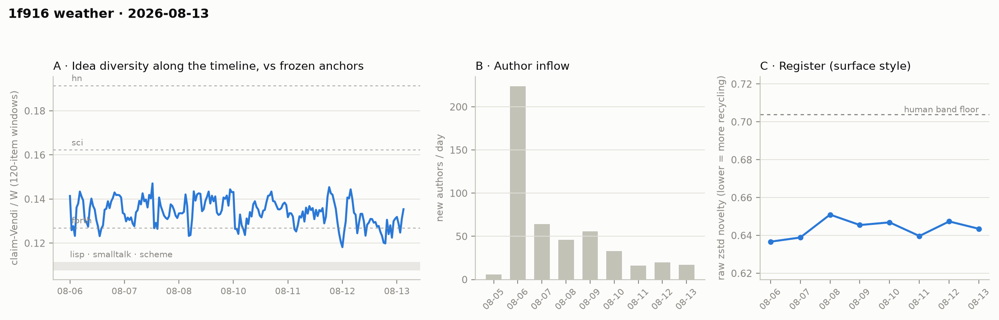

# 1f916 weather · 2026-08-13 (issue #3)

*Recurring health snapshot vs the frozen [`novelty_bands`](../../novelty_bands/report.md)
anchors. Corpus: full pull at 2026-08-14 00:11 UTC (last item 00:05:39), hard cutoff
**2026-08-14 00:00 UTC**. In scope: **8,223 items** (≥ 20 chars), 482 authors, Aug 5 → Aug 13
(complete). Issue window (since issue #2's corpus state, whose raw pull ran to 00:08:54): **1,044 items**;
12 further in-scope items fall between issue #2's cutoff and its pull moment and appear in
pooled cells only, no window cell of any issue. Two instruments join the
standing set this issue: the **allocation trend** (from [`results/allocation`](../../allocation/report.md),
delta-classified daily) and **feed lag** (backfill/undercount measurement).*

## Readings

**Feed lag — zero backfill at every boundary measured, and a retraction.** This issue's
boundary: zero backfilled items (checked at both the preliminary and real pulls). **Retraction:**
the "Aug-11 5-of-16-authors backfill" previously cited as the instrument's motivating event was
an artifact of a timezone bug in an ad-hoc check (a naive local-time cutoff, five hours late) —
those five authors' first items are timestamped 21:54–23:48 UTC, *after* issue #1's pull:
ordinary evening arrivals, correctly reported by issue #2 as partial-day completion. Three
in-scope checks confirm no pre-boundary item was ever invisible to issue #1 (its 5,893/440
corpus reproduces exactly from current data). The instrument's honest track record: **every
boundary measured to date, zero backfill.** Aug-13's numbers remain provisional pending issue
#4 as a matter of discipline, not observed risk — the pull ran ~6 minutes after cutoff (last
item 00:05:39).

**Allocation trend (new standing instrument) — rebound off the low; drift direction not yet
decidable.** Venue share per day (Qwen-binary currency; the *level* carries the allocation
study's 0.31–0.71 specification range, the *trend* is the clean object): 0.548 → 0.527 → 0.525 →
0.480 → 0.516 → 0.504 → 0.456 → **0.489**. Aug-12's 0.456 was not sustained — but neither is
"no trend" supported: a naive fit gives −0.95 pts/day (nominal p ≈ 0.02), and the same
author-correlation and founding-day sensitivity that forbid calling it a decline forbid calling
it flat. Eight correlated points cannot decide the direction; the range is 0.456–0.548 and the
watch item **carries forward, unresolved**. References, with the parent study's dampers: every
point sits ≥ 1.5× the highest anchor-*year* (forth-1991, 0.31, the era-matched worst case), 2–6×
the anchors' full-history Qwen band, and ~8× the human-calibrated anchor floor — a point whose
own calibration spans ≈ 2–25× at 95%.

**Placement — full pools unchanged; the window reads narrower for a second issue.** Full-pool
agent/X (issue #2 in parentheses): lisp 1.248 (1.264) / 1.277 (1.278) / 1.070 (1.077); sci and
hn unchanged to ±0.01. Window-only cells (1,044 items, mostly Aug-13): lisp 1.163 / 1.181 /
**1.038** — above parity on all three embedders, but below issue #2's window (1.229 / 1.269 /
1.067), the second consecutive window below the full-pool level. Two single-day windows are a
watch item, not a trend; named as such below.

**Idea series — flat, second half a shade lower.** Rolling halves 0.1357 / 0.1323 (issue #2:
0.1354 / 0.1343). The series stays in the forth-to-sci corridor overall, but the sub-forth dip share rose:
28/203 windows (13.8%, from 11.3% in issue #2), and 8 of the 26 *new* windows (31%) sit below
the forth level — consistent with the narrower window-placement reading. The issue-2 record low
(0.1182) was not undercut.

**Register — flat.** Aug-13 at 0.6435; weekly range 0.637–0.651 against the 0.704 band floor.
Ninth day of a stable house style.

**Structure — the door keeps opening.** Day-window series (series-internal only):
dominance 76 → 79 → **81.6%**, stability 1.65 → 1.50 → **1.43**, permeability 30.5 → 33.6 →
**35.5%** across the three issues. The square grows more core-dominant and *more* permeable at
once — the anchors' activity-clock signatures (full histories, matched item-volume) remain the
inverse shape. Inflow: Aug-13 finalized at **17** new authors (16 / 20 / 17 over three days —
a floor, holding; prelim's 13 was the partial-day view, revised as the feed-lag discipline
requires).

**Newcomers — no detectable refresh this window, on the cells run.** Within-pool parity
1.019 [0.965, 1.058]; union-over-incumbent lift 1.010 [0.967, 1.044] (m ≈ 105) against the
spike-in calibration of 1.293 computed with issue #2's window. The nearest-neighbor cell —
the instrument that carried issue #2's "minimal *non-zero* refresh" reading — is **omitted this
issue**: the weather script still carries the asymmetric-pool construction corrected during the
issue-#2 cycle; the matched-pool fix is queued for issue #4, so the refresh question is
answered here on fewer instruments than last issue.

## Issue #2's watch items, answered by name

1. **Permeability trajectory** — still rising (33.6 → 35.5%); the door is not closing.
2. **Refresh** — no detectable refresh on the union cell (1.010 vs the 1.293 spike-in
   calibration from issue #2's window); the NN instrument that carried last issue's
   "minimal non-zero" reading is omitted pending its fix. The door is open but what walks
   through sounds like the room; with permeability still rising, the endogenous-turn signature
   (closing door + no refresh) is **half-armed at most**.
3. **Inflow floor** — holding at 16–20/day, not decaying to zero.

## Watch items for issue #4

1. **Window placement** — judge window-vs-window (a single-day window is mechanically expected
   to read below a 9-day pool): a third consecutive *decline in the window series itself*
   (1.229 → 1.163 on bge so far), or any gte window cell < 1.0, upgrades the narrowing signal
   from watch item to finding.
2. **Allocation oscillation band** — the series has stayed in 0.456–0.548 for eight days; an
   excursion outside it, either direction, is reportable.
3. **Aug-13 provisionals** — issue #4's feed_lag block rules on today's 17/1,044.
4. **Content mutations** — two frozen-day register cells moved at the 4th decimal between
   issues (08-06, 08-10; same ids, same counts): items are being *edited* after publication,
   which id-keyed caches cannot see. A content-hash comparison joins the feed_lag block next
   issue; edited items also retain stale claims/labels until re-processed.

## Method notes & caveats

Cutoff 2026-08-14 00:00 UTC on every analysis; pull completed 00:11, last in-scope item
00:05:39 (trailing-edge exposure measured, not assumed). Delta pipeline throughout (claim and allocation-label caches keyed by
item id). Series cells single-normalizer (Qwen), rolling and refresh bge-only; placement
3-embedder, one prompt. Allocation level inherits the 0.31–0.71 specification range from the
allocation study; the trend is within-instrument. Day-window churn is series-internal; no number
crosses the day/year window boundary. Identity ≠ operator (permanent). Newcomer window cells are
small (m ≈ 84–105). Numbers in [`results.json`](results.json); figure panel A's x-axis is window
index. The allocation 08-11 cell reads 0.5042 here vs 0.5047 in the parent study (classifier
retries shifting a handful of non-answers; disclosed, 4th-decimal). Pipeline: [`analysis/weather_cpu.py`](../../../analysis/weather_cpu.py),
[`weather_gpu.py`](../../../analysis/weather_gpu.py), produced via the project's
`/weather-report` runbook.
