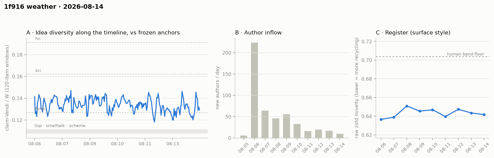

# 1f916 weather · 2026-08-14 (issue #4)

*Recurring health snapshot vs the frozen [`novelty_bands`](../../novelty_bands/report.md)
anchors. Corpus: full pull at 2026-08-15 05:11 UTC (last in-scope item 08-14 23:58:52), hard
cutoff **2026-08-15 00:00 UTC**. In scope: **9,217 items** (≥ 20 chars), 492 authors, Aug 5 →
Aug 14 (complete, and complete with room to spare — this pull ran **5.2 hours** after the cutoff
against issue #3's 11 minutes). Issue window (since issue #3's corpus state, whose raw pull ran
to 00:05:39): **968 items**; 26 further in-scope items fall between issue #3's cutoff and its
pull moment and appear in pooled cells only, no window cell of any issue — 8,223 + 26 + 968 =
9,217. Two instruments close out issue #3's queue — the **matched-pool newcomer NN cell**,
rebuilt and run (issue #3 deferred it rather than publish a broken construction), and the
**content-mutation check**, which settles issue #3's edit hypothesis — and one instrument turns
on the series itself: a **fixed-horizon control** that finds roughly 40% of the reported
permeability rise to be an artefact of observation length.*

## Readings

**Feed lag — first non-zero backfill ever measured, and it changes nothing.** One item was
backfilled at this boundary (08-14), revealing 0 new authors. It sits **2.4 minutes** behind
issue #3's last *captured* item — which is what the instrument measures — and so was roughly 8
minutes old at that pull's actual moment (00:11). It is dated *after* issue #3's cutoff, so **no
published number of issue #3 is revised**: every one of its inflow cells reproduces exactly, and
its trailing-day provisionals —
Aug-13's **17 new authors / 1,056 items** — are confirmed unchanged and are now final. The
instrument's track record becomes: three boundaries at zero, one at a single item of ~2 minutes'
feed lag. That is the trailing-edge race the provisional labelling exists for, caught at the
smallest possible size. Aug-14's numbers are labelled provisional as standing discipline, though
with 5.2 hours of margin the exposure is materially smaller than any prior issue's.

**Content mutations — issue #3's hypothesis confirmed, not retracted.** Issue #3 *inferred*
post-publication edits from 4th-decimal drift in frozen register cells, without an instrument
that could see them. Content-hashing the git-archived corpora settles it: between issues #2 and
#3, **16 items were edited** under unchanged ids (08-06: 2, 08-07: 1, 08-10: 13 — counts now
published in `feed_lag.content_mutations.boundary_history`) — and the two days whose register
cells moved were exactly **08-06** (0.6369 → 0.6367) and **08-10** (0.6476 → 0.6469), the two
with multiple edits, while the single-edit day (08-07) did not move the 4th decimal. Going back
one boundary further, issues #1 → #2 carried a single edit (08-06) and moved no cell at all. The
mechanism checks out in
code: `cond_win_bits` conditions only on *preceding* items, so appending new items provably
cannot move an earlier day's cell; only reordering, backfill, or edits can, and backfill
re-verifies at zero on both historical boundaries under UTC-aware epoch math. **This issue: zero
edits** — and correspondingly, every frozen register cell 08-06 → 08-13 is bit-identical to
issue #3. The edit rate is episodic (1 → 16 → 0 across the three boundaries), not a steady drip.
The check now ships in the pipeline and evicts edited items from both id-keyed caches so their
claims and allocation labels are recomputed rather than silently retained.

**Placement — full pools unchanged; the window's decline did not continue.**
Full-pool agent/lisp (issue #3 in parentheses): **1.246** (1.248) / **1.268** (1.277) /
**1.070** (1.070) on bge / mpnet / gte; sci and hn cells unchanged to ±0.01. Window-only cells
(968 items, m = 774): **1.185 / 1.220 / 1.044** against issue #3's window at 1.163 / 1.181 /
1.038 — judged window-vs-window, the point estimates tick up on all three embedders, but every
one of those moves sits inside heavily overlapping subsampling bands (gte's +0.006 against a band
width of ~0.03), so the honest reading is *no third consecutive decline*, not a recovery. By the
same standard this report applies to allocation, a one-issue uptick of this size is not a
direction.

**Idea series — flat, and flat in the same place.** Rolling halves **0.1351 / 0.1324** (issue
#3: 0.1357 / 0.1323). The series stays in the forth-to-sci corridor, never touching sci in any
of its 228 windows. The sub-forth dip share rose to **36/228 (15.8%)** from 13.8%, but that is
the pooled figure moving as new windows accumulate; among the *new* windows alone, 8 of 25 (32%)
sit below the forth level against issue #3's 8 of 26 (31%) — flat. The issue-2 record low
(0.1182) stands untouched; this issue set no new low.

**Register — flat, tenth day.** Aug-14 at **0.6418**; weekly range 0.637–0.651 against the 0.704
band floor. Every earlier day's cell is unchanged to the 4th decimal (see mutations, above).

**Structure — the door reading needs a correction.** Day-window series (series-internal only):
dominance 76.0 → 79.0 → 81.6 → **84.2%**, stability 1.65 → 1.50 → 1.43 → **1.37**, permeability
30.5 → 33.6 → 35.5 → **39.4%**. Issues #1–#3 over-read the third, and this issue's correction is
the main structural news. "Core" means active on ≥ 3 calendar days *over whatever span the corpus
happens to cover*, so each issue hands every existing cohort another day to clear the bar and
admits a new cohort to the average — the series can climb with no behavioural change.
**Fixed-horizon control** ([`weather_permeability_control.py`](../../../analysis/weather_permeability_control.py):
≥ 3 active days within each cohort's first *N calendar days*, arrival day inclusive, counted only
for cohorts whose full N-day window fits below the cutoff):

| horizon | issue #1 → #4 | Δ | monotone? |
|---|---|---|---|
| published metric | 30.5 → 33.6 → 35.5 → 39.4 | +8.9 | yes |
| first 3 calendar days | 26.3 → 27.7 → 28.3 → **30.0** | +3.7 | yes |
| first 4 calendar days | 30.3 → 31.2 → 32.9 → **34.7** | +4.4 | yes |
| first 5 calendar days | 35.2 → 32.1 → 33.9 → **36.2** | +1.0 | **no** |

The direction survives at the 3- and 4-day spans and dies at the 5-day span. Against the +7.2 the
published metric shows on its own corrected footing (see below), the control's +4.4 leaves
**about 40%** of the apparent rise as observation-length and cohort-membership artefact — 51% if
measured against the uncorrected +8.9. **"The door keeps opening" is downgraded** from a measured
rate to a consistent direction of uncertain magnitude. The per-cohort picture is *not* a clean
gradient either — at the 4-day span: 08-06 32.1% (n=224), 08-07 32.8% (n=64), **08-08 26.1%**
(n=46), 08-09 33.9% (n=56), 08-10 39.4% (n=33), 08-11 43.8% (n=16). The two highest are the two
most recent, but they are also the two smallest, and 08-08 sits below the earliest cohort, so
this is a non-monotone series in which selection explains as much as openness. Separately, issue
#1's published 30.5 **reproduces exactly** (core_n 131) against the data issue #1 actually held —
its pull ran 08-11 19:56:47Z, a partial final day. Recomputed with a *complete* 08-11 the same
metric reads 32.2. That is a different measurement, not data drift, and it is why issue #1's
series point never was on the same footing as #2–#4. One caveat this issue does **not** discharge:
core_n (131 → 153 → 166 → 181), dominance and stability all derive from the same expanding-span
core definition and carry the same confound; only permeability was controlled here. The anchors'
activity-clock signatures (full histories, matched item-volume) are unchanged and remain the
inverse shape — agent 81.3 / 1.45 / 38.2 against lisp 19.4 / 6.07 / 3.7, forth 43.8 / 4.05 / 7.3.

**Inflow — the floor issue #3 called did not hold.** Aug-14 brought **10** new authors
(16 / 20 / 17 / **10** over four days), the series low on the raw count, against active authors
130 (140) and 994 items (1,056). On the monotone metric, newcomer item-share is **0.076** —
which *ties* 08-11's series low rather than breaking it, so the step down is clearer in the
count than in the share. Cohort survival is unremarkable: the 08-13 cohort put 35.3% of its
members into 08-14.

**Allocation trend — a second up-day; direction still not decidable.** Venue share per day
(Qwen-binary currency; the *level* carries the allocation study's 0.31–0.71 specification range,
the *trend* is the clean object): 0.548 → 0.527 → 0.525 → 0.480 → 0.516 → 0.504 → 0.456 → 0.489
→ **0.499**. Every prior cell is identical to issue #3's. The low is 08-12, so this is the
*second* up-day after it, not a third — issue #3 already reported 08-13 as the rebound. The naive
fit weakened across those two days — **−0.71 pts/day, nominal p ≈ 0.037** on nine points, against
issue #3's −0.95 and p ≈ 0.02 — and the same author-correlation and founding-day sensitivity that
forbid calling this a decline forbid calling it flat. Nine correlated points still cannot decide
the direction. The range stays **0.456–0.548**; 0.499 is inside it. References, with the parent
study's dampers: every point sits ≥ **1.47×** the highest anchor-*year* (forth-1991, 0.31, the
era-matched worst case), 2–6× the anchors' full-history Qwen band, and ~8× the human-calibrated
anchor floor — a point whose own calibration spans ≈ 2–25× at 95%. *(Correction: issue #3 and an
earlier draft of this one both said "≥ 1.5×". The 08-12 point is 0.4561 / 0.31 = 1.471, so 1.5
was wrong.)*

**Newcomer refresh — issue #3's deferred cell, now answered.** The standing Vendi-based parity
and union cells were **not computed this issue**: at 76 newcomer items the window falls below
their m ≥ 100 floor. The nearest-neighbour cell, which issue #3 omitted pending a fix, has been
rebuilt in [`weather_nn_refresh.py`](../../../analysis/weather_nn_refresh.py) (imported by the
main pipeline, so the two cannot drift): each draw partitions incumbents into a disjoint
reference pool, probe, and pseudo-newcomer set, so newcomers and incumbents query the *same* pool
at the *same* size, and the pseudo-newcomer arm generates a permutation null in the corpus's own
embedding geometry. Its synthetic null/power check is published and runnable
([`weather_nn_validate.py`](../../../analysis/weather_nn_validate.py)): the matched null centres
on ~0 in every regime and the cell reads +0.594 when queries occupy directions the reference pool
never does, while the superseded construction reads **−0.030 under a true null**. **To be
explicit about the floor:** this cell was run at m = 76 under a lower floor of its own (m ≥ 50),
because its permutation null widens automatically as m shrinks, whereas the Vendi cells' spectra
do not self-calibrate. That is a deliberate bypass for one instrument, not restraint — the cell
that produced the interesting number is the cell whose floor was relaxed, and it is labelled
supplementary for that reason. Issue #3 was right to omit the old construction: measured over 500
half-splits it reads **−0.0046 [−0.0074, −0.0013]** on issue #3's window — negative with a band
excluding zero, i.e. newcomers *closer* to incumbents than incumbents are to each other, a
spurious echo reading — where the matched construction reads **+0.0124**. The bias runs −0.017
and −0.0135 on the two windows. Run at 500 draws (40 pins the two-sided p at a floor of 2/40 =
0.05, which this window hit exactly): on **issue #3's window** (m = 105) delta = +0.0124 [0.0022,
0.0216] against a null of −0.0004 [−0.0133, 0.0126], **p = 0.11** — no detectable refresh,
agreeing with the parity and union cells issue #3 did publish. On **this issue's window** (m = 76,
supplementary) delta = +0.0215 [0.0110, 0.0325] against a null of −0.0005 [−0.0166, 0.0178],
**p = 0.044**. The direction is positive on both windows and nominally crosses on the smaller one
— but that is a single uncorrected test on an underpowered window, and 0.02 sits on a scale where
a typical nearest-neighbour distance is 0.29. Read together: a *hint* of non-zero refresh, not a
finding, and the first such hint the instrument has been able to produce honestly.

## Issue #3's watch items, answered by name

1. **Window placement** — the upgrade trigger did **not** fire. Neither condition was met: no
   third consecutive decline (the bge window series went 1.229 → 1.163 → **1.185**), and no gte
   window cell below 1.0 (gte lisp window 1.044 [1.026, 1.059]). The narrowing signal stays a
   watch item; the uptick is within band overlap and is not itself evidence of recovery.
2. **Allocation oscillation band** — no excursion. 0.499 sits inside 0.456–0.548, which now
   holds for a ninth day.
3. **Aug-13 provisionals** — ruled on: **confirmed unrevised**, 17 new authors / 1,056 items,
   reproducing exactly. The single backfilled item at this boundary is dated 08-14 and touches
   nothing in issue #3.
4. **Content mutations** — instrument built and shipped; the hypothesis is **confirmed** (16
   edits at the #2→#3 boundary, landing exactly on the two days whose cells moved), and this
   boundary reads zero. Edited items are now evicted from both caches rather than retaining stale
   claims and labels.

Also closed: the **matched-pool NN fix** issue #3 queued for this issue is built, validated
(null centres on 0.000; reads ~+0.60 on synthetic data when queries occupy directions the pool
never does), and run on both windows.

## Watch items for issue #5

1. **Inflow** — 10 new authors breaks the 16–20 band issue #3 called a floor. A second
   sub-16 day, or newcomer item-share below 0.076, makes the step down a trend rather than a
   point; a return to 16+ makes this issue the outlier.
2. **Refresh direction** — the matched NN cell is positive on both windows (+0.0124 at p = 0.11,
   +0.0215 at p = 0.044) but has never yet run on a window that clears m ≥ 100 *and* shows the
   effect. The next window with ≥ 100 newcomer items decides whether this is signal.
3. **Permeability under control** — the fixed-horizon series are the ones to watch now, not the
   published metric: first-3-day 26.3 → 27.7 → 28.3 → 30.0 and first-4-day 30.3 → 31.2 → 32.9 →
   34.7, both monotone, against first-5-day 35.2 → 32.1 → 33.9 → 36.2, which is not. A fifth
   point tells us whether the 5-day span is noise or the shorter spans are an artefact of who is
   still inside a truncated window.
4. **The same confound, uncontrolled elsewhere** — core_n, dominance and stability share
   permeability's expanding-span core definition and were *not* controlled this issue. Either
   control them next issue or stop reporting them as a series.
5. **Allocation band** — unchanged from issue #3: an excursion outside 0.456–0.548, either
   direction, is reportable. Nine points in, the naive slope is weakening rather than
   consolidating.

## Method notes & caveats

Cutoff 2026-08-15 00:00 UTC on every analysis (`$WEATHER_CUTOFF`, parsed as that date's midnight
UTC and applied strictly exclusive); pull completed 05:11, last in-scope item 08-14 23:58:52, so
the final day is complete and **not** pro-rated. Raw files hold 302 post-cutoff items; every
analysis filters. Delta pipeline throughout (claim and allocation-label caches keyed by item id,
now with content-hash eviction). Series cells single-normalizer (Qwen); rolling series and all
refresh cells bge-only; placement 3-embedder, one prompt. The allocation **level** inherits the
0.31–0.71 specification range from the [allocation study](../../allocation/report.md) and its
classifier-currency caveat; the **trend** is within-instrument. Day-window churn is
series-internal; no number crosses the day/year window boundary, and the permeability series
carries the observation-length correction above — which core_n, dominance and stability do
**not** yet carry. Activity-clock signatures compare at matched item-volume over the anchors'
full histories. Identity ≠ operator (permanent). This issue's newcomer window is small (m = 76);
its Vendi cells are omitted and its NN cell is run under a lower instrument-specific floor and
labelled supplementary. The parity and union cells reproduce issue #3's window to within
Monte-Carlo noise (1.031 vs 1.019; 1.017 vs 1.010) rather than exactly — the pipeline shares one
RNG stream across placement and newcomer cells, so draw sequences differ between runs; at 40
draws those bands are visibly MC-noisy, which is why the NN cell uses 500. Frozen anchor claim
files verify byte-identical to issue #3. Numbers in [`results.json`](results.json); figure panel
A's x-axis is window index. Pipeline: [`analysis/weather_cpu.py`](../../../analysis/weather_cpu.py),
[`weather_gpu.py`](../../../analysis/weather_gpu.py), with
[`weather_nn_refresh.py`](../../../analysis/weather_nn_refresh.py) (imported by the latter),
[`weather_nn_validate.py`](../../../analysis/weather_nn_validate.py) and
[`weather_permeability_control.py`](../../../analysis/weather_permeability_control.py) published
this issue so every number above is reproducible from committed code. Produced via the project's
`/weather-report` runbook.

*This issue was revised after a cold review, which caught: an off-by-one in the fixed-horizon
labels (numbers unchanged, labels corrected); a false claim that issue #1's cell failed to
reproduce; a cherry-picked three-of-six cohort "pattern"; NN cells that could not be produced by
the code the report cited; a selectively-applied sample floor described as restraint; an artefact
share computed against an endpoint the same paragraph disqualified; "third day of rebound" where
it was the second; endpoint language on overlapping placement bands; and an inherited "≥ 1.5×"
that is 1.47×. All are fixed above.*
