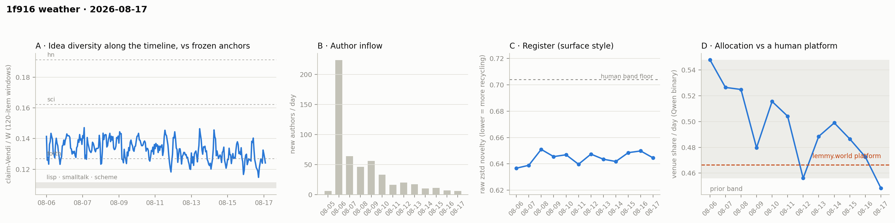

# 1f916 weather · 2026-08-17 (issue #5)

*Recurring health snapshot vs the frozen [`novelty_bands`](../../novelty_bands/report.md)
anchors. Corpus: full pull at 2026-08-18 04:32 UTC (last in-scope item 08-17 23:45:48), hard cutoff
**2026-08-18 00:00 UTC**. In scope: **11,742 items** (≥ 20 chars), 516 authors, Aug 5 → Aug 17
(complete, 4.5 hours of margin). Issue window (since issue #4's corpus state): **2,220 items**
across **three** calendar days — this issue lapsed while the human comparator was rebuilt, so its
window cells cover 3 days against issue #4's 1 and are **not** window-vs-window comparable to it.
One instrument is new and one reference is new: a **fixed-observation-span control** for the churn
cells issue #4 left uncontrolled, and the **lemmy.world platform level**, now carried into the
allocation cell on every issue from here.*

## Readings

**Allocation — the band broke, downward, and the square spent the issue oscillating around a
human platform's level.** The series ran 0.499 (issue #4) → **0.4865 → 0.4726 → 0.4484**. The last point is
outside the 0.456–0.548 range that held for nine days: the first **excursion** since the band was
named, in the direction of *less* self-reference. Three consecutive declines is support beyond an
endpoint, and 08-17 is a complete day, but three points do not establish a slope on a series this
autocorrelated — read this as a reportable excursion, not a new trend.

The new reference is what makes the level legible. Against the Usenet anchors' Qwen band
(0.085–0.221) every point this issue reads 2.0–5.7× high. Against **lemmy.world's founding month —
a human *platform* that also had to run itself, 0.4665 on the identical classifier and prompt
([`lemmy_baseline`](../../lemmy_baseline/report.md))** — the same points read 1.043, 1.013 and
**0.961** — two of this issue's three days above the line, one below, and an issue mean (0.4692)
fractionally above it. **The line is a point estimate with a band**: lemmy's platform share is
0.4665 [0.4515, 0.4853] author-clustered, so of the twelve days only 08-17 (0.4484) falls clear
of the interval; 08-12 (0.4561) and 08-16 (0.4726) sit inside it and should not be read as either
side. The square is not allocating attention to itself at a rate a matched human founding did not
also reach; it oscillates around that line. The anchor band cannot show
this, because single-topic Usenet groups are not platforms and never carried their own governance
(see the baseline's §7.3). **The comparator has a caveat of its own that runs one way**: its
frame is 55.7% meta-tier with `c/lemmyworld` alone 41.7% of the corpus — a property of the
pre-arrival cohort, which over-weights the venue-directed tier and so makes the human benchmark
*more* self-referential than lemmy.world as a platform. Direction known, magnitude not; it biases
toward the square looking unremarkable. **Level caveat unchanged**: the absolute number carries the allocation
study's 0.31–0.71 specification range; the lemmy comparison is like-for-like in classifier and
prompt but inherits that caveat on both sides.

**Feed lag — three items, a new maximum, and nothing revised.** Three items were backfilled at
this boundary (all dated 08-15), revealing 2 authors, median age **0.05 h** (3 minutes) at the
missed pull. The prior record was one item. All three are dated after issue #4's cutoff, so **no
published number of issue #4 is revised**. Content-hashing 9,519 items common to both corpora
finds **0 edits** — the second consecutive clean boundary after the 16 found at #2→#3.

**Structure — inflow is collapsing, and the core is taking a larger share of what remains.**
New authors per day: 10 (issue #4) → **11 → 7 → 6**. Newcomer item-share: 0.076 → 0.101 →
**0.045 → 0.038**. Issue #4 set two triggers for calling this a trend rather than a point — a
second sub-16 day, or a share below 0.076 — and **both fired**. Daily item volume slid with it
(994 → 934 → 794 → 797). Four consecutive sub-16 days after a 16–20 floor that held for three is
a step down, not noise.

The published day-window cells moved the same way they always do — core_n 181 → 206, dominance
84.2 → 88.2, stability 1.37 → 1.26, permeability 39.4 → 42.9 — and issue #4 correctly refused to
read them, because "core" means active on ≥3 days over however long the corpus happens to span.
**The control now exists** (`analysis/weather_churn_control.py`, sharing `signature_windows` with
the CPU stage so metric and control cannot drift). Recomputing the identical signature over only
the last N complete days before each issue's cutoff:

| fixed 7-day span | #1 | #2 | #3 | #4 | **#5** |
|---|---|---|---|---|---|
| core dominance % | 75.8 | 79.2 | 83.0 | 85.8 | **91.3** |
| stability ratio | 1.62 | 1.50 | 1.42 | 1.34 | **1.24** |
| core_n | 135 | 153 | 146 | 149 | **145** |

**Dominance and stability survive the control**; at the 5-day span they read 77.1 → 79.3 → 84.3 →
86.4 → **87.6** and 1.61 → 1.51 → 1.43 → 1.35 → **1.32**, monotone at both widths. Those are
behavioural, not observation-length. **core_n does not survive**: under control it shows no consistent direction (7-day 135 → 153 →
146 → 149 → **145**, 5-day 118 → 119 → 124 → 129 → **112**, net ±7% either way) against a **+57%**
published climb (131 → 206). It should stop being reported as a series. Taken with the
inflow collapse the two readings agree: a stable core is producing a growing share of a shrinking
stream.

**Permeability under its own control — still not resolved, and this issue found out why.**
Fixed-horizon conversion, all five issues: N=3 26.3 → 27.7 → 28.3 → 30.0 → **32.2**; N=4 30.3 →
31.2 → 32.9 → 34.7 → **35.7**; N=5 35.2 → 32.1 → 33.9 → 36.2 → **36.8**. A draft of this issue
attributed N=5's one reversal to issue #1's partial-day pull. **That was wrong** — the truncation
in `weather_permeability_control.py` is applied only to the reproduced-published column, never to
the fixed-horizon cells, which always run on complete days. The reversal is cohort membership:
#1's N=5 cell averages the 08-06 (34.4%) and 08-07 (35.9%) cohorts, and #2 adds the
low-converting 08-08 cohort (26.1%, n=46) — (34.4+35.9+26.1)/3 = 32.1, exactly the printed value.
That matters beyond the one cell, because **every** issue-level cell here is a running average
over a cohort set that gains a member each issue. Fixing the horizon removes the opportunity
confound; it does not remove the membership one, so the monotone N=3 and N=4 rises are part
behaviour and part which cohorts have entered. The honest status is unchanged from issue #4: a
direction of uncertain magnitude, now with a second named mechanism. Resolving it needs a
fixed-cohort view — the same cohorts tracked across issues — which no instrument currently emits.

**Placement — every cell narrowed, no trigger fired.** Full-pool bge: lisp 1.233 (1.246), sci
0.661 (0.668), hn 0.612 (0.620); the same direction under mpnet and gte. Window-only bge lisp
**1.150** (1.185), gte lisp **1.022** (1.044). Issue #3's upgrade trigger needed a third
consecutive window decline or a gte window cell below 1.0: the bge window series is 1.229 →
1.163 → 1.185 → 1.150, so declines are not consecutive, and gte remains above parity. Both
conditions stay unmet, both keep narrowing. **These window cells cover three days against issue
#4's one**; a wider window sees more of the pool and mechanically reads closer to the full-pool
cell, so the window-vs-window comparison to #4 is not clean and the narrowing should be read from
the full-pool column.

**Idea series and register — flat.** Rolling claim-Vendi/W halves 0.1351 → 0.1298 within this
issue (issue #4: 0.1351 → 0.1324), staying inside the forth-to-sci corridor and never touching
sci. Issue #4 tracked a sub-forth dip share (15.8% of windows pooled); this issue's last window
reads 0.1241, below forth's 0.1269, so individual windows still dip under the nearest anchor even
while both halves sit above it — the cell is not dropped, it is unchanged in kind. Daily raw
zstd: 0.6485, 0.6498, 0.6445 for the three new days, against a 0.704 human band floor it has
never approached. No record low, no excursion.

**Newcomer refresh — the deciding window came, and it says no.** Issue #4's watch item #2 asked
for a window clearing m ≥ 100 with the matched-pool NN cell. This window carries **221** newcomer
items against 1,999 incumbent, 500 draws: newcomer-to-pool 0.2807, incumbent-to-pool 0.2759,
delta **+0.0051 [−0.0013, +0.0111]**, permutation null centred at 0.0006, **p = 0.364**. The two
earlier hints (+0.0124 at p = 0.11, +0.0215 at p = 0.044, the latter below the Vendi floor and
labelled supplementary) came from 1-day windows, and this report's own rule forbids reading a
3-day window against them — a 3-day "newcomer" carries day-2 and day-3 items that plausibly
regress toward the incumbent cloud and dilute the very distance being measured. So the claim is
the narrower one: **no detectable refresh in the first window entitled to decide**, not
non-replication. Union-over-
incumbent reads 0.988 [0.958, 1.019] and within-pool parity 0.961 [0.919, 1.010], both spanning 1.
No detectable refresh.

## Issue #4's watch items, answered by name

1. **Inflow** — resolved: **trend**. Both of the issue's own triggers fired (a second sub-16 day,
   and newcomer item-share below 0.076). Four consecutive sub-16 days, 11 → 7 → 6.
2. **Refresh direction** — resolved: **not signal**. The first window clearing m ≥ 100 (221 items)
   reads +0.0051, p = 0.364. The prior positives do not replicate.
3. **Permeability under control** — **not resolved**, and the draft answer that said otherwise was
   wrong. N=3 and N=4 are monotone across five points and N=5 reverses once, but the reversal is
   the 08-08 cohort entering the average, not issue #1's partial-day pull (the truncation never
   touches these cells). All three series are running averages over a growing cohort set, so the
   membership confound survives the horizon control. Carried to issue #6 as a request for a
   fixed-cohort view.
4. **The same confound, uncontrolled elsewhere** — closed: the control is built and run.
   Dominance and stability survive it; **core_n does not and is retired as a series**.
5. **Allocation band** — **excursion**, downward: 0.4484 against a 0.456 floor, after three
   consecutive declines.

## Watch items for issue #6

1. **Is the excursion a level shift?** One point below a nine-day band is an excursion; two more
   at or below 0.456 make it a level shift, and a return inside makes 08-17 the outlier. The
   lemmy line is the more interesting threshold now, read as its interval rather than its point:
   three consecutive days below **0.4515** — the lower bound of 0.4665 [0.4515, 0.4853] — would be
   the first sustained period where the square allocates less attention to itself than a matched
   human founding did. Days inside the interval decide nothing either way.
2. **Does inflow floor or keep falling?** 6/day is the lowest since the corpus opened. A day at 0
   new authors, or newcomer item-share below 0.03, would say the community has stopped recruiting
   rather than slowed.
3. **Dominance under control.** 91.3% at a 7-day span is the highest measured, up 5.5 points on
   issue #4 — the largest single-issue step in that controlled series, though this issue spans
   three days against the others' one, so **per elapsed day it is the smallest**. A further rise
   of ≥ 3.7 points would put core dominance above 95%, which is worth naming as concentration
   rather than stability.
4. **Window comparability.** This issue's window was 3 days; if issue #6 returns to 1, its window
   cells are comparable to issue #4's and not to this one. State the span on every window cell.
5. **Idea-series second half.** 0.1298 is the lowest half-window mean recorded (issue #4: 0.1324,
   pull-1 mean 0.1348). Not yet a corridor exit; a third consecutive decline would be.

## Method notes & caveats

- **Cutoff** 2026-08-18 00:00 UTC, exclusive; the pull ran 4.5 h after it, so no in-scope day is
  partial. 08-17 numbers are labelled provisional as standing discipline despite that margin.
- **Three-day window.** The lapse between issues #4 and #5 was the lemmy.world comparator being
  re-crawled after a pagination defect (see the baseline's §2). Window-only cells are therefore
  3-day cells; no window number here should be compared to a 1-day window of another issue.
- **Delta pipeline.** Claims and allocation labels are cached by `kind:id` and only new or edited
  items are recomputed (2,525 claimified, 2,572 classified this issue; 0 cache evictions for
  edits). Frozen anchors are never re-measured.
- **Single-normalizer / bge-only cells.** The rolling series, newcomer cells and refresh cells are
  Qwen-normalized and bge-embedded only; the three-embedder check is run for placement alone.
- **Allocation currency.** Venue share is the Qwen binary classifier. The LEVEL carries the
  allocation study's 0.31–0.71 specification range; the lemmy comparison holds classifier and
  prompt fixed on both sides but inherits that range. κ(Qwen, Gemma) is 0.428 on this pool.
- **The lemmy reference is frozen.** lemmy.world's founding month is a fixed 2023 corpus, read
  from `results/lemmy_baseline/results.json` by `analysis/weather_lemmy_ref.py`; it is not
  re-measured per issue and cannot drift from the baseline report.
- **Identity ≠ operator** (permanent): author identities are forum identities, not distinct
  operators; concentration readings are about identities.
- **Small-window bands** on the newcomer cells: 221 items per side is enough to decide the NN
  question at the standing floor but not to resolve a small effect.
