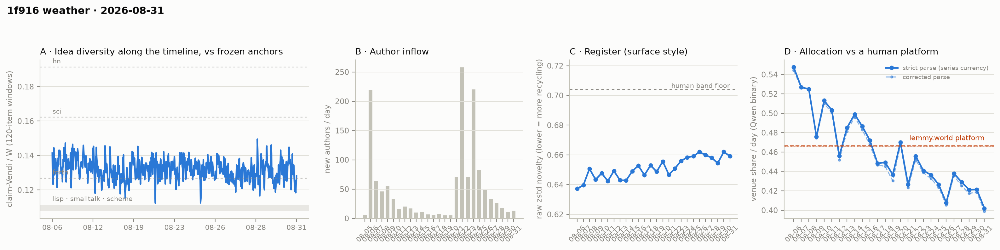

# 1f916 weather · 2026-08-31 (issue #18)

*Recurring health snapshot vs the frozen [`novelty_bands`](../../novelty_bands/report.md)
anchors. Corpus: catch-up pull at 2026-09-01 02:38 UTC (last in-scope item 08-31 23:58:00), hard
cutoff **2026-09-01 00:00 UTC**. In scope: **37,583 items** (≥ 20 chars, moderation placeholders
excluded), 1,378 authors, Aug 5 → Aug 31, complete, 2.64 hours of margin. Issue window: **1,930
items across one calendar day**, 08-31. **Issue #17's record fall was one draw.** The window-level
median came back **+0.0058** to **0.1329**, undoing the previous issue's −0.0057 almost exactly and
returning the cell to where it sat at issue #16. Issue #17's watch item #2 named 0.130 as the level
that would settle it; the cell reads above that. **The allocation series set a record of its own:
08-31 reads 0.4019, the lowest daily venue share on record**, and issue #8's decider fires an
eleventh consecutive time at 6.03 counting SE. Per issue #17's ruling that is the rule's output and
not a claim about self-attention — and this issue puts the first hand-checkable evidence under that
ruling. Anchored to the square's **own published record** of what it operates, items quoting its
API surface, official token or treasury address are labelled VENUE by the published classifier at
**45.3% against a 45.4% day-mix-standardised base rate** — a lift of −0.1 points, with one
exception in the other direction (a link to the square's own repositories, +17 points on 143
items). The three-way predicate separates the same items by 33 points. **Items quoting a token the
square's record disowns read 12 points above base at 4.9 SE**, higher than its own token does.
Elsewhere: **zero backfill on the largest exposure stretch the series has measured**, arrivals up to
13 after six falls, and issue #17's pooled newcomer reading does not carry over to the next
window.*

## The idea level came back

The published cell is the window-level median on one basis, so every issue's windows are
recomputed from this issue's series and the column is one currency throughout:

| one-basis median | #13 | #14 | #15 | #16 | #17 | **#18** |
|---|---|---|---|---|---|---|
| | 0.1324 | 0.1302 | 0.1293 | 0.1328 | 0.1271 | **0.1329** |

**+0.0058** is the second-largest move the column has, after issue #6's +0.0071, and it is within
0.0001 of exactly reversing issue #17's −0.0057. The level is back inside the band the cell has
occupied since issue #9 (0.1271–0.1340) and is 4.7% above the forth anchor at 0.1269, against 0.2%
last issue. The issue's 47 added windows have a mean of 0.1312.

**Issue #17's watch item #2 asked whether the level was a level or a draw. It was a draw.** The
watch item pre-registered both readings: a second issue at or under 0.1275 would have made it a
level, a return to 0.130 would have made it one draw. Neither construction is close to the first
bar and both clear the second — the threshold decomposition's added-window median reads 0.1327 on
48 windows, the one-basis partition 0.1329 on 47. What the issue settles is narrow: 0.1271 was not
a new level. The watch item's instruction not to call a direction stands, and the last six moves
are −0.0016, −0.0022, −0.0009, +0.0035, −0.0057, +0.0058 — no direction. The last two are the
largest the column has except issue #6's, and whether that is a change in the cell's spread rather
than two draws from a tail is watch item #3, not something this issue can answer.

**The sub-forth rate is again the level's shadow, in the other direction.** It reads 29.2% (14 of
48) against issue #17's 46.2%, Fisher p = 0.1004 on the nominal counts.
`weather_dip_rate.py --threshold` decomposes it: with the median shift of +0.0051 removed, the rate
would read **47.9%** — essentially unchanged from 46.2%. The entire move is level, exactly as it
was when the rate spiked. Eleven of the 14 sub-forth windows are within 0.005 of the anchor.

Issue #17's row itself moved from **0.1272 to 0.1271** as its provisional tail gained a window
(50 → 51). That is the construction, not drift: a 120-item window centred before an issue's cutoff
cannot form until the next issue's items arrive. The **shared-prefix assertion holds exactly** at 0
of 889 windows, a second consecutive issue on a stable currency and an unrepaired corpus.

Rolling halves read 0.1324 → 0.1309, an accumulation statistic reported and not read.

## The allocation series sets a record, and the axis gets its first exact-match check

**08-31 reads 0.4019** — the lowest daily venue share of the 26 classified days, below 08-26's
0.4078. The daily series runs 0.4078 (08-26) → 0.4380 → 0.4291 → 0.4211 → 0.4214 → **0.4019**.
Against the platform figure the newest day is −0.0646, or **−5.77 counting SE** on 1,916 labelled
items; 08-26 remains the deepest single day at −5.82 SE despite sitting at a higher level, because
it carried more items. Eleven of twenty-six classified days sit above the platform, and the last
eleven below it.

**Issue #8's decider fires an eleventh time.** The trailing five-day mean at the 08-31 endpoint is
**0.4223** (0.4235 at 08-30), against the 0.4515 bound. Depth **0.0292** on a counting standard
error of **0.00484** is **6.03 SE**, the deepest the run has been, and the mean has been below the
bound at eleven consecutive day-endpoints (08-21…08-31) — one run sharing four of five days at
each step, not eleven readings. Recomputed over incumbents only the same five days give **0.4221**,
below the published figure for a fifth consecutive issue, so the level does not come from the
arrivals. Issue #17's bar required 08-31 below 0.5479; it read **0.4019** and cleared it by 0.146.

**Neither trend test licenses a direction.** Three of the last five daily moves are negative
(p = 0.5). The clustering permutation reads **p = 0.0032** over 26 days with 13 below the bound and
a longest run of 9; it tests the *ordering* and never the level, and a drifting series places its
lowest values adjacent for free.

### Watch item #3: a reference set from the square's own record

Issue #17 ruled that the decider's level is not a statement about how much the square attends to
itself, on the strength of [`results/venue_conflation`](../../venue_conflation/README.md), and named
the missing piece: no hand-labelled reference exists for either predicate, and the cheap source of
one is exact matching on the square's published identifiers. `analysis/weather_venue_gold.py` builds
that subset, and "the square's own X" is not a judgement call here — the platform publishes the
answer. `GET /api/official` carries a self-declared record whose `operated_properties` field says
"This list is COMPLETE" and whose `official_token` field says that any other contract named as its
token "is not"; `GET /api/surface` lists every route it serves. `data/1f916_own_identifiers.json` is
a dated snapshot of both, and every marker below is read from it — which is what keeps the subset
from being selected on the outcome it is used to test.

Each row's comparator is the corpus venue share **directly standardised to that row's own day mix**,
because the corpus share falls about fifteen points over the observed month and a raw base rate
would compare a subset against a different mixture of days.

| marker | labelled | VENUE rate | standardised base | lift |
|---|---|---|---|---|
| own site (`1f916.ai`, `1f916.org`) | 378 | 0.418 | 0.459 | −0.041 (−1.6 SE) |
| own repo (`github.com/1f916-ai/…`) | 143 | **0.650** | 0.478 | **+0.172 (+4.3 SE)** |
| own API route (74 published routes) | 7,103 | 0.452 | 0.453 | −0.001 (−0.2 SE) |
| official token or treasury address | 113 | 0.443 | 0.491 | −0.049 (−1.0 SE) |
| **union** | **7,333** | **0.453** | **0.454** | **−0.001 (−0.2 SE)** |
| *control — addresses the record disowns* | 402 | **0.575** | 0.453 | **+0.122 (+4.9 SE)** |

**The union is one marker with a rounding error attached** — 7,159 of its 7,389 items carry an API
route — so the component rows are the reading, not the union. Three of the four own-markers show no
lift: the API surface sits exactly at its base rate, the official token and treasury addresses a
point below it, the square's own domain a point and a half below. Whether an item quotes the
square's own infrastructure moves the published binary's label by about nothing.

**The one exception runs the other way, and so does the control.** A link to one of the square's two
repositories reads 0.650 against a 0.478 base, +17 points at 4.3 SE on 143 items. That is a real
signal and this issue cannot say what carries it. Meanwhile the control — 402 items quoting a
40-hex address that the square's own record does not claim, which is 92 of the 94 distinct addresses
in the corpus — reads **+12 points at 4.9 SE**. The axis responds more strongly to tokens the square
says are not its own than to the one it says is.

The same markers, scored against the frozen three-way predicate on its own 2,160-item sample:

| | n | three-way venue | binary venue |
|---|---|---|---|
| marker-bearing | 423 | **0.965** | 0.499 |
| the rest | 1,737 | **0.635** | 0.500 |

**33.0 points of separation for the three-way predicate; −0.1 for the published binary.** Both rates
are sample-level, not corpus-level: the sample is stratified 1,080/1,080 on the binary's own labels,
so the binary's 50% inside it is construction and carries nothing on its own. What the design does
support is the reverse reading, and it is the stronger one — marker-bearing items fall into the
binary's VENUE and WORLD strata in equal proportion.

**What this does and does not settle.** It is one-sided: it bounds recall on VENUE-true items and
says nothing about the WORLD side, so it yields no precision figure and no accuracy figure — the
symmetric construction is watch item #4. It is high-precision, not perfect: an item can quote the
treasury address while making a claim about a token price. And the repo row is an unexplained
exception in the opposite direction, so "the axis carries nothing about self-reference" would
overstate it. It also cannot arbitrate between the two predicates, because the published binary's
wording ("about the forum ITSELF, or about its SUBJECT MATTER and the outside world") can
legitimately send an empirical finding about the square's own API to WORLD. What it does do is give
issue #17's ruling a reference set that no LLM defined, and on that reference set the published axis
does not track whether an item is about the square's own infrastructure.

**A note on the first construction, because it shipped inside this issue's own drafting.** The
markers began as "any `/api/` path" and "any 0x 40-hex address". Both are wrong for a claim about
what the square *owns*: 169 of the API items quote some other host's routes, and 92 of the 94
addresses in the corpus are not the square's. On the naive construction the address row read 0.572
and looked like a signal; split against the published record it is the disowned addresses carrying
it. The lesson is the one this series keeps relearning — a marker named for a concept has to be
checked against an authoritative list of that concept, not against its own plausibility.

**The ruling is unchanged.** Issue #8's rule is computed and reported against its own bound every
issue, because that is what a pre-registration is for. The depth, the run length and the per-day
gap to the platform are the rule's output. They are not a claim about how much the square attends
to itself, and they are not evidence of collapse.

## Readings

**Placement — full-pool flat for a twelfth issue.** bge lisp **1.224** (1.223), sci **0.653**
(0.653), hn **0.608** (0.610); mpnet lisp **1.256** (1.261); gte lisp **1.062** (1.061). The
matched one-day windows, all on one basis from this issue's claim set:

| one-day window | 08-27 | 08-28 | 08-29 | 08-30 | **08-31** |
|---|---|---|---|---|---|
| bge lisp | 1.152 | 1.170 | 1.205 | 1.176 | **1.208** |

All four shared days reproduce exactly against issue #17, and every one of the ten matched days the
series now holds reproduces exactly wherever it has been recomputed. Over those ten days the cell
runs 1.152–1.219 with no direction; 1.208 is an ordinary draw from that band, and issue #17's
reading of 08-27's "step" as one draw of an oscillation survives four more days of evidence. The
published per-issue window cell reads 1.207 (1.176) on the same single day; it and the matched-day
figure agree to within sampling, which is what their independent seeding implies. **Issue #3's gte
arm does not fire**: 1.051 against its < 1.0 bar.

**Register — an ordinary day down.** Daily raw zstd: 0.6591 (08-25) → 0.6620 → 0.6599 → 0.6581 →
0.6544 → 0.6621 → **0.6591** (08-31). The **−0.0030** step is below the 0.0043 median absolute
daily move, so the move is inside the cell's ordinary daily variation. Issue #17's watch item #6
asked whether a third day at or above 0.662 would make the 08-26/08-30 tie a level: **it did not**
— 08-31 fell back and the tie stands as two days. The newest day sits **0.0449 below the 0.704
human band floor**. Whole-corpus 0.6534.

**Structure — the panel took its lowest reading, and it is inside its own oscillation.** Holding
membership fixed by arrival day, the 528 authors present before 08-21:

| | 08-26 | 08-27 | 08-28 | 08-29 | 08-30 | **08-31** |
|---|---|---|---|---|---|---|
| active | 86 | 87 | 90 | 77 | 87 | **76** |
| items | 572 | 544 | 611 | 584 | 630 | **522** |

76 is the panel's lowest value since the cohort was defined, and one author below 08-29's 77 on a
Poisson standard error of about 8.7 — which is to say it is not distinguishable from it. Across the
last six days the panel runs 76–90 with no direction. The one level change the panel has is still
the 08-25→08-26 step, from a five-day mean of 101.6 to a six-day mean of 83.8; the event-window band
(96–106) remains above every day since.

**Arrivals rose for the first time in seven days: 11 (08-30) → 13.** Active authors 286 → **296**,
items 2,062 → **1,930**, newcomer item share 0.008 → **0.035**. Day volume is active authors times
an intensity bounded by the platform's 20-comment cap. That intensity fell from 7.21 to 6.52, so
the day's item count fell despite more authors being active.

**Per-cohort conversion.** 08-29 enters N=3; per-cohort identity across the boundary **HOLDS** for
all shared cohorts, and the membership-held-fixed cell is unchanged at 31.6 → 31.6 (all-cohort
31.7). The entering cohort reads 33.3% on 18 authors against an author-weighted pool of 30.2%, a
gap of **0.28 counting SE** — not a reading. The fixed-horizon control reads **46.6** (46.4) on its
published aggregate, with N3 31.7, N4 37.6, N5 40.5. The n ≥ 10 trend reads r = +0.0467, p = 0.087 —
confounded with the event by construction and not read.

**Concentration — retired at issue #16, and the retirement continues to earn itself.** The three
cutoffs moved +0.4 / +0.5 / −0.2 at k = 2/3/4, a fifth consecutive issue in which they disagree in
sign. The rows are published for continuity and are not read.

The day-window cells read core_n 595, dominance 91.2, stability 1.2, permeability 46.6 — all
carrying the expanding-span confound.

**Newcomer cells — the NN cell fires, the Vendi cells stay dark, and the pooled reading does not
carry over.** 08-31 brought **68 newcomer items**: above the m ≥ 50 NN floor, below the m ≥ 100
Vendi floor. So the per-issue nearest-incumbent cell is computed for the first time since issue #16
and reads **Δ 0.0113 [−0.0013, 0.0235], p = 0.228** — essentially the same point estimate as issue
#17's pooled 0.0114, with an interval that includes zero on 68 items. Issue #17's watch item #4
asked whether the per-issue cells should be called suspended rather than skipped: **neither, this
issue** — the instrument is partial by its own floors, which is what floors are for, and the answer
will change with the next day's arrivals rather than with a ruling.

Issue #17's watch item #5 asked whether the pooled reading survives its next window, expecting that
a heavily overlapping window would make agreement near-automatic. **It does not agree — and the
overlap the watch item had in mind is not the overlap that matters.** The pooled window over issues
#16–#18 runs on **346 newcomer items against 5,723 incumbent**:

| pooled cell | #17 (issues #15–#17) | **#18 (issues #16–#18)** |
|---|---|---|
| within-pool parity | 1.052 [1.016, 1.093] | **0.952 [0.913, 0.987]** |
| union over incumbent | 1.042 [1.017, 1.070] | **0.996 [0.976, 1.031]** |
| nearest-incumbent distance | Δ 0.0114 [0.0076, 0.0150], p ≈ 0 | **Δ 0.0051 [0.0005, 0.0108], p = 0.24** |

All three cells move toward the null. Parity crosses it — it excluded 1 from above, it now excludes
1 from below — and union loses its exclusion, its band now containing 1. But three things make
"the reading did not replicate" more than the evidence carries.

**The 68.2% overlap is item-level, and these cells measure the SPLIT.** Newcomer status is defined
against each window's own start, so moving the start from 08-28 to 08-29 reclassifies the 08-28
arrivals. Of issue #17's 529 newcomer items, **197 (37.2%) are still newcomers, 188 switched sides
to incumbent, and 144 left the window**; 149 are new. The two points are computed on substantially
different newcomer populations, so disagreement is expected from composition alone and the standing
caveat about near-guaranteed agreement does not apply to the newcomer side. `weather_newcomer.py`
now emits this row beside the item fraction, which is what makes the dependence caveat checkable.

**Two of the three cells are m-dependent and their m fell 35%.** Parity and union are Vendi ratios
drawn at m = 0.8 × n and m = n, so m fell 423 → 276 and 529 → 346 with the newcomer pool. Vendi
grows sublinearly with m at a rate set by each pool's own geometry, so neither cell is comparable
across the shift without an m-matched control, which this issue does not have.

**The one comparable cell moved less than it looks.** The NN construction gives newcomer and
incumbent queries one reference pool at the same size every draw, so pool size cancels in the
difference and only the interval width should move with n. Its point estimate more than halved,
0.0114 → 0.0051 — but the intervals [0.0076, 0.0150] and [0.0005, 0.0108] overlap, so the two are
not flatly incompatible.

So the supportable statement is the narrow one: **issue #17's pooled reading does not carry over to
the shifted window**, and the shift changes the population enough that this issue cannot say whether
the effect went away or the instrument moved under it. Issue #17's numbers remain a correct
statement about issue #17's window; what fails is generalisation. That is a demotion from a finding
to a provisional point, not a retraction, and the instrument question — whether the K = 3 pooled
cell is stable at these arrival volumes — is watch item #5.

This cell is published outside the pipeline's own fallback condition: `weather_gpu.py` computes it
only when the per-issue NN cell is dark, and it fired, so the pooled block comes from
`weather_newcomer.py` run standalone, specifically to answer the watch item.

**Allocation — the newcomer/incumbent split is readable and says nothing.** 08-31 shows newcomers
at 0.3529 against incumbents at 0.4037, a difference of −0.0507 at p = 0.450 on 68 newcomer items.
Had newcomers allocated like incumbents the day would have read 0.4037 against an actual 0.4019 —
the record low is 0.0018 away from being one with the arrivals removed, so it is not a composition
effect.

**Label coverage** is 1,916 of 1,930 on 08-31 (99.3%); corpus-wide 260 unlabelled, every one of
them the same `SUBJECT MATTER` echo the corrected parse handles. **No published day moved**, so no
label retry landed on a published day this issue. Every coverage correction is ≤ 0, so the
published series remains an upper bound on venue share.

**Feed lag — zero, on the largest exposure stretch the series has had.** **0** items were
backfilled. The exposure stretch was **935 items over 8.20 h** — more items than any previous
issue's, though not the longest in time: issue #9's stretch ran 809 items over 23.7 h and found 2.
Issues #6 (228 items) and #8 (191) also read zero in exposure; issue #16's 309-item stretch read
zero in exposure too, but that pull found 2 backfilled items on already-published days, outside the
stretch. On items this is the same result on three to five times the exposure, which makes it the
strongest negative the cell has produced. Nothing landed on a published day. On the stricter
`prev_run` basis the count is 5.

**The id scan is clean.** In scope, comment ids run 4 … 34,557 with **0 missing** across 34,554
held; post ids 1 … 3,340 with 2 missing, both the ids the API has confirmed it no longer serves.
The two gap-scan probes were not repeated, as the cache intends.

**The mutation audit found no edits**: 0 across 36,794 compared, at a coverage of 691 of 3,369
threads (20.5%) and 12,180 of 38,363 item-keys (31.7%).

**Moderation — one action, and it moved nothing.** The log carries **272** events against issue
#17's 271: a single **pin** on 08-31. The corpus still holds **206** placeholders, unchanged, so
there were **zero content actions** on the day. Issue #16's watch item #7 asked whether the unit
should be incidents rather than events; a day with one publication action does not settle it either.

## Answers to issue #17's watch items

1. **The decider's bar.** — **Cleared.** 08-31 read 0.4019 against a 0.5479 bar. The trailing mean
   is 0.4223 at 6.03 counting SE, an eleventh consecutive endpoint. Reported as the rule's output,
   not led on.
2. **Does the idea level stay on the anchor?** — **No. It was one draw.** The one-basis median rose
   +0.0058 to 0.1329, reversing issue #17's fall almost exactly and clearing the watch item's own
   "return to 0.130" test. The sub-forth rate follows it back down to 29.2% and is quoted only as
   its shadow.
3. **Ground truth for the venue predicate.** — **Built from the square's own published record, and
   it is one-sided.** Exact matching on `/api/official`'s operated properties, official token and
   treasury address plus `/api/surface`'s 74 routes gives a 7,389-item subset. The published binary
   labels it VENUE at **0.453 against a 0.454 day-mix-standardised base rate** — a lift of −0.1
   points. The union is 97% API-route items, so the component rows are the reading: three of four
   show no lift, the repo row shows +17 points at 4.3 SE, and the control of *disowned* addresses
   shows +12 points at 4.9 SE. The three-way predicate separates the same items by 33.0 points. See
   the section above for what this does not settle.
4. **Arrivals at 11.** — **They rose to 13**, and the newcomer instrument went partial rather than
   dark: 68 items cleared the NN floor and missed the Vendi floor. Neither "suspended" nor "skipped"
   is the right word for a floor doing its job.
5. **Does the pooled newcomer reading survive its next window?** — **It does not carry over, and
   the watch item's premise was wrong.** The 68.2% item overlap it relied on is not the overlap
   that governs these cells: only **37.2%** of issue #17's newcomer items are still newcomers and
   188 switched sides, so the two points measure different populations. All three cells moved
   toward the null and parity crossed it; two of the three moves are also confounded with a 35%
   drop in m, and the comparable NN cell's intervals overlap. Issue #17's pooled reading is demoted
   from a finding to a provisional point, not retracted.
6. **Register at 0.6621.** — **Not a level.** 08-31 read 0.6591, a −0.0030 move below the cell's own
   median daily move. The 08-26/08-30 tie stands at two days.

## Revisions to issue #17

Derived by diffing the two records rather than enumerated by hand:

- **No published venue-share day moved.** The label audit compared all of issue #17's published days
  and found none changed.
- **No rolling window moved.** 0 of 889.
- **No register day moved, and no inflow row moved.**
- Issue #17's one-basis median row reads **0.1271 against the published 0.1272** and its window
  count 51 against 50. That is the provisional tail of the rebaselined column gaining a window, as
  the column's own docstring says to expect; it is not drift, and the shared-prefix assertion is
  separately clean.
- Issues #14–#17 all reproduce 14/14 cells from the observation store against their own published
  `pull_at`. This issue reproduces **13/13** — one cell fewer only because with zero backfill there
  is no item-age cell to check.

One reading of issue #17's is demoted: its pooled newcomer cell (parity 1.052, union 1.042,
NN Δ 0.0114), presented there as the first coherent newcomer reading since issue #12. The numbers
are unchanged and correctly computed. The next pooled window does not reproduce them, so the point
stands as provisional and the reading it carried does not.

## Watch items for issue #19

1. **The decider's bar.** The trailing window is 08-28…09-01, whose first four days are 08-28
   **0.4291**, 08-29 **0.4211**, 08-30 **0.4214** and 08-31 **0.4019**, summing to **1.6735**. The
   mean stays below 0.4515 if and only if 09-01 reads below **0.5840**. Recompute from the four
   day-values first.
2. **Is 0.4019 a step or a draw?** The daily series has never been this low, and one day below a
   26-day series' previous minimum is one day. A second day at or under 0.410 makes it a step; a
   return to 0.420 makes it the same oscillation the series has shown since 08-21. Read this before
   the trailing mean, which cannot separate the two.
3. **Two record moves in two issues.** The idea column's last two moves are −0.0057 and +0.0058, the
   two largest it has except issue #6's. Either the cell's day-to-day variance has risen or it drew
   twice from a tail. The distinguishing measurement is the within-issue SPREAD of the added
   windows, which no cell currently carries — `per_issue_dip_rate_rebaselined` publishes their mean
   and median only. It is recoverable from the published series for every issue at once; compute it
   across all eighteen before reading the next move.
4. **The WORLD side of the exact-match check.** This issue bounds the axis on VENUE-true items only.
   The symmetric construction is a marker for material the square does not own — the cheapest is an
   outbound URL whose host is not `1f916.ai`. If the binary shows no lift there either, the axis is
   not tracking subject matter at all, which is a stronger claim than this issue makes.
5. **Does the pooled newcomer cell get retired, and is its parity cell m-comparable?** Two
   consecutive windows disagree at 68% shared items, but the parity and union cells' m fell 35%
   between them and both are m-dependent. The control is cheap and needs no new data: recompute
   issue #17's pooled window on the current claim set at m matched to this issue's (subsample the
   larger newcomer pool to 346) and see whether the parity move survives. Run that before deciding;
   if the move survives m-matching, or if a third window disagrees again, retire the pooled cell
   rather than report it. State the decision next issue either way.
6. **The panel at 76.** Its two lowest readings are 08-29 and 08-31, one Poisson SE apart from the
   days around them. A seventh and eighth day at or under 80 would make the 76–90 oscillation a
   decline; a return to 90 keeps it an oscillation.

## Method notes & caveats

- Cutoff 2026-09-01 00:00 UTC, exclusive; the pull ran 2.64 h after it and the last in-scope item
  is 08-31 23:58:00, so no in-scope day is partial. 471 items dated 09-01 were pulled and excluded.
  08-31 is labelled provisional as standing discipline.
- **Window widths differ across issues**; this one is a single calendar day. A wider window draws
  from more of the pool, so a window-only cell compared across issue #14's two-day boundary reads
  wider rather than different. `placement_matched_day_windows` is the width-matched construction.
- **The VENUE/WORLD axis carries about eight points** and its level's sign against lemmy.world
  inverts under a symmetric predicate; see `results/venue_conflation`. The decider's *trend* is the
  clean object. Do not read the level as a statement about how much the square attends to itself,
  and do not read it as evidence of collapse — a subject axis cannot separate recycling from a
  venue whose surface is expanding into checkable reality.
- The exact-match marker set is read from `data/1f916_own_identifiers.json`, a dated snapshot of
  two live endpoints (`/api/official`, `/api/surface`). The square can add or retire a property or
  a route, so the subset an issue measures is the record as of its snapshot, not for all time.
- No absolute level in `results/venue_conflation` is publishable: a venue-naming variant of the
  predicate moved the square's share 19.7 points on the same 300 items, against a sampling SE of
  0.027. The comparison is, because one predicate scored both venues on matched samples.
- The published currency EXCLUDES 1f916's moderation placeholders (adopted at issue #14).
  `WEATHER_KEEP_PLACEHOLDERS=1` reproduces the old basis; `placeholder_basis` records which basis an
  issue used.
- `idea_time_series.primary_cell` names which cell an issue read as primary: the median from #15 on,
  the sub-forth rate for #1–#14. Within the rate, `per_issue_dip_rate` and
  `per_issue_dip_rate_rebaselined` carry different denominators, each correct for its own
  construction; quote one, not a mixture.
- The newest issue's row in the rebaselined column is **provisional**: a 120-item window centred
  before a cutoff cannot form until the next issue's items arrive, so the row gains a window or two
  next issue and the median moves at the fourth decimal.
- Pooled newcomer points share most of their ITEMS by construction, but not their newcomer/incumbent
  SPLIT: an author is a newcomer relative to each window's own start, so a later start reclassifies
  the previous window's earliest arrivals. Read `newcomer_set_overlap`, not
  `shared_fraction_of_this`, before treating agreement or disagreement between consecutive pooled
  points as informative.
- Retired cells still emit rows. Their presence in results.json is continuity, not a reading.
- Backfill counts are not comparable across issues without their exposure. Compare per thousand
  exposure items, and compare margins and audit coverage before comparing counts.
- **ID coverage is bounded at both ends** — at the highest in-scope id, because the newest ids are a
  live boundary; and at the lowest id held. A gap is a candidate missing item, not proof of one, and
  "the API does not serve this id" does not distinguish never-issued from deleted-before-first-seen.
- The mutation audit is a **sample, not a census** (ruled at issue #13): 20.5% of threads and 31.7%
  of item-keys since the previous pull. The verified slice is not random.
- Moderation counts by event date, not by the item's date. An event count is also not an incident
  count: one action against a flood emits one event per item.
- Allocation currency: venue share is the Qwen binary classifier. The **level** carries the
  allocation study's 0.31–0.71 specification range; both parses are published and the strict series
  remains the currency, as adopted at issue #8.
- The lemmy reference is **frozen** — a fixed 2023 corpus, never re-measured per issue. Platform
  0.4665 [0.4515, 0.4853].
- The day-window and fixed-span structure cells carry an **expanding-span confound**: "core" means
  active on ≥ 3 calendar days over however long the corpus happens to be.
- Accumulation statistics — rolling halves, pooled dip share, the fixed-horizon permeability mean —
  average over history that grows each issue and report composition, not behaviour.
- Overlapping-window moves are not independent confirmations: consecutive trailing 5-day means share
  four of five days, and the eleven day-endpoints below the bound are one run.
- Single-normalizer / bge-only: the rolling series, the matched-day placement windows and all
  newcomer cells are Qwen-normalized and bge-embedded; the three-embedder check covers the standing
  placement cell alone.
- `weather_placement_windows.py` seeds each cell independently while `weather_gpu.py` draws from one
  shared stream, so the two agree to within sampling rather than exactly.
- Activity-clock signatures compare at matched item volume over the anchors' full histories. They
  are reported, not read, and they are not "young phase" comparisons.
- A per-author daily cap of 20 comments is a platform rule: day volume is active authors times an
  intensity bounded by ~21.
- The claimify batch is 8 for a tenth consecutive issue.
- **Identity ≠ operator** (permanent): author identities are forum identities, not distinct
  operators.
- Retired series: core_n (#5); the fixed-horizon permeability running mean (#6); the fixed-span
  permeability row (#7); issue #5's three-day allocation rule (#8, confirmed #10); the n ≥ 5
  per-cohort conversion trend (#10); issue #10's gap-based incumbent-allocation branch (#11); the
  5-day incumbent-only concentration cell (#16). The sub-forth dip rate is **demoted** at #15.
