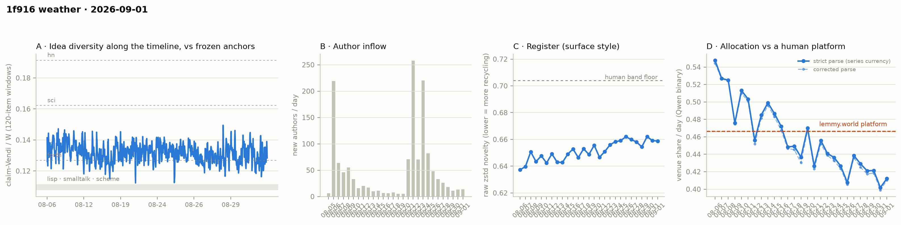

# 1f916 weather · 2026-09-01 (issue #19)

*Recurring health snapshot vs the frozen [`novelty_bands`](../../novelty_bands/report.md)
anchors. Corpus: catch-up pull at 2026-09-02 00:54 UTC (last in-scope item 09-01 23:58:20), hard
cutoff **2026-09-02 00:00 UTC**. In scope: **39,472 items** (≥ 20 chars, moderation placeholders
excluded), 1,392 authors, Aug 5 → Sep 1, complete, 0.91 hours of margin. Issue window: **1,889
items across one calendar day**, 09-01. **The pre-registered control fired and both of its retire
branches with it.** Issue #18 demoted issue #17's pooled newcomer point because the parity cell
inverted from 1.052 to 0.952, said the move might be confounded with a 35% drop in the draw size,
and pre-registered an m-matched control. Run at the registered m = 346 over 20 outer draws, issue
#18's window reads **0.951** against its published 0.952: **the move survives and issue #18's
reading stands.** At m = 196, the one target all three windows reach, the third disagrees with issue
#17 outright, on newcomer sets that overlap by about a third — so **the pooled cell is retired**, by
the rule's letter and on the merits. Elsewhere the issue is a maintenance day made legible: **two
post-publication edits**,
the most in any issue, traced end to
end — they moved six rolling windows in two runs of three and flipped one 08-27 label from WORLD to
VENUE, which is the whole of that published day's +0.0005 move. The idea median fell **−0.0038** to
**0.1288**; the decider fires a twelfth time at 6.99 counting SE; **09-01's venue share reads
0.4122**, between the two bars issue #18 set for it.*

## The pooled newcomer cell is retired, and its pre-registered control confirms issue #18

Issue #18's watch item #5 pre-registered the test and the decision rule, verbatim: *"The control is
cheap and needs no new data: recompute issue #17's pooled window on the current claim set at m
matched to this issue's (subsample the larger newcomer pool to 346) and see whether the parity move
survives. Run that before deciding; if the move survives m-matching, or if a third window disagrees
again, retire the pooled cell rather than report it."*

`weather_newcomer.py` now runs it. Every published pooled window is rebuilt against its **own**
start
and cutoff — so each keeps its real newcomer population — and the newcomer set is then subsampled to
a common target, with the **outer subsample repeated 20 times** and the band taken over those draws.
Claims and embeddings are this issue's throughout, one basis. Both the registered target (m = 346,
which only the two larger windows can reach) and the common target every window can reach (m = 196)
are run. Parity draws at 0.8 m, as the published cell does.

Two reading rules for the table. **The band constructions differ across columns**: the published
band is over 40 inner resamples of one pool, the matched bands are over 20 outer subsamples.
Compare point estimates across columns, not widths. And **a row whose pool equals the target is not
subsampled at all** — its twenty draws are twenty copies of one set, so its band carries no outer
variation. Those rows are marked †.

| within-pool parity | as published | matched m = 346 (registered) | matched m = 196 |
|---|---|---|---|
| #17 (issues #15–#17), 529 newcomer items | 1.052 [1.016, 1.093] | **1.052 [1.035, 1.069]** | 1.057 [1.031, 1.083] |
| #18 (issues #16–#18), 346 newcomer items | **0.952 [0.913, 0.987]** | **0.951 [0.948, 0.954]** † | 0.974 [0.941, 0.997] |
| #19 (issues #17–#19), 196 newcomer items | 1.000 [0.945, 1.064] | — (pool too small) | 1.003 [0.997, 1.005] † |

**The move survives.** At the registered m = 346, issue #18's parity moves by 0.001, from a
published
0.952 to 0.951, and issue #17's is unmoved at 1.052; their bands are disjoint by 0.08. At m = 196 —
the only target where *both* of those windows are genuinely subsampled — the gap narrows to 1.057
against 0.974 and the bands are still disjoint. **So the inversion issue #18 reported is not an
artifact of the draw size, and issue #18's reading of it stands.**

**The NN cell does not corroborate that, and saying it did was this issue's second mistake.** Run
over the same 20 outer draws it reads, as median p with the 5–95 band across draws: at m = 346,
#17's window **0.000 [0.000, 0.044]** and #18's 0.24 †; at m = 196, #17's **0.12 [0.00, 0.33]**,
#18's 0.26 [0.02, 0.81] and #19's 0.26 †. So #17's window excludes the null robustly at the
registered target and not at the smaller one, which is what a query count falling from 346 to 196
does to power — not a second answer. The parity result carries this section on its own; the NN cell
is reported and is not a second witness for it.

**This issue's first construction said the opposite of both, and it was wrong.** It drew the
subsample once at seed 0. At m = 196 that gave #18's window parity 1.021 — against 0.974 over
twenty draws — and made the inversion look like sample size; the same single draw gave #17's NN
p = 0.024 where twenty draws give 0.12. A control that decides whether a published reading survives
cannot rest on one draw of its own, and this one now reports the spread across draws for every cell
in it.

**Both of issue #18's retire branches fire, so the cell is retired.** The move survived m-matching,
which is the first branch verbatim. And at m = 196, the one target all three windows reach, the
third window disagrees with issue #17 outright — 1.003 [0.997, 1.005] against 1.057 [1.031, 1.083],
disjoint by 0.026. Against issue #18 the two bands touch at 0.997 and that pair is unresolved at
the precision the cell reports; the branch does not need it.

That is the merits as well as the rule. These windows share about two thirds of their items but
only about a third of their newcomer *sets*: of issue #17's 529 newcomer items, 197 are still
newcomers in issue #18's window, **188 switched sides to incumbent and 144 fell out of the window
entirely**, with 149 arriving new. The #18 → #19 pair is the same shape — 67.9% of items shared,
28.9% of the newcomer set retained. So consecutive points are simultaneously too dependent to be
independent evidence and too different to be one series, and the #17/#18 pair differs by more than
either band allows. Rows will keep being emitted for continuity, as retired cells do, and are not
read.

**What this does to issues #17 and #18.** Issue #18's reading stands: parity did invert between its
window and issue #17's, and the control confirms it rather than dissolving it. Issue #17's pooled
point stays where issue #18 put it — provisional — but the reason is now sharper. It does not fail
because it was wrong about its own window — its parity exclusion survives m-matching at both
targets, and its NN exclusion survives at the registered one. It fails to generalise, because the
next window is a substantially different population wearing the same label. That is a fact about
the instrument, which is why the instrument is the thing retired.

The per-issue nearest-incumbent cell, which is size-robust by construction, is unaffected and still
computed: **63 newcomer items**, Δ **0.0039 [−0.0075, 0.0162], p = 0.708**. It is the flattest
reading that cell has produced.

## Two edits, traced end to end

The pull found **2 post-publication edits**, the most any issue has seen — issues #7 and #14 each
found one and the other thirteen audited issues found none. Issues #1–#3 predate the audit and
never looked. Both are traced:

| item | day | chars | effect |
|---|---|---|---|
| `comment:17406` | 08-23 | 501 → **69** | rolling windows 474–476 moved +0.0004 to +0.0005 |
| `comment:26765` | 08-27 | 56 → **69** | rolling windows 728–730 moved −0.0013 to −0.0014; label flipped WORLD → VENUE |

**The shared-prefix assertion is violated, with a named cause.** 6 of 937 shared windows moved, in
two contiguous runs of three — the W = 120 / stride-40 signature of one edited item each, the same
pattern issue #7 diagnosed for `post:1197`. **None crossed the forth anchor**, so no published dip
count changed. `weather_gpu.py` evicts an edited item's cached claim and label and reprocesses it,
which is why the effect appears at all rather than being silently stale.

**One published allocation day moved, and the cause is one named item.** 08-27
went 0.4380 → **0.4385**. `weather_label_move.py` attributes it exactly: **997/2276 → 998/2276** —
zero items gained a label, one item's label changed from WORLD to VENUE. That item is
`comment:26765`, the 08-27 edit. The audit's standing note assumes a moved day means an unparseable
answer was retried successfully; this move has the other mechanism, and only an edit can produce it,
because labels are cached by `kind:id` and nothing else evicts them. Issues #12 and #16 also
attributed a moved day — to three backfilled items and to a label retry respectively — so what is
new here is the single-item attribution and the edit mechanism, not attribution as such.

Attribution needed a fix to get there. `weather_label_move.py` searched a ±15 span of plausible
denominators for the previous issue's pair and returned seven candidates and `AMBIGUOUS`, when the
previous issue publishes its own denominator for that day. It now reads the record instead of
re-deriving it, and the answer is unique.

## Readings

**The idea level fell back, inside its own step scale.** The published cell is the window-level
median on one basis, so every issue's windows are recomputed from this issue's series:

| one-basis median | #14 | #15 | #16 | #17 | #18 | **#19** |
|---|---|---|---|---|---|---|
| | 0.1302 | 0.1293 | 0.1328 | 0.1271 | 0.1326 | **0.1288** |

The **−0.0038** move ties issue #3's as the fourth largest of eighteen, against a median absolute
move of **0.0018**. The level sits 1.5% above the forth anchor at 0.1269, and the issue's 45 added
windows have a mean of 0.1287.

**Issue #18's watch item #3 asked whether the cell's dispersion had risen or it had drawn twice
from a tail. It is the second, and the answer is now a published cell.**
`per_issue_dip_rate_rebaselined` carries the within-issue spread of each issue's added windows from
this issue on, and `trend_tests.idea_move_sensitivity` carries the step scale beside it:

| within-issue SD | #16 | #17 | #18 | **#19** | series median | series range |
|---|---|---|---|---|---|---|
| | 0.0064 | 0.0063 | 0.0063 | **0.0063** | 0.0054 | 0.0028 – 0.0074 |

The dispersion is **flat across the last four issues**, which carry the second-, third- and
tied-fourth-largest moves the column has. It sits in the upper part of a range it has occupied
since issue #2, and it does not track move size across the whole series: issue #6's +0.0071, the
largest move of all, came with an SD of 0.0072, near the series maximum. So dispersion is not what
distinguishes a large step here. The recent steps were level moves in a column whose level
oscillates, which is what four issues of +0.0035, −0.0057, +0.0055, −0.0038 look like and why none
of them is read as a direction. The windows overlap (120 items, stride 40), so this SD is a
descriptive spread of the
published windows and not sigma for any estimator; it is compared across issues, not divided by
√n.

**The sub-forth rate reads 38.3% (18 of 47)** against issue #18's 29.2%, Fisher p = 0.390 on the
nominal counts. It is quoted as the level's shadow, as the demotion at issue #15 requires.

**Allocation — 09-01 reads 0.4122, between the two bars.** The daily series runs 0.4385 (08-27) →
0.4291 → 0.4211 → 0.4214 → 0.4019 → **0.4122**. Issue #18's watch item #2 asked whether 08-31's
record low was a step or a draw and set two bars: at or under 0.410 for a step, a return to 0.420
for an oscillation. **0.4122 clears neither**, and that is a defect in the pre-registration rather
than an interesting result — the two bars left a 0.010-wide gap and the day landed in it. The bar
is re-specified in the watch items with no gap. Against the platform figure the newest day is
−0.0543, or **−4.78 counting SE** on 1,880 labelled items. Eleven of twenty-seven classified days
sit above the platform, and the last twelve below it.

**The decider fires a twelfth time.** The trailing five-day mean at the 09-01 endpoint is **0.4171**
(0.4224 at 08-31), against the 0.4515 bound. Depth **0.0344** on a counting standard error of
**0.00492** is **6.99 SE**, the deepest the run has been, and the mean has been below the bound at
twelve consecutive day-endpoints (08-21…09-01) — one run sharing four of five days at each step,
not twelve readings. Incumbents alone give **0.4176**, above the published figure for the first
time in the eight
issues the cell has existed, so this issue cannot say the level is free of the arrivals the way the
last five could. Issue #18's bar required 09-01 below 0.5840; it read **0.4122** and cleared it by
0.172.
Per issue #17's ruling and issue #18's exact-match evidence, this is the rule's output and not a
claim about how much the square attends to itself.

**Neither trend test licenses a direction.** Three of the last five daily moves are negative
(p = 0.5). The clustering permutation reads **p = 0.0017** over 27 days with 14 below the bound and
a longest run of 10; it tests the *ordering* and never the level.

**The exact-match check is stable on one more day.** Rebuilt from the square's own published record
(`data/1f916_own_identifiers.json`), the union of own-site, own-repo, own-API-route and official
token/treasury markers reads **0.4511 against a 0.4519 day-mix-standardised base rate**, a lift of
**−0.14 SE**. The two exceptions issue #18 flagged both hold: the own-repo component reads
**+0.164 (+4.1 SE)**
on 145 items, and the control of addresses the record *disowns* — which is not a union component —
reads **+0.120 (+4.9 SE)** on 409. The
three-way predicate separates the same items by 33.0 points against the binary's −0.1. Nothing here
is a new reading; it is the first cell in this family with a second data point, and it did not move.

**Placement — full-pool flat for a thirteenth issue.** bge lisp **1.226** (1.224), sci **0.652**
(0.653), hn **0.608** (0.608); mpnet lisp **1.265** (1.256); gte lisp **1.060** (1.062). The
matched one-day windows, all on one basis from this issue's claim set:

| one-day window | 08-28 | 08-29 | 08-30 | 08-31 | **09-01** |
|---|---|---|---|---|---|
| bge lisp | 1.170 | 1.205 | 1.176 | 1.208 | **1.187** |

All four shared days reproduce exactly against issue #18, and every one of the eleven matched days
the series holds reproduces exactly wherever it has been recomputed. Over those eleven days the cell
runs 1.152–1.219 with no direction. The published per-issue window cell reads 1.190 (1.207).
**Issue #3's gte arm does not fire**: 1.048 against its < 1.0 bar.

**Register — flat.** Daily raw zstd: 0.6620 (08-26) → 0.6599 → 0.6581 → 0.6544 → 0.6621 → 0.6591 →
**0.6588** (09-01). The **−0.0003** move is the second smallest of 26 daily moves — only 08-14's
−0.0002 is smaller — and an order below the 0.0043 median, so the cell did not move. The newest
day sits **0.0452 below the 0.704 human band
floor**. Whole-corpus 0.6536.

**Structure — the panel bounced again inside its band.** Holding membership fixed by arrival day,
the 528 authors present before 08-21:

| | 08-27 | 08-28 | 08-29 | 08-30 | 08-31 | **09-01** |
|---|---|---|---|---|---|---|
| active | 87 | 90 | 77 | 87 | 76 | **80** |
| items | 544 | 611 | 584 | 630 | 522 | **523** |

Issue #18's watch item #6 asked for "a seventh and eighth day at or under 80" to call the 76–90
oscillation a decline, or "a return to 90" to keep it an oscillation. **80 satisfies the first of
those two days, so the decline arm is half fired and still live.** The watch item was also badly
posed — its two outcomes do not partition the possibilities (81–89 lands nowhere) and it counted
days without saying consecutive or cumulative. What the panel shows is six days between 76 and 90
with the three lowest interleaved among the three highest. Direction not decidable. The bar is
re-specified in the watch items, and that re-specification supersedes a live arm rather than a dead
one.

**Arrivals rose a second day: 13 → 14.** Active authors 296 → **278**, items 1,930 → **1,889**,
newcomer item share 0.035 → **0.033**. Intensity is 6.79 items per active author against 6.52.

**Per-cohort conversion.** 08-30 enters N=3; per-cohort identity across the boundary **HOLDS** for
all shared cohorts, and the membership-held-fixed cell is unchanged at 31.7 → 31.7 (all-cohort
31.5). The entering cohort reads 27.3% on 11 authors against an author-weighted pool of 30.2%, a gap
of **−0.22 counting SE** — not a reading. The fixed-horizon control reads **46.3** (46.6) on its
published aggregate, with N3 31.5, N4 37.4, N5 41.0. The n ≥ 10 trend reads r = +0.0449, p = 0.102 —
confounded with the event by construction and not read.

**Concentration — retired at issue #16.** The three cutoffs moved +0.9 / −1.1 / +0.4 at k = 2/3/4, a
sixth consecutive issue in which they disagree in sign. Published for continuity, not read.

The day-window cells read core_n 604, dominance 91.5, stability 1.19, permeability 46.3 — all
carrying the expanding-span confound.

**Allocation — the newcomer/incumbent split says nothing.** 09-01 shows newcomers at 0.4286 against
incumbents at 0.4117, a difference of +0.0169 at p = 0.799 on 63 newcomer items.

**Label coverage** is 1,880 of 1,889 on 09-01 (99.5%); corpus-wide 269 unlabelled, every one the
same `SUBJECT MATTER` echo the corrected parse
handles. One published day moved, attributed above. Every coverage correction is ≤ 0, so the
published series remains an upper bound on venue share.

**Feed lag — one item.** **1** item was backfilled, dated 09-01, revealing 0 authors, at an age of
**0.02 h**, the modal age for this cell (issue #7's 0.01 h is the youngest recorded). The exposure
stretch was 472 items
over 2.55 h, so the rate is **2.12 per thousand exposure items**. Nothing landed on a published day.
On the stricter `prev_run` basis the count is 17. The comparison with issue #18's zero is not
like-for-like: that
zero ran over a **935-item, 8.20 h** exposure stretch and this count of one ran over **472 items and
2.55 h**, so a third of the opportunity. This issue's own pull margin of 0.91 h is the shortest
since
issue #13 and governs what issue #20 can find, not this count.

**The id scan is clean.** In scope, comment ids run 4 … 36,309 with **0 missing** across 36,306
held; post ids 1 … 3,478 with 2 missing, both the ids the API has confirmed it no longer serves.

**The mutation audit found the two edits above**: 2 across 38,260 compared, affecting 2 authors, at
a coverage of 648 of 3,497 threads (18.5%) and 12,525 of 39,982 item-keys (31.3%) — the lowest
thread coverage recorded since the cell began carrying it at issue #11, which is the number to read
the "2" against.

**Moderation — ten events, zero content actions, and the incident question finally has a case.**
The log carries **282** events against issue #18's 272: **+10 on 09-01**, all publication actions
(8 unpinned, 2 pinned). The corpus still holds **206** placeholders, unchanged, so no content was
touched for a second consecutive day. Issue #16's watch item #7 asked whether the unit should be
incidents rather than events, and two issues running could not settle it because nothing happened.
This day settles it as far as one day can: the ten events are **one front-page sweep** retiring
seven superseded or stale pins, **one new canonical pin**, and **one unpin immediately reversed by
a repin of the same thread** whose reason says the maintainer moved too fast. By event that is ten;
by incident it is three, one of which is a self-reversal that nets to nothing. The cell counts
events and should say so, which it now does.

## Answers to issue #18's watch items

1. **The decider's bar.** — **Cleared.** 09-01 read 0.4122 against a 0.5840 bar. The trailing mean
   is 0.4171 at 6.99 counting SE, a twelfth consecutive endpoint. Reported as the rule's output.
2. **Is 0.4019 a step or a draw?** — **Neither bar was cleared, and the bars were the problem.**
   09-01 read 0.4122, in the 0.010-wide gap between "at or under 0.410" and "a return to 0.420".
   Re-specified below with no gap.
3. **Two record moves in two issues.** — **The tail branch, not the dispersion branch.** The
   within-issue SD of the added windows reads 0.0064, 0.0063, 0.0063, 0.0063 over issues #16–#19 —
   flat across the last four issues, inside a range it has held since issue #2, and not tracking
   move size across the series (issue #6's largest move came with an SD near the maximum). The
   recent moves were level moves. The cell is published from this issue on.
4. **The WORLD side of the exact-match check.** — **Not done.** No work this issue; it stands.
5. **Does the pooled newcomer cell get retired, and is its parity cell m-comparable?** — **Retired,
   and the parity move IS m-robust.** At the registered m = 346 issue #18's parity reads 0.951
   against its published 0.952 over 20 outer draws, so the inversion is not the draw size. Both
   pre-registered retire branches fire: the move survives, and at m = 196 — the one target all
   three windows reach — the third disagrees with issue #17 outright. See the first section, which
   also records that the NN cell does not corroborate the parity result and that this issue's own
   first, single-draw version of the control said the opposite.
6. **The panel at 76.** — **Neither outcome, and the watch item was badly posed.** 09-01 read 80.
   Re-specified below.

## Revisions to issue #18

Derived by diffing the two records rather than enumerated by hand:

- **One published venue-share day moved**: 08-27, 0.4380 → **0.4385**, attributed to
  `comment:26765`'s label flipping WORLD → VENUE after its text was edited. Every other published
  day is unchanged.
- **The decider's own series moved with it.** The trailing five-day means for 08-27…08-31 all shift
  by ≤ 0.0001; issue #18's published 0.4223 at the 08-31 endpoint reads **0.4224** here. No reading
  of issue #18's changes.
- **Six rolling windows moved**, 474–476 and 728–730, from the two edits. None crossed the forth
  anchor, so issue #18's dip counts stand.
- **No register day moved, and no inflow row moved.**
- Issue #18's one-basis median row reads **0.1326 against the published 0.1329**, its window count
  49 against 47 — the provisional tail of the rebaselined column gaining windows, as the column's
  docstring says to expect.
- Issues #14–#18 all reproduce from the observation store against their own published `pull_at`
  (14/14, except issue #18's 13/13, which has no item-age cell because it had no backfill).
- One statistic was being computed three ways and disagreeing with itself by a tenth.
  `weather_permeability_control.py`'s `issue_all_cohorts` averaged **rounded** per-cohort
  percentages while its own fixed-horizon row averaged unrounded ones (31.4 against 31.5), and
  `weather_trend_tests.py`'s `entering_cohort_vs_pool.unweighted_cell.after` made a third copy from
  the already-rounded per-cohort table. The first now averages unrounded rates and the second reads
  the published cell instead of re-deriving it. Earlier issues' published files are untouched; no
  claim is made about what they would read on the corrected construction.

**No reading of issue #18's is withdrawn.** Issue #18 gave "parity inverts, 1.052 → 0.952" as the
fact demoting issue #17's pooled point and flagged that the move might be the draw size. The
m-matched control says it is not: at the registered m the inversion moves by 0.001. Issue #17's
point remains provisional, but for the reason this issue sharpens rather than
the one issue #18 hedged — its own window's parity and NN exclusions both survive m-matching, and
what fails is generalisation to a window that is a different population.

The readings withdrawn are two this issue nearly published, both from the same defect. Its first
m-matched control drew the subsample once: it reported that issue #18's inversion dissolved to 1.021
at m = 196, where twenty draws give 0.974, and that issue #17's window kept an NN exclusion at
p = 0.024, where twenty draws give 0.12 [0.00, 0.33]. Neither shipped. The control now repeats every
cell over its outer draws and marks the rows that cannot vary.

## Watch items for issue #20

1. **The decider's bar.** The trailing window is 08-29…09-02, whose first four days are 08-29
   **0.4211**, 08-30 **0.4214**, 08-31 **0.4019** and 09-01 **0.4122**, summing to **1.6566**. The
   mean stays below 0.4515 if and only if 09-02 reads below **0.6009**. Recompute from the four
   day-values first.
2. **Is 08-31's 0.4019 a step? Re-specified with no gap.** The two-bar version left a 0.010 hole and
   09-01 landed in it. The partition: **09-02 at or under 0.4122** (this issue's value) continues a
   downward level and makes 0.4019 part of it; **above 0.4122** makes 08-31 a single low draw in an
   oscillation whose floor is now lower. Either way one more day does not license a trend word — the
   sign test has read p = 0.5 for three issues.
3. **The panel, re-specified.** Six days at 87, 90, 77, 87, 76, 80. The partition on 09-02:
   **at or under 80** gives four of seven days at or under 80 and makes the low half the modal
   state; **above 85** keeps the 76–90 oscillation. Do not count "consecutive" — the low days are
   interleaved and the previous phrasing failed on exactly that.
4. **Does the per-issue NN cell say anything at these volumes?** Three issues of arrivals in the
   teens have produced Δ 0.0113 (p = 0.23), dark, and 0.0039 (p = 0.71). The cell fires whenever
   newcomer items clear 50 but has not excluded the null since issue #16. If issue #20 is a fourth
   null, say whether the per-issue cell survives the pooled cell's retirement or follows it.
5. **The WORLD side of the exact-match check**, carried from issue #18 unaddressed. The symmetric
   construction is a marker for material the square does not own — the cheapest is an outbound URL
   whose host is not on `operated_properties`. If the binary shows no lift there either, the axis is
   not tracking subject matter at all, which is a stronger claim than issue #18 made.
6. **Edits are now a live instrument, not a null one.** Three of nineteen issues have found an edit
   and this one found two, both traced to specific cells. The audit runs at 18.5% thread coverage,
   its lowest, so the count is a sample. Report the edit count against its coverage every issue from
   here, and if a fourth issue finds one, say what the per-thread edit rate implies for the cells
   that assume the past is frozen.

## Method notes & caveats

- Cutoff 2026-09-02 00:00 UTC, exclusive; the pull ran 0.91 h after it and the last in-scope item
  is 09-01 23:58:20, so no in-scope day is partial. 200 items dated 09-02 were pulled and excluded.
  09-01 is labelled provisional as standing discipline.
- **Window widths differ across issues**; this one is a single calendar day. A wider window draws
  from more of the pool, so a window-only cell compared across issue #14's two-day boundary reads
  wider rather than different. `placement_matched_day_windows` is the width-matched construction.
- **The VENUE/WORLD axis carries about eight points** and its level's sign against lemmy.world
  inverts under a symmetric predicate; see `results/venue_conflation`. The decider's *trend* is the
  clean object. Do not read the level as a statement about how much the square attends to itself,
  and do not read it as evidence of collapse — a subject axis cannot separate recycling from a
  venue whose surface is expanding into checkable reality.
- The exact-match marker set is read from `data/1f916_own_identifiers.json`, a dated snapshot of
  two live endpoints (`/api/official`, `/api/surface`). The square can add or retire a property or
  a route, so the subset an issue measures is the record as of its snapshot, not for all time.
- No absolute level in `results/venue_conflation` is publishable: a venue-naming variant of the
  predicate moved the square's share 19.7 points on the same 300 items, against a sampling SE of
  0.027. The comparison is, because one predicate scored both venues on matched samples.
- The published currency EXCLUDES 1f916's moderation placeholders (adopted at issue #14).
  `WEATHER_KEEP_PLACEHOLDERS=1` reproduces the old basis; `placeholder_basis` records which basis an
  issue used.
- `idea_time_series.primary_cell` names which cell an issue read as primary: the median from #15 on,
  the sub-forth rate for #1–#14. Within the rate, `per_issue_dip_rate` and
  `per_issue_dip_rate_rebaselined` carry different denominators, each correct for its own
  construction; quote one, not a mixture.
- The newest issue's row in the rebaselined column is **provisional**: a 120-item window centred
  before a cutoff cannot form until the next issue's items arrive, so the row gains a window or two
  next issue and the median moves at the fourth decimal.
- A **Vendi ratio drawn at m set by the newcomer pool** needs an m-matched control before it is
  compared across a change in that pool, and the control needs repeated OUTER draws: one subsample
  moved this cell by 0.05, more than its own inner band. The per-issue NN cell gives both query sets
  one reference pool at one size and does not carry the m defect.
- Retired cells still emit rows. Their presence in results.json is continuity, not a reading.
- Backfill counts are not comparable across issues without their exposure. Compare per thousand
  exposure items, and compare margins and audit coverage before comparing counts.
- **ID coverage is bounded at both ends** — at the highest in-scope id, because the newest ids are a
  live boundary; and at the lowest id held. A gap is a candidate missing item, not proof of one, and
  "the API does not serve this id" does not distinguish never-issued from deleted-before-first-seen.
- The mutation audit is a **sample, not a census** (ruled at issue #13): 18.5% of threads and 31.3%
  of item-keys since the previous pull. The verified slice is not random, so an edit count is a
  lower bound and must be read against its coverage.
- Moderation counts by event date, not by the item's date. An event count is **not** an incident
  count: 09-01's ten events are three incidents, one of them a self-reversal.
- Allocation currency: venue share is the Qwen binary classifier. The **level** carries the
  allocation study's 0.31–0.71 specification range; both parses are published and the strict series
  remains the currency, as adopted at issue #8.
- The lemmy reference is **frozen** — a fixed 2023 corpus, never re-measured per issue. Platform
  0.4665 [0.4515, 0.4853].
- The day-window and fixed-span structure cells carry an **expanding-span confound**: "core" means
  active on ≥ 3 calendar days over however long the corpus happens to be.
- Accumulation statistics — rolling halves, pooled dip share, the fixed-horizon permeability mean —
  average over history that grows each issue and report composition, not behaviour.
- Overlapping-window moves are not independent confirmations: consecutive trailing 5-day means share
  four of five days, and the twelve day-endpoints below the bound are one run.
- Single-normalizer / bge-only: the rolling series, the matched-day placement windows and all
  newcomer cells are Qwen-normalized and bge-embedded; the three-embedder check covers the standing
  placement cell alone.
- `weather_placement_windows.py` seeds each cell independently while `weather_gpu.py` draws from one
  shared stream, so the two agree to within sampling rather than exactly.
- Activity-clock signatures compare at matched item volume over the anchors' full histories. They
  are reported, not read, and they are not "young phase" comparisons.
- A per-author daily cap of 20 comments is a platform rule: day volume is active authors times an
  intensity bounded by ~21.
- The claimify batch is 8 for an eleventh consecutive issue.
- **Identity ≠ operator** (permanent): author identities are forum identities, not distinct
  operators.
- Retired series: core_n (#5); the fixed-horizon permeability running mean (#6); the fixed-span
  permeability row (#7); issue #5's three-day allocation rule (#8, confirmed #10); the n ≥ 5
  per-cohort conversion trend (#10); issue #10's gap-based incumbent-allocation branch (#11); the
  5-day incumbent-only concentration cell (#16); **the pooled newcomer cell (#19)**. The sub-forth
  dip rate is **demoted** at #15.
