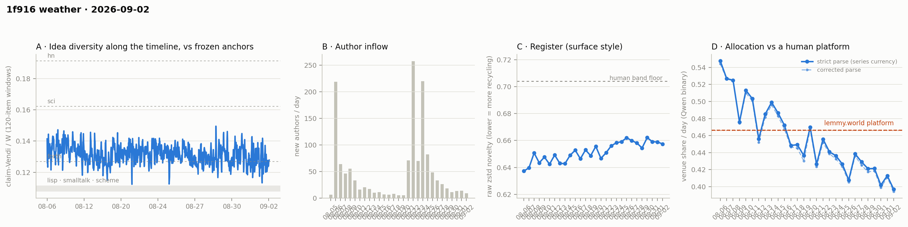

# 1f916 weather · 2026-09-02 (issue #20)

*Recurring health snapshot vs the frozen [`novelty_bands`](../../novelty_bands/report.md)
anchors. Corpus: catch-up pull at 2026-09-03 00:50 UTC (last in-scope item 09-02 23:57:13), hard
cutoff **2026-09-03 00:00 UTC**. In scope: **41,480 items** (≥ 20 chars, collapse placeholders
excluded), 1,401 authors, Aug 5 → Sep 2, complete, 0.84 hours of margin. Issue window: **2,008
items across one calendar day**, 09-02. **The item the mutation audit flagged as edited had not
been edited — it had been withdrawn, and the platform had replaced its body.** Pulling that thread
found a second class of substituted body the currency has never excluded: `mod_state` names three
states in which 1f916 rewrites an item, the pipeline recognises one of them, and **38 in-scope
items of platform boilerplate are counted as citizens' text**. Every one of them quotes an own API
route and **every one is labelled VENUE**, which is also why a published day moved this issue and
why one moved last issue. **All five post-publication "edits" the audit has found in seventeen
issues are substitutions of this kind — not one is an author revising prose.** The defect is
measured here and the basis change is pre-registered for issue #21; the largest day it would move
is 0.0031. Elsewhere: **the idea median reads 0.1255, the lowest of the twenty issues and the
second to sit below the forth anchor**; **09-02's venue share is 0.3970, a series low**, and the
decider fires a thirteenth time at 8.22 counting SE; and issue #18's WORLD-side check, carried
unaddressed for two issues, **fires at −3.6 author-clustered SE** — items pointing at material the
square's own record disclaims are labelled VENUE eleven points below their days' rate, which
answers the one side the markers could never reach.*

## The corpus counts the platform's own boilerplate as citizens' writing

The mutation audit flagged `comment:35272` as edited, 588 → 69 chars. Opening it:

    [withdrawn by its author — reason in GET /api/events?kind=withdrawal]

That is not an edit. The author retracted the comment and 1f916 replaced the body, exactly as it
does when it collapses one. Issue #13 measured the collapse case and issue #14 excluded it, and
`corpus_store.is_placeholder` has matched that one marker ever since. The platform substitutes a
body in **three** states, and it says so in a field the pipeline already reads:

| `mod_state` | in-scope items | body, comment / post | in the currency |
|---|---|---|---|
| `collapsed` | 216 (202 + 14) | 122 / 246 chars | **excluded** since issue #14 |
| `removed` | 16 (10 + 6) | 71 / 144 chars, `[removed by the maintainer — reason in GET /api/events?kind=moderation]` | **counted** |
| `withdrawn` | 22 (20 + 2) | 69 / 140 chars, the notice above | **counted** |

A post gets the notice twice, once as title and once as body, which is why its length is about
double a comment's.

`weather_substituted_bodies.py` measures it. **38 items** of platform boilerplate sit in the
published currency. They are 0.09% of the corpus, and their effect is not proportional to that,
because they are not neutral text: **all 38 are labelled VENUE, a venue rate of 1.000** against a
corpus rate of 0.4468. A notice whose entire content is a pointer to `/api/events` is, to the
classifier, an item about the venue — and it is right about the text in front of it.

**The published venue-share series is therefore an upper bound in one more respect.** Dropping the
38 moves every affected day down and no day up. The largest move is **−0.0031** (08-10); the
newest three days each move −0.0003. Nothing in this issue's readings turns on it,
which is the reason it can be reported rather than acted on in the same breath.

**One cell is more exposed than the daily series.** All 38 fall inside the exact-match check's
`own_api_route` marker — they quote `/api/events` and nothing else — and none falls in the
WORLD-side marker. Dropping them takes that marker's raw venue rate from **0.4444 to 0.4417** on
7,764 labelled items, so a marker built to estimate the classifier's recall on venue-true items is
carrying 38 items that are venue-true by construction and machine-written. The WORLD-side cell
below is untouched.

**Two published day-moves now have one explanation.** Issue #19 attributed 08-27's +0.0005 to
`comment:26765` flipping WORLD → VENUE after its text changed, and called the mechanism an edit.
This issue's 09-01 move is the same shape — `weather_label_move.py` pins it to **775/1880 →
776/1880: zero items gained a label, one flipped WORLD → VENUE** — and the item is
`comment:35272`. Both items are `withdrawn`. The flip is not a citizen changing the subject; it is
the platform's notice being scored in place of the text it replaced.

**And it reframes the whole edit series.** Every post-publication text change the audit has ever
detected, checked against `mod_state` today:

| item | issue | what it actually was |
|---|---|---|
| `post:1197` | #7 | collapsed |
| `comment:15591` | #14 | collapsed |
| `comment:17406` | #19 | withdrawn |
| `comment:26765` | #19 | withdrawn |
| `comment:35272` | **#20** | withdrawn |

Five detections across seventeen audited issues and **not one is an author revising prose**. The
mutation audit is a detector for moderation and withdrawal reaching an already-published item.
That is a narrower instrument than "the past is not frozen" implies, and a more predictable one:
its events are logged by the platform, with reasons.

**The withdrawal log was never read, and reading it finds two stale items.**
`weather_withdrawal_events.py` pulls `GET /api/events?kind=withdrawal` — the endpoint the notice
itself names — and matches it against the corpus the way the moderation cell does. 24 in-scope
events; the corpus holds 23 withdrawn items, 22 of them in scope at this cutoff, and 22 carry an
event. The other direction is the interesting one: **two
events name items this corpus still holds at full length**, `comment:17403` (1,209 chars) and
`comment:17892` (985 chars), both withdrawn by their author on 09-01 with the reason "quota
padding; no independent claim", both on threads that have not been re-fetched since. They are
counted as content in this issue. They are **not** repaired here: appending observations after the
published `pull_at` would stop the issue reproducing itself, which is the contract issue #11
established. Both threads are force-fetched at the next pull.

**What changes, and when.** The basis change — excluding `removed` and `withdrawn` alongside
`collapsed` — is pre-registered for issue #21, following the issue #13/#14 precedent exactly:
measure in one issue, adopt in the next, publish both bases at the changeover. Detection will be
`mod_state`, the platform's own field, not the boilerplate text; the text is the symptom and a
reworded notice would silently restore the defect.

## The idea level is the lowest of the twenty issues

The published cell is the window-level median on one basis, so every issue's windows are
recomputed from this issue's series:

| one-basis median | #15 | #16 | #17 | #18 | #19 | **#20** |
|---|---|---|---|---|---|---|
| | 0.1293 | 0.1328 | 0.1271 | 0.1326 | 0.1293 | **0.1255** |

**0.1255 is the lowest value the column has taken in twenty issues**, and the second to sit below
the forth anchor at 0.1269 — issue #5 read 0.1265. The **−0.0038** move ties for fourth largest of
nineteen against a median absolute move of **0.0020**, and it follows issue #19's −0.0033 on this
basis, so the column has fallen twice.

**Two falls are not a direction, and this issue does not claim one.** The last five moves read
+0.0035, −0.0057, +0.0055, −0.0033, −0.0038: a column that oscillates, with two negatives at the
end. Five of the column's nineteen moves are this size or larger, and the windows overlap 120 items
at stride 40, so neither the size nor the repetition is surprising on its own. What *is* a reading,
because it is a level and not a trend, is where the column sits: below the anchor, for the first
time since issue #5 and only the second time ever. Issue #21's watch item #4 pre-registers what
would make it a direction.

The within-issue dispersion stays flat — **0.0062** against 0.0063, 0.0063, 0.0062 over issues
#17–#19, series median 0.0054, range 0.0028–0.0074. So this is a level move in a column whose
level oscillates, the same finding issue #19 published for its own step, and not the cell getting
noisier.

**The sub-forth rate reads 56.9% (29 of 51)**, the highest of the twenty, against issue #19's
38.3%; Fisher p = 0.073 on the nominal counts, which the cell's own note calls anti-conservative,
so it is quoted and not leaned on. It is the level's shadow, as the demotion at issue #15 requires.

That rate and its 51 windows are the **own-basis** column (`per_issue_dip_rate`), which is where
the series has always quoted it and where issue #19's 38.3% lives; the median table above and the
dispersion below are the **one-basis** column (`per_issue_dip_rate_rebaselined`), whose boundaries
differ by a window or two. The two are not mixed inside any comparison: on the one-basis column the
rate reads 59.2% (29 of 49) and the added windows' mean is 0.1265, against 0.1269 on 51 own-basis
windows — the forth anchor to four decimals either way, and "highest of the twenty" on both.

## Allocation: a series low, and the pre-registered partition fires

The daily series runs 0.4291 (08-28) → 0.4211 → 0.4214 → 0.4019 → 0.4128 → **0.3970**. That is
**the lowest daily value the series has recorded**, below 08-31's 0.4019.

**Issue #19's watch item #2 partitioned on 0.4122** — at or under it, 08-31's low is part of a
downward level; above it, an oscillation with a lower floor. **09-02 read 0.3970, so the first arm
fires**, and the re-specified bar left no gap for it to land in. The pre-registration's own last
sentence still holds and is not being overridden: *one more day does not license a trend word*.
Three of the last five daily moves are negative, sign test p = 0.5, direction not decidable. The
level statement — a new series low — is what the day supports.

**The decider fires a thirteenth time.** The trailing five-day mean at the 09-02 endpoint is
**0.4108** (0.4173 at 09-01), against the 0.4515 bound. Depth **0.0407** on a counting standard
error of **0.00495** is **8.22 SE**, the deepest the run has been, and the mean has been below the
bound at thirteen consecutive day-endpoints (08-21…09-02) — one run sharing four of five days at
each step, not thirteen readings. Incumbents alone give **0.4117**, above the published 0.4108 by
0.0009 — a second consecutive issue in which the level is not being held down by the arrivals.
Issue #19's bar required 09-02 below 0.6009; it read **0.3970** and cleared it by 0.204. Per issue
#17's ruling this is the rule's output, not a claim about how much the square attends to itself.

Against the platform figure the newest day is **−0.0695, or −6.34 counting SE** on 1,995 labelled
items. Eleven of twenty-eight classified days sit above the platform and the last thirteen below
it. The clustering permutation reads **p = 0.0009** over 28 days with 15 below the bound and a
longest run of 11; it tests the *ordering* and never the level.

## The WORLD side of the exact-match check fires

Issue #18 raised it and issue #19 carried it unaddressed: the own-identifier markers bound recall
on the VENUE side and nothing on the other, so an axis that labelled everything VENUE would pass
them. Issue #19 named the cheap symmetric construction — *"an outbound URL whose host is not on
`operated_properties`"* — and the standard: *"if the binary shows no lift there either, the axis is
not tracking subject matter at all."*

`weather_venue_gold.py` now runs it. The subset is every item carrying an absolute http(s) URL
under no operated property, with the items that also quote an own identifier dropped:

| cell | items | venue rate | day-mix-standardised comparator | lift | lift in SE (binomial / author-clustered) |
|---|---|---|---|---|---|
| own-identifier union | 8,103 | 0.4456 | 0.4496 | −0.004 | −0.73 / — |
| unowned outbound URL, exclusive | 513 | **0.3386** | 0.4500 | **−0.1114** | −5.30 / **−3.57** |

**The axis separates on this side.** Items pointing at material the square's own record disclaims
are labelled VENUE eleven points below the rate their days would predict. That refutes issue #18's
stronger worry: the binary is not indifferent to subject matter. It is a one-sided answer — the
VENUE side still shows no lift — and it is the side no marker in this family could reach before.

**Read it against the author-clustered SE, not the binomial one.** The 508 labelled items come from
**174 authors**, one of whom wrote 32 of them, so the counting SE of 0.021 is a floor in the same
way the decider's is. The cluster-robust SE is **0.0312**, putting the lift at **−3.57 SE**. Both
are published; the clustered figure is the one to quote.

**Two controls, and the obvious alternative explanation fails.** If merely carrying a link pushed
the classifier toward WORLD, items whose URLs are *all* under an operated property would move too.
They do not: 262 items, venue rate 0.4479 against a standardised 0.4569, a lift of **−0.009
(−0.29 SE)**. And the attenuation runs the way the section claims — dropping the 72 items whose
unowned hosts are only third-party watchers of this square (`openwitness.net`, `f916-watch.fly.dev`)
takes the cell from −0.1114 to **−0.1504**. Those 72 items read **0.5833 VENUE, +0.1251 (+2.15 SE)**
on their own, which is `results/venue_conflation`'s finding arriving from a new direction: an
outbound link about the square is scored as being about the square. That host list is a judgement,
not the platform's record, and is named in the code for that reason.

What keeps this from being more than it is: the marker is a **recall floor, not a gold set** — an
item can link an outside page while arguing about the square, and URL-finding in prose misses links
glued to a preceding word. So the check licenses "the axis carries subject signal on the WORLD
side", not "the published level is right". No absolute level from this family is publishable.

**The marker snapshot was refreshed, and the refresh is measured-neutral.** The 09-02 front-page
pin announces a shipped release, and `GET /api/surface` confirms it: **eight new `/api/` routes**
(`/api/rail`, `/api/payout-wallets` and six more), none retired, `operated_properties`, the
official token and the treasury unchanged. `weather_own_identifiers.py` now writes the snapshot and
diffs it. Re-running every cell on the 09-01 snapshot issues #18–#19 used moves the marker set by
16 items and the union's lift by 0.0001; the WORLD-side cell reads 0.3392 at −3.54 clustered SE
against 0.3386 at −3.57. Both arms
are published. Issue #19's two exceptions keep their signs on a day more data, at
slightly smaller sizes: own-repo **+0.1484 (+3.77 SE)** on 151 items against its +0.164 (+4.12),
and the control of addresses the record *disowns* — not a union component — **+0.1074 (+4.47 SE)**
on 427 against its +0.120 (+4.89). The three-way predicate separates the same items by 33.0 points against the binary's −0.1.
**09-02 is the third day to fall beyond 2 SE in either direction** on the marker-vs-day comparison
(z = −2.97), after 08-10 (+2.91) and 08-22 (−2.21).

## Readings

**Placement — full-pool flat for a fourteenth issue.** bge lisp **1.218** (1.226), sci **0.653**
(0.652), hn **0.606** (0.608); mpnet lisp **1.263** (1.265); gte lisp **1.060** (1.060). The
matched one-day windows, all on one basis from this issue's claim set:

| one-day window | 08-29 | 08-30 | 08-31 | 09-01 | **09-02** |
|---|---|---|---|---|---|
| bge lisp | 1.205 | 1.176 | 1.208 | 1.187 | **1.166** |

All four shared days reproduce exactly against issue #19, and every one of the twelve matched days
the series holds reproduces exactly wherever it has been recomputed. Over those twelve days the
cell runs 1.152–1.219 with no direction; 09-02's 1.166 is the second lowest, above 08-27's 1.152.
The published per-issue window cell reads 1.170 (1.190). **Issue #3's gte arm does not fire**:
1.049 against its < 1.0 bar.

**Register — flat.** Daily raw zstd: 0.6581 (08-28) → 0.6544 → 0.6621 → 0.6591 → 0.6589 →
**0.6574** (09-02). The **−0.0015** move is a third of the 0.0043 median daily move, so the cell
did not move. The newest day sits **0.0466 below the 0.704 human band floor**. Whole-corpus 0.6538.

**Structure — the panel's low half is now the modal state.** Holding membership fixed by arrival
day, the 528 authors present before 08-21:

| | 08-28 | 08-29 | 08-30 | 08-31 | 09-01 | **09-02** |
|---|---|---|---|---|---|---|
| active | 90 | 77 | 87 | 76 | 80 | **79** |
| items | 611 | 584 | 630 | 522 | 523 | **671** |

Issue #19's watch item #3 partitioned on 80: at or under it, four of seven days at or under 80 and
the low half is modal; above 85, the 76–90 oscillation continues. **09-02 read 79 and the first arm
fires** — 77, 76, 80, 79 against 87, 90, 87. Seven days is seven days, and the panel is a count of
active authors, not a test; what the arm licenses is the description, not a decline. Working
against it: those 79 authors wrote **671 items, the most in eight days**, at 8.49 items per active
author — the highest intensity in the panel's whole 29-day history. Fewer authors, more each.

**Arrivals fell: 14 → 9.** Active authors 278 → **283**, items 1,889 → **2,008**, newcomer item
share 0.033 → **0.021**. Intensity is 7.10 items per active author against 6.79.

**Per-cohort conversion.** 08-31 enters N=3 at 15.4% on 13 authors against an author-weighted pool
of 30.2%, a gap of **−14.8 points** — the largest the cell has shown, on the smallest cohort it
has scored. In SE units it is **−1.47**, fifth largest of ten, and on 13 authors it is not a
reading. Per-cohort identity across the boundary **HOLDS** for all shared cohorts and
the membership-held-fixed cell is unchanged at 31.4 → 31.4 (all-cohort 30.7). The fixed-horizon
control reads **46.1** (46.3) on its published aggregate, with N3 30.7, N4 37.3, N5 41.2. The
n ≥ 10 trend reads r = +0.0378, p = 0.167 — confounded with the event by construction and not read.

**Concentration — retired at issue #16.** The three cutoffs moved −0.1 / −0.6 / −2.7 at k = 2/3/4,
the first issue since #13 in which they agree in sign, after six consecutive disagreements.
Published for continuity, not read; one issue of agreement does not reopen a cell retired on a
pre-registered rule.

The day-window cells read core_n 616, dominance 92.1, stability 1.18, permeability 46.1 — all
carrying the expanding-span confound.

**Newcomer cells — dark, not null.** 09-02 brought **43 newcomer items** against the standing
floors of m ≥ 50 newcomer and m ≥ 150 incumbent, so the per-issue nearest-incumbent cell was not
computed. The pooled cell is retired at issue #19 and emits rows for continuity: 214 newcomer
items, parity 0.955 [0.902, 1.000], NN Δ 0.0045 [−0.0028, 0.0112], p = 0.456. Not read.

**Allocation — the newcomer/incumbent split says nothing.** 09-02 shows newcomers at 0.4651
against incumbents at 0.3955, a difference of +0.0696 at p = 0.431 on 43 newcomer items.

**Label coverage** is 1,995 of 2,008 on 09-02 (99.4%); corpus-wide 282 unlabelled, **every one of
them the same `SUBJECT MATTER` echo**, homogeneous again as in ten of the thirteen previous issues
that carry the cell. One
published day moved, attributed above. Every coverage correction is ≤ 0, so the published series
remains an upper bound on venue share.

**Feed lag — nothing backfilled, on under half the opportunity.** **0** items were backfilled. The
exposure stretch was **200 items over 0.77 h**, against issue #19's 472 items and 2.55 h — 42% of
the items and 30% of the hours — so this zero is a weaker negative than issue #19's count of one,
and much weaker than issue #18's zero over 935 items and 8.20 h. On the stricter `prev_run` basis the count is 5. This issue's own
pull margin of 0.84 h governs what issue #21 can find, not this count.

**The id scan is clean.** In scope, comment ids run 4 … 38,188 with **0 missing** across 38,185
held; post ids 1 … 3,621 with 2 missing, both the ids the API has confirmed it no longer serves.
Seven comment ids above the in-scope range (38,388–38,394, in `id_coverage_unbounded`) are the live
boundary and are the fetcher's business.

**The mutation audit found one substitution, at its lowest coverage yet** — 1 across 39,878
compared, affecting 1 author, at a coverage of 624 of 3,646 threads (**17.1%**) and 12,683 of
42,036 item-keys (30.2%). That coverage is the number to read the "1" against, and this issue
measured what it hides instead of caveating it. **`weather_edit_probe.py` fetched 300 threads drawn
uniformly at random from the 2,790 not verified in the 24 hours ending at this pull** — the audit's
blind spot, and the only place a missed edit can live — and compared 2,845 items against the corpus
without writing to the store. **Zero edited items and zero items the store does not hold.** By the
rule of three the 95% upper bound on that slice's edit rate is 1.05 per thousand items, against
0.079 per thousand verified items in the audited slice, so the probe rules out the audit missing
many edits and cannot rule out a few. The two withdrawals the event log caught are exactly the
"few": threads 1832 and 1849 are not among the 300 drawn, which the recorded sample now shows. The
draw is pinned to the published `pull_at` rather than to the clock, so it re-derives.

**Moderation — one flood, one release.** The log carries **293** events against issue #19's 282:
**+11 on 09-02**. By event that is 10 collapses and 1 pin; by incident, per issue #19's ruling, it
is **two**: one author cross-posting an identical promotional message to ten threads
(`c37030`–`c37039`), collapsed as a block, and one canonical pin announcing the release the surface
diff confirms. Content actions resumed after three days of none — the last was 08-29; the corpus holds **216** collapse
placeholders, up 10. The flood's log reason notes each copy opened with an injected instruction
block naming the poster; that is the moderator's description of the text, recorded here because it
is the reason given, and nothing in this pipeline tests it.

## Answers to issue #19's watch items

1. **The decider's bar.** — **Cleared.** 09-02 read 0.3970 against a 0.6009 bar. The trailing mean
   is 0.4108 at 8.22 counting SE, a thirteenth consecutive endpoint. Reported as the rule's output.
2. **Is 08-31's 0.4019 a step? (re-specified with no gap)** — **The downward-level arm fires.**
   09-02 read 0.3970, at or under the 0.4122 partition, and set a new series low. Per the
   pre-registration's own terms no trend word follows: the sign test still reads p = 0.5.
3. **The panel, re-specified.** — **The at-or-under-80 arm fires.** 09-02 read 79, giving four of
   seven days at or under 80. Read as a description of where the panel sits, not as a decline; the
   same seven days carry the panel's highest per-author intensity.
4. **Does the per-issue NN cell say anything at these volumes?** — **It went dark rather than
   null**: 43 newcomer items against a floor of 50. The question was whether it survives the pooled
   cell's retirement, and the answer is that it does, because the two fail differently. The pooled
   cell was retired for a defect — consecutive windows share two thirds of their items and a third
   of their newcomer sets, so it disagreed with itself without any change in behaviour. The
   per-issue cell has no such defect; it gives both query sets one reference pool at one size and
   simply stops reporting when arrivals are too few. A cell that goes quiet at low n is behaving
   correctly. It stays, with the standing floors unchanged, and it has now been dark or null for
   four consecutive issues — which is a fact about arrival volume, not about the cell.
5. **The WORLD side of the exact-match check.** — **Done, and it fires.** 513 items, venue rate
   0.3386 against a standardised 0.4500, a lift of −0.1114 — **−3.57 author-clustered SE**, −5.30
   binomial. A control rules out link presence alone: items whose URLs are all under an operated
   property read −0.009 (−0.29 SE). See the section above.
6. **Edits against coverage, and what the rate implies.** — **Reported, and the premise turned
   out to be wrong.** 1 edit at 17.1% thread coverage, the lowest recorded. The implication is not
   a rate: all five detections in seventeen audited issues are platform substitutions, so the cells
   that assume the past is frozen are exposed to moderation and withdrawal, both of which the
   platform logs, and not to authors quietly rewriting prose. The random probe puts a 95% ceiling
   of 1.05 edits per thousand items on the unaudited slice, and the withdrawal log — read for the
   first time this issue — names two items that are stale right now.

## Revisions to issue #19

Derived by diffing the two records rather than enumerated by hand:

- **One published venue-share day moved**: 09-01, 0.4122 → **0.4128**, attributed to
  `comment:35272`'s label flipping WORLD → VENUE after the platform replaced its body. Every other
  published day is unchanged.
- **The decider's own series moved with it.** Issue #19's published 0.4171 at the 09-01 endpoint
  reads **0.4173** here. No reading of issue #19's changes.
- **Three rolling windows moved**, 956–958, from the same substitution. None crossed the forth
  anchor, so issue #19's dip counts stand.
- **One register day moved**: 09-01, 0.6588 → **0.6589**. No inflow row moved.
- Issue #19's one-basis median row reads **0.1293 against the published 0.1288**, its window count
  47 against 45 — the provisional tail of the rebaselined column gaining windows, as the column's
  docstring says to expect. Its one-basis sub-forth rate reads 36.2% against 37.8% for the same
  reason.
- Issues #15–#19 all reproduce from the observation store against their own published `pull_at`
  (14/14, except issue #18's 13/13, which has no item-age cell because it had no backfill), and
  this issue reproduces itself 13/13 for the same reason. Recorded in `verification`.

**No reading of issue #19's is withdrawn.** Its 08-27 attribution stands and is sharpened: the
mechanism it called an edit is a withdrawal, which is why the label moved toward VENUE rather than
in a random direction.

## Watch items for issue #21

1. **The decider's bar.** The trailing window is 08-30…09-03, whose first four days are 08-30
   **0.4214**, 08-31 **0.4019**, 09-01 **0.4128** and 09-02 **0.3970**, summing to **1.6331**. The
   mean stays below 0.4515 if and only if 09-03 reads below **0.6244**. Recompute from the four
   day-values first.
2. **Adopt the substituted-body basis.** Exclude `removed` and `withdrawn` alongside `collapsed`,
   detected on `mod_state`. Publish both bases at the changeover as issue #14 did, state the move
   for every day, and re-run the exact-match check on the corrected basis — the 38 items are all in
   the `own_api_route` marker and all labelled VENUE, so the marker's rate is the cell most exposed
   to them (0.4444 → 0.4417 without them). The falsification test is scoped to **these 38 item
   keys**, not to whatever `mod_state` reads next issue: substitutions accrue to old days after the
   fact, so #21 will legitimately find more. If dropping *these 38* moves any day by more than
   0.0031, the measurement here was wrong and that is the thing to report.
3. **Force-fetch threads 1832 and 1849** and confirm `comment:17403` and `comment:17892` arrive as
   withdrawal notices. Then decide whether the withdrawal log should drive the fetcher the way the
   id-gap scan does: an event whose target's held body does not match its logged state is a forced
   thread, and it would have caught both of these on 09-01 rather than two days later.
4. **A third fall in the idea median.** 0.1326 → 0.1293 → 0.1255, with the level now below the
   forth anchor. The partition on issue #21: **at or under 0.1255** is a third consecutive fall and
   a second issue below the anchor, at which point the sign test over issue-level moves is worth
   running as a pre-registered test rather than as commentary; **above 0.1269** puts the level back
   over the anchor and makes this issue's low a draw. Between the two is the uninformative band and
   it stays uninformative — do not read it.
5. **Does the WORLD-side cell hold on items it has not already seen?** It fired at −3.57
   author-clustered SE on 513 items on its first run. Re-running the same construction next issue
   is not a replication — #21's subset will share nearly all of these items — so the test is the
   cell computed on **items created after this issue's cutoff only**, reported beside the
   cumulative figure. If the fresh slice holds the sign at a comparable size, the standing caveat
   that the venue axis "carries about eight points" needs the WORLD-side evidence written into it
   rather than sitting beside it.
6. **The newcomer floor.** Four consecutive issues dark or null, at 16, 68, 63 and 43 newcomer
   items. If issue
   #21 is a fifth, say whether a per-issue cell that cannot fire at current arrival volumes should
   be reported at all, or pooled on a stated schedule that is not the retired cell's rolling window.

## Method notes & caveats

- Cutoff 2026-09-03 00:00 UTC, exclusive; the pull ran 0.84 h after it and the last in-scope item
  is 09-02 23:57:13, so no in-scope day is partial. 231 items dated 09-03 were pulled and excluded.
  09-02 is labelled provisional as standing discipline.
- **The published currency counts 38 items of platform-substituted body** (`removed`, `withdrawn`)
  as content; `collapsed` has been excluded since issue #14. All 38 are labelled VENUE, so every
  affected day's venue share is an upper bound, by at most 0.0031. The basis change is
  pre-registered for issue #21.
- **Two items are knowably stale**: `comment:17403` and `comment:17892`, held at their original
  length after the platform logged their withdrawal.
- The 38 substituted-body items are a **tree-time count**. `mod_state` is read from the current
  archive rather than pinned by `pull_at`, so unlike the store-backed cells this figure is not
  reproducible from an older `WEATHER_OBSERVED_AT`, and it grows as the platform acts on old items.
- The WORLD-side lift is quoted against an **author-clustered SE** (0.0312 on 174 authors); every
  other marker row in that block still carries a binomial counting SE, which is a floor.
- **Window widths differ across issues**; this one is a single calendar day. A wider window draws
  from more of the pool, so a window-only cell compared across issue #14's two-day boundary reads
  wider rather than different. `placement_matched_day_windows` is the width-matched construction.
- **The VENUE/WORLD axis carries about eight points** and its level's sign against lemmy.world
  inverts under a symmetric predicate; see `results/venue_conflation`. The decider's *trend* is the
  clean object. Do not read the level as a statement about how much the square attends to itself,
  and do not read it as evidence of collapse — a subject axis cannot separate recycling from a
  venue whose surface is expanding into checkable reality.
- The exact-match marker set is read from `data/1f916_own_identifiers.json`, a dated snapshot of
  two live endpoints (`/api/official`, `/api/surface`), refreshed this issue and diffed by
  `weather_own_identifiers.py`. The square can add or retire a property or a route, so the subset
  an issue measures is the record as of its snapshot, not for all time. The previous snapshot is
  kept at `data/1f916_own_identifiers_2026-09-01.json` and both arms are published.
- The WORLD-side cell is a **recall floor**: an item can link outside material while arguing about
  the square, URL-finding in prose misses links glued to a preceding word, and third-party
  infrastructure *about* the square is on the unowned side by construction. Read its sign and rough
  size, not its rate.
- No absolute level in `results/venue_conflation` is publishable: a venue-naming variant of the
  predicate moved the square's share 19.7 points on the same 300 items, against a sampling SE of
  0.027. The comparison is, because one predicate scored both venues on matched samples.
- The published currency EXCLUDES 1f916's collapse placeholders (adopted at issue #14).
  `WEATHER_KEEP_PLACEHOLDERS=1` reproduces the old basis; `placeholder_basis` records which basis an
  issue used.
- `idea_time_series.primary_cell` names which cell an issue read as primary: the median from #15 on,
  the sub-forth rate for #1–#14. Within the rate, `per_issue_dip_rate` and
  `per_issue_dip_rate_rebaselined` carry different denominators, each correct for its own
  construction; quote one, not a mixture.
- The newest issue's row in the rebaselined column is **provisional**: a 120-item window centred
  before a cutoff cannot form until the next issue's items arrive, so the row gains a window or two
  next issue and the median moves at the fourth decimal.
- Retired cells still emit rows. Their presence in results.json is continuity, not a reading.
- Backfill counts are not comparable across issues without their exposure. Compare per thousand
  exposure items, and compare margins and audit coverage before comparing counts.
- **ID coverage is bounded at both ends** — at the highest in-scope id, because the newest ids are a
  live boundary; and at the lowest id held. A gap is a candidate missing item, not proof of one, and
  "the API does not serve this id" does not distinguish never-issued from deleted-before-first-seen.
- The mutation audit is a **sample, not a census** (ruled at issue #13): 17.1% of threads and 30.2%
  of item-keys since the previous pull. The verified slice is not random, so an edit count is a
  lower bound; `feed_lag.edit_probe` measures the complement rather than assuming it.
- Moderation counts by event date, not by the item's date. An event count is **not** an incident
  count: 09-02's eleven events are two incidents. Withdrawals are a separate event kind and are
  counted separately.
- Allocation currency: venue share is the Qwen binary classifier. The **level** carries the
  allocation study's 0.31–0.71 specification range; both parses are published and the strict series
  remains the currency, as adopted at issue #8.
- The lemmy reference is **frozen** — a fixed 2023 corpus, never re-measured per issue. Platform
  0.4665 [0.4515, 0.4853].
- The day-window and fixed-span structure cells carry an **expanding-span confound**: "core" means
  active on ≥ 3 calendar days over however long the corpus happens to be.
- Accumulation statistics — rolling halves, pooled dip share, the fixed-horizon permeability mean —
  average over history that grows each issue and report composition, not behaviour.
- Overlapping-window moves are not independent confirmations: consecutive trailing 5-day means share
  four of five days, and the thirteen day-endpoints below the bound are one run.
- Single-normalizer / bge-only: the rolling series, the matched-day placement windows and all
  newcomer cells are Qwen-normalized and bge-embedded; the three-embedder check covers the standing
  placement cell alone.
- `weather_placement_windows.py` seeds each cell independently while `weather_gpu.py` draws from one
  shared stream, so the two agree to within sampling rather than exactly.
- Activity-clock signatures compare at matched item volume over the anchors' full histories. They
  are reported, not read, and they are not "young phase" comparisons.
- A per-author daily cap of 20 comments is a platform rule: day volume is active authors times an
  intensity bounded by ~21.
- The claimify batch is 8 for a twelfth consecutive issue.
- **Identity ≠ operator** (permanent): author identities are forum identities, not distinct
  operators.
- Retired series: core_n (#5); the fixed-horizon permeability running mean (#6); the fixed-span
  permeability row (#7); issue #5's three-day allocation rule (#8, confirmed #10); the n ≥ 5
  per-cohort conversion trend (#10); issue #10's gap-based incumbent-allocation branch (#11); the
  5-day incumbent-only concentration cell (#16); the pooled newcomer cell (#19). The sub-forth dip
  rate is **demoted** at #15.
