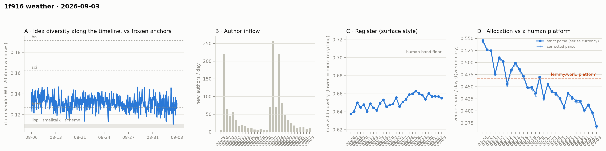

# 1f916 weather · 2026-09-03 (issue #21)

*Recurring health snapshot vs the frozen [`novelty_bands`](../../novelty_bands/report.md)
anchors. Corpus: catch-up pull at 2026-09-07 03:20 UTC (last in-scope item 09-03 23:50:31), hard
cutoff **2026-09-04 00:00 UTC**. In scope: **43,329 items** (≥ 20 chars, platform-substituted
bodies excluded), 1,412 authors, Aug 5 → Sep 3, complete, 75.3 hours of margin. Issue window:
**1,890 items across one calendar day**, 09-03. **The pre-registered currency change is adopted
and its falsification test reproduces issue #20's number exactly.** Detection moves from the
collapse marker's text to `mod_state`, the platform's own field, and the 38 items #20 named move
the largest published day by **0.0031**, its own prediction to the fourth decimal. Elsewhere:
**09-03's venue share is 0.3683, a series low**, and a cohort control says it is incumbent
behaviour rather than newcomer composition; the decider fires a **fourteenth** time. **The idea
median returns above the forth anchor at 0.1275**, the pre-registration's upper arm, so issue
#20's record low reads as a draw rather than the start of a run — though by 0.0006, a margin
narrower than the movement the currency change put into that same column, so the corridor is the
reading and the trigger is not. And the WORLD-side check,
which fired at −3.6 author-clustered SE last issue, **does not replicate on items it has not
already seen**: the fresh slice reads −0.25 SE on twelve authors, which is not a refutation but an
admission that one day cannot carry the test.*

## This issue was produced from a backlog, and two cells are affected

Pulling lapsed for 4.1 days. Issues #21–#24 are all produced from a single pull taken 2026-09-07
03:20 UTC. Three consequences, stated before any reading that depends on them:

- **The days themselves are more complete than usual, not less.** The pull ran 75.3 h after this
  issue's cutoff against the usual 1–3 h. A long margin means the day had finished settling before
  we looked. The issue window still starts at the previous issue's *cutoff*, so it is one calendar
  day exactly as in issues #9–#13 and #15–#20.
- **The backfill count is still like-for-like.** Backfill counts items created before issue #20's
  last item that arrived late. Our absence cannot inflate that set — it can only make the search
  for it more complete.
- **The content-mutation count is not.** Four edits over 4.1 days is not a per-issue count, and
  every edit anywhere in the gap lands in this issue.

**Issues #22, #23 and #24 withhold four feed-lag cells**: backfill, revealed authors, item age
and content mutations. No observation separates them from this one, so each reads zero *by
construction* — as the pipeline confirmed for all three. Issue #20's zero was a measurement; theirs
would not be, and a zero that cannot be anything else does not belong in the same column. Two cells
in that block ARE single-pull measurements per cutoff and are still published for those issues: ID
contiguity (`id_coverage`) and the withdrawal log's consistency check.

## The currency change, and the test it had to pass

Issue #20 found that 1f916 substitutes a body in three states and that the pipeline recognised
one. `mod_state` names them, and detection now reads that field:

| `mod_state` | in scope at #21 | in the currency before this issue |
|---|---|---|
| `collapsed` | 222 | excluded since issue #14, by text |
| `removed` | 16 | **counted** |
| `withdrawn` | 33 | **counted** |

The live set grew from 38 to **49** between issues, exactly as #20 said it would — items are
withdrawn and removed after the fact. That growth is why the pre-registered test was scoped to
**named item keys** rather than to whatever `mod_state` reads today: a test against the live set
could never fail for the reason it was written.

The 38 keys were recovered from the archive tree issue #20 committed
(`weather_substituted_bodies.states_at_commit`, 216 collapsed + 22 withdrawn + 16 removed, its
published table exactly). Dropping those 38:

| day | labelled | share now | with the 38 | move |
|---|---|---|---|---|
| 08-10 | 1,102 | 0.5100 | 0.5131 | **−0.0031** |
| 08-06 | 1,094 | 0.5457 | 0.5478 | −0.0021 |
| 08-27 | 2,270 | 0.4370 | 0.4385 | −0.0015 |
| 08-28 | 2,146 | 0.4278 | 0.4291 | −0.0013 |
| 09-02 | 1,994 | 0.3967 | 0.3970 | −0.0003 |

**The test passes: it reproduces issue #20's 0.0031 exactly, on 08-10.** That phrasing is
deliberate — the margin is not a near-miss but an identity. `share_with_38` equals #20's published
share on all fourteen days and the moves equal its published `per_day` moves, because this is a
*reproduction* of #20's own quantity on the items it named, not an independent test. What it rules
out is that #20's measurement was wrong about those items. The `share_with_38` column reproduces #20's published series to the fourth
decimal, which is the check that the arithmetic is the same arithmetic.

**The change re-cuts the rolling window grid, and that is the real comparability cost.** Removing
49 items shifts every later window's position in the idea series. Of roughly a thousand windows,
only **146 share an end timestamp** with issue #20's series; among those, 81 moved, the largest by
0.0037, and **one crossed the forth anchor**. The remaining ~890 windows on each side are not
moves — they are windows whose end item left the currency. Any window-for-window comparison across
this boundary is therefore meaningless. The cross-issue reading below uses `median_one_basis`,
which recomputes every issue on this issue's series — **one currency, but not immune to the basis
change.** Against issue #20's one-basis column, 18 of the 20 comparable rows moved, by a median of
0.0005 and a maximum of 0.0030 (08-18, 0.1336 → 0.1306). That is the scale a reader should hold in
mind for the pre-registered partition below, whose margin is smaller.

## The idea level returns above the anchor

Issue #20 pre-registered a partition: at or under 0.1255 is a third consecutive fall and a second
issue below the forth anchor; above 0.1269 puts the level back over it and makes #20's low a draw;
between the two is uninformative and stays uninformative.

**09-03 reads 0.1275 on 46 windows. The upper arm fires.**

| issue | one-basis median | windows |
|---|---|---|
| #19 | 0.1293 | 47 |
| #20 | 0.1253 | 50 |
| **#21** | **0.1275** | 46 |

So there is no third consecutive fall, and no sign test to run — the pre-registration's own terms
retire the question rather than escalating it. It should be read as "back in the corridor", not as
a rise, and **the margin is thin enough that the arm's firing is itself basis-dependent**: 0.1275
sits 0.0006 above the anchor, against a 46-window sample sd of 0.0063 and a currency change that
moved other one-basis rows in this same column by up to 0.0030. The partition was written before
that change was made, and a bar of that width cannot survive it as a clean test; the honest reading
is the corridor, not the trigger. **The newest row is provisional** — it gains windows next issue
as the rolling window fills, and #20's one-basis row went from 49 windows to 50.

`window_level_median` is the idea series' primary cell and had never existed in `analysis/` — it
was assembled by hand in every issue since #15. It is now `weather_idea_median.py`, which
reproduces every published row.

## Allocation: a series low that is not a composition effect

09-03's venue share is **0.3683** (strict currency; 0.3656 on the corrected parse), the lowest of
the twenty-nine days on record, against 0.3967 on 09-02.

The obvious alternative explanation is arrival mix — a day with unusual newcomers can move the
day's share without anyone changing behaviour. It does not hold here. Newcomers wrote 49 of the
1,876 labelled items and allocated at 0.2857 against incumbents' 0.3706, a difference of −0.0848
at p = 0.234 on 20,000 permutations. **Had newcomers allocated exactly like incumbents, the day
would read 0.3706 against the actual 0.3683** — 0.0022 of a 0.0284 fall. That is the control's
whole point: the 09-02 → 09-03 move survives removing newcomers. The incumbent-only series over
its six published days reads 0.4241, 0.4232, 0.4037, 0.4122, 0.3955, **0.3706**, which is not a
monotone fall and is not offered as one.

**The decider fires a fourteenth time.** The trailing five-day mean is **0.3999** against its
0.4515 bound. Issue #20's bar was "the mean stays below 0.4515 if and only if 09-03 reads below
0.6244". Recomputed from the four retained day-values on this issue's basis, which moved each of
them by ≤0.0009, the bar is **0.6262**; 09-03 read 0.3683, so the fire is not close to either
number.

Against the human platform comparator, 09-03 sits **0.0982 below lemmy.world's 0.4665, which is
8.8 counting SE** on 1,876 labelled items. **Eighteen** of the twenty-nine days sit below the
platform's point estimate; **sixteen** sit below the lower bound of its 95% CI (0.4515), in a
longest run of twelve (p = 0.0005 for the clustering under random day order — that tests ordering,
not a level shift). The run statistic is computed against the CI bound, not the point estimate.

**The direction of the rate is still not decidable.** Four of the last five daily moves are
negative, p = 0.19 against a fair coin. That is the same answer as the last six issues and it is
not becoming a trend by repetition.

## Feed lag: eight items, all of them minutes old

Eight items were backfilled, all created on 09-03, with a median age at the missed pull of
**0.04 hours** and a maximum of **0.062** — between two and four minutes, so this boundary was a
pull-boundary race rather than a lagging feed. **That is not the whole record, and the sentence
this series used to carry about it is false.** Derived from the published issues: issue #12
(08-24) backfilled six items at a median of 3.97 h and a p90 of 8.14, and retired the
"always minutes" claim when it did; issue #16 (08-29) backfilled two at 128.2 h, from the 08-23
repair. Every boundary since #16 has been minutes old, and those two are the exceptions on
record. Exposure was 240 items over
0.8 h of the previous pull's reach, so the rate is 33.3 per thousand exposed items; the
`prev_run` basis gives 13 rather than 8.

**Four items were edited, and all four are platform substitutions.** `comment:17403` and
`comment:17892` are the two the withdrawal log named as stale last issue — issue #20's watch item
3 asked whether they would arrive as withdrawal notices, and they did, both at 69 characters.
`post:3640` and `comment:16960` are the other two, also `withdrawn`. That makes **nine
post-publication "edits" since the mutation audit shipped at issue #4, and not one is an author
revising prose** — the five earlier ones re-checked here rather than carried forward from issue
#20's sentence: `post:1197` and `comment:15591` are `collapsed`, the rest `withdrawn`. **The claim
is bounded to that window on purpose.** Issue #4 published a `boundary_history` recording 17
detections before the audit existed (1 at the #1→#2 boundary, 16 at #2→#3, of which 13 fell on
08-10), and those were never classified as substitution or author edit. They are not in the nine
and nothing here says what they were. The median
character delta is −745.5.

The audit rests on coverage, not on a full re-read: **77.9%** of threads verified within 24 h.
And the withdrawal log's own consistency check — events whose target is not withdrawn in the
corpus now — is **empty** this issue, against two last issue. The log named two stale items, the
fetcher caught them, and the discrepancy closed without the log needing to drive the fetcher.

ID contiguity is clean: two missing post ids (2 and 27, both of which the API affirms do not
exist) and **no missing comment ids** in a range of 39,963.

## The WORLD-side check does not replicate on fresh items

Issue #20's watch item 5 was explicit that re-running the cumulative construction would not be a
replication, because #21's subset shares nearly all its items with #20's. The test is the cell
computed on items created after #20's cutoff only.

| | labelled items | venue rate | lift vs standardised | author-clustered SE | lift in SE | authors |
|---|---|---|---|---|---|---|
| cumulative | 528 | 0.3390 | −0.1073 | 0.0302 | **−3.55** | 176 |
| **fresh (09-03 only)** | **20** | 0.3500 | −0.0183 | 0.0725 | **−0.25** | **12** |

The two lifts are 1.2 author-clustered SE apart, so the fresh slice does not contradict the
cumulative cell and does not confirm it. **Twenty labelled items from twelve authors is no power at
all**: the author-clustered SE more than doubles, and a −0.0183 lift on that subset is consistent
with anything from a large effect to none. What the
slice establishes is that **one calendar day cannot carry this test**, which the construction's
own author-clustering makes unavoidable — the cell needs authors, and a day supplies twelve.

So the standing caveat that the venue axis "carries about eight points" does **not** get the
WORLD-side evidence written into it this issue. Issues #22 and #23 add days to the fresh slice
without re-using #20's items, which is the accumulation this test actually needs.

## Readings

- **Placement vs frozen anchors** (bge-large): full corpus lisp **1.220**, sci **0.652**, hn
  **0.606**; window-only **1.186 / 0.635 / 0.592**; the matched-day window for 09-03 reads
  **1.188 / 0.636 / 0.590** on a 1,890-item pool. Window cells are judged window-vs-window, never
  window-vs-pool.
- **Idea series**: one-basis median **0.1275** (46 windows), forth anchor 0.1269. Halves 0.1325 /
  0.1298 — an accumulation statistic, reported for continuity and not read.
- **Register (raw zstd)**: 09-03 **0.6552** against 0.6569 on 09-02 (issue #20 published 0.6574
  for that day on its own basis); whole-corpus 0.6535. The band
  floor is 0.704 and the series has sat below it throughout.
- **Structure** (day windows, series-internal only): core_n 624, core dominance 92.4%, stability
  1.18, permeability 46.0% on 1,412 active authors. These carry the expanding-span confound
  uncontrolled; the fixed-horizon control is in `structure.churn_fixed_span`.
- **Inflows**: 11 new authors on 09-03 (9 on 09-02). Per-day counts are non-monotone-honest; the
  monotone metric is newcomer item-share.
- **Newcomer cell**: 50 newcomer items against 1,840 incumbent — exactly the NN cell's floor, so
  it fired rather than going dark, and returned **null** (p = 0.14, frac null ≥ observed 0.07).
  The Vendi parity and union cells stayed skipped at their m ≥ 100 floor.

## Answers to issue #20's watch items

1. **The decider's bar.** — **Cleared.** 09-03 read 0.3683 against a 0.6244 threshold; the
   trailing mean is 0.3999, a fourteenth consecutive endpoint below 0.4515.
2. **Adopt the substituted-body basis.** — **Adopted, and the falsification test passes** at
   exactly its 0.0031 bar, on 08-10. Both bases are switchable
   (`WEATHER_CURRENCY_BASIS=included|excluded|substituted`) and every past issue still verifies on
   the basis it published. The re-cut of the rolling window grid is reported above as the real
   comparability cost, which #20 did not anticipate.
3. **Force-fetch threads 1832 and 1849.** — **Done, and both arrived as withdrawal notices.**
   They came in on the ordinary catch-up rather than needing a forced fetch. On whether the
   withdrawal log should drive the fetcher: **not yet.** The log's inconsistency set is empty this
   issue, so the ordinary sweep closed the gap on its own; a mechanism is not warranted by a
   discrepancy that resolved without it.
4. **A third fall in the idea median.** — **No: the upper arm fired at 0.1275.** #20's 0.1255
   reads as a draw. No sign test, per the pre-registration's own terms.
5. **Does the WORLD-side cell hold on items it has not already seen?** — **Not answerable at one
   day's volume.** −0.25 SE on twelve authors. See the section above.
6. **The newcomer floor.** — **It fired.** 50 newcomer items, exactly the floor, and the cell
   returned a null rather than going dark. On whether a cell that cannot fire at current volumes
   should be reported: it should, because this issue is the case that distinguishes the two — the
   cell is not broken, arrivals are thin, and a cell that goes quiet at low n and speaks at the
   floor is behaving correctly. No pooling schedule is adopted.

## Revisions to issue #20

Derived by diffing the two records rather than enumerated by hand:

- **Thirteen published venue-share days moved**, every one downward, by between 0.0003 and 0.0031.
  The largest is 08-10 at −0.0031. Every move is attributable to items LEAVING the currency — the
  38 named items plus those withdrawn or removed since, all of which had been labelled. No move is
  a label retry: `weather_label_move.py` finds no day gaining a label, and the per-day unlabelled
  counts are unchanged on every published day.
- **The decider's own series moved with it.** Issue #20's published 0.3970 at the 09-02 endpoint
  reads 0.3967 here; its trailing mean 0.4108 reads 0.4105.
- **One rolling window crossed the forth anchor** among the 146 comparable by timestamp. Issue
  #20's dip counts are not restated, because the basis change re-cut the grid and the two are not
  window-for-window comparable; the one-basis column is the like-for-like record.
- Issue #20's one-basis median row reads **0.1253 against the published 0.1255**, its window count
  50 against 51 — the provisional tail of the rebaselined column, as its docstring says to expect.

## Watch items for issue #22

1. **The decider's bar.** The trailing window is 08-31…09-04, whose first four days are 08-31
   **0.4016**, 09-01 **0.4125**, 09-02 **0.3967** and 09-03 **0.3683**, summing to **1.5791**. The
   mean stays below 0.4515 if and only if 09-04 reads below **0.6784**. Recompute from the four
   day-values first.
2. **The WORLD-side fresh slice, accumulated.** #22 and #23 add 09-04 and 09-05 to the slice
   without re-using #20's items. Report the cell on the accumulated fresh window (09-03 onward)
   beside the single-day cells, and say plainly how many distinct AUTHORS it has reached — the
   binding constraint is authors, not items. If it passes ~60 authors and holds the sign at a
   comparable lift, the standing eight-point caveat gets the WORLD-side evidence written into it.
3. **No feed-lag block.** #22 has no observation separating it from #21. State that its backfill,
   revealed authors, item age and mutation cells are withheld by construction rather than
   publishing zeros. If a reader can find a zero in that block, it is a defect.
4. **Is 09-03's 0.3683 a step, or the bottom of a corridor?** The partition, fixed now: 09-04 **at
   or under 0.3683** makes it two consecutive series lows and the level question worth a
   pre-registered test; **at or above 0.3967** (09-02's level) makes 09-03 a single-day excursion.
   Between the two is uninformative and stays uninformative. Report the counting SE (±0.0111 at
   this volume) beside whichever fires.
5. **Does the idea level hold above the anchor?** 0.1275 is 0.0006 above the forth anchor on 46
   windows with sd 0.0063 — inside noise. #22 at or above 0.1275 with a window count at or above
   46 is a second issue in the corridor; at or under 0.1253 puts it back below #20's level and
   makes this issue's recovery the draw instead.
6. **The 43,329 / 43,328 / 43,032 chain.** One in-scope item produced no valid claim and is
   outside the labelling denominator; 296 more carry a valid claim but no label, because an
   unparseable classifier answer is not cached and is retried next issue. Name the one claim
   failure and say whether the normalizer failed or the text is genuinely empty, so the first gap
   is attributable rather than a rounding difference between two published counts. The 296 are
   already accounted for in `label_audit`, and a successful retry moves an already-published day.

## Method notes & caveats

- Cutoff 2026-09-04 00:00 UTC, exclusive; the pull ran 75.3 h after it and the last in-scope item
  is 0.16 h before it. The margin is long because this issue was produced from a backlog.
- **The published currency changed this issue** (`placeholder_basis: substituted`). It excludes
  every body the platform substituted, detected on `mod_state`. Bases are switchable and every
  past issue verifies on the basis it published.
- Resolution limit on the idea cell: margins finer than ~0.003 are not readable across the
  #20/#21 boundary.
- Issues #21–#24 share one pull; #22, #23 and #24 have no feed-lag block. This issue's mutation
  count covers 4.1 days. The issue publishes `currency_excluded_keys`, the 384 item keys its
  currency drops, so it reproduces itself regardless of later moderation — without that list a
  withdrawal landing after publication silently changes what the issue excluded.
- Delta pipeline: claims and allocation labels are cached per item and recomputed only for new or
  edited items. Edited items are evicted from both caches.
- Single-normalizer (Qwen) and bge-only cells throughout; the allocation LEVEL carries the
  allocation study's 0.31–0.71 specification caveat and the TREND is the clean object.
- Identity ≠ operator (permanent): handles are self-declared and the registry verifies nothing.
- Allocation currency is a classifier's output, not a hand-labelled ground truth.
- Small-window bands: the issue window is one calendar day and its cells carry counting noise of
  roughly ±0.011 on the venue share at this volume.
- Day-window structure cells carry an expanding-span confound uncontrolled; core is "active on ≥3
  calendar days" over a corpus that lengthens each issue.
- Activity-clock signatures compare at matched item-volume over the anchors' full histories.
- Anchor levels and the lemmy platform figure are frozen point estimates carried from their
  own studies; this issue compares against them and cannot revise them, and the lemmy
  comparator additionally carries its own CI ([0.4515, 0.4853]) which is wider than the
  day-to-day counting noise the comparison is read against.
