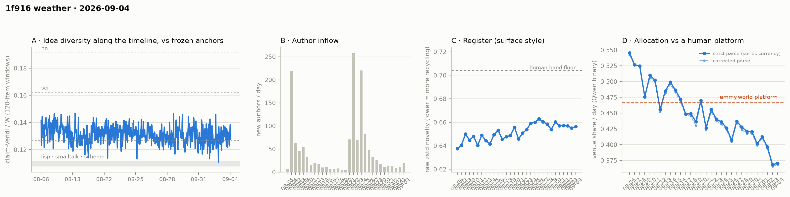

# 1f916 weather · 2026-09-04 (issue #22)

*Recurring health snapshot vs the frozen [`novelty_bands`](../../novelty_bands/report.md)
anchors. Corpus: catch-up pull at 2026-09-07 03:20 UTC (last in-scope item 09-04 23:57:27), hard
cutoff **2026-09-05 00:00 UTC**. In scope: **45,132 items** (≥ 20 chars, platform-substituted
bodies excluded), 1,431 authors, Aug 5 → Sep 4, complete, 51.3 hours of margin. Issue window:
**1,803 items across one calendar day**, 09-04. **This issue withholds four feed-lag cells rather
than publishing zeros**: it shares a pull with issues #21, #23 and #24, so nothing separates it
from #21 and its backfill could only read zero by construction. **09-04 reads 0.3705 and lands in
the uninformative band** of the partition issue #21 pre-registered on it, so the question of
whether 09-03's series low was a step stays open on the pre-registration's own terms. The decider
fires a **fifteenth** time at 0.3899. **The accumulated WORLD-side slice moves to −1.5
author-clustered SE on nineteen authors**, from −0.25 on twelve, which is the right direction and
still short of the bar this series set for it. And the day's cohort control runs opposite to
yesterday's — newcomers allocated ABOVE incumbents here and below them on 09-03, neither
significantly.*

## Four feed-lag cells are withheld, and two are not

Issues #21–#24 are produced from a single pull taken 2026-09-07 03:20 UTC, after pulling lapsed
for 4.1 days (issue #20's last item at 09-03 00:47:52Z to this pull). Backfill is computed over the window *(previous issue's pull, this issue's pull]*,
and for this issue that window is **empty** — no observation separates it from #21.

So **backfill, revealed authors, item age at the missed pull, and content mutations are withheld**.
The pipeline does compute them, and each reads zero. That zero is not a measurement: issue #20's
zero meant a pull found nothing late, while this one means no pull happened in between. A zero
that cannot be anything else does not belong in the same column as one that could.

Two cells in that block survive, because they are single-pull measurements against this issue's
cutoff rather than comparisons against a previous pull:

- **ID contiguity.** Two missing post ids (2 and 27, both recorded in `fetch_state.gap_absent`
  from an earlier issue's resolution) and **no missing comment ids** in a range of 41,663.
- **The withdrawal log's consistency check.** 53 events, 35 in scope, and **zero** whose target is
  not withdrawn in the corpus now — the same clean result as #21.

The margin cuts the other way from the usual worry: the pull ran 51.3 h after the cutoff and the
last in-scope item is 0.04 h before it, so 09-04 had finished settling long before it was
measured. Thread coverage is 77.9% verified within 24 h.

## The step question stays open, on its own terms

Issue #21 pre-registered a partition on 09-04, fixed before this issue ran: **at or under 0.3683**
makes two consecutive series lows and the level question worth a test; **at or above 0.3967**
makes 09-03 a single-day excursion; between the two is uninformative and stays uninformative.

**09-04 reads 0.3705.** That is in the band. The partition returns no reading and this issue makes
none — the counting SE at this volume is ±0.0114, which is wider than the 0.0022 that separates
09-04 from 09-03, so the two days are not distinguishable by the instrument even before the
pre-registration is consulted.

What can be said without the partition: 09-04 sits **0.0960 below lemmy.world's 0.4665, which is
8.4 counting SE** on 1,792 labelled items. Seventeen of thirty days now sit below the lower bound
of the comparator's 95% CI (0.4515) in a longest run of thirteen (p = 0.0003 for the clustering
under random day order — that tests ordering, not a level shift); **nineteen** sit below its point
estimate.

**The decider fires a fifteenth time.** The trailing five-day mean is **0.3899** against its 0.4515
bound. Issue #21's bar was "the mean stays below 0.4515 if and only if 09-04 reads below 0.6784";
it read 0.3705.

**The direction of the rate is still not decidable.** Three of the last five daily moves are
negative, p = 0.5 against a fair coin. 09-04's own move is **+0.0022**, which the sign test counts
and this prose does not characterise — it is 0.2 counting SE, inside the band declared
uninformative above. Every issue since #13 has returned this same answer, and it is not becoming a
trend by repetition.

## The cohort control reverses sign between consecutive days

On 09-03 newcomers allocated *below* incumbents (0.2857 vs 0.3706) and the day would have read
higher without them. On 09-04 they allocate *above* (0.4559 vs 0.3672) and the day would have read
**0.3672 instead of 0.3705** without them.

| day | newcomer items | newcomer share | incumbent share | difference | p |
|---|---|---|---|---|---|
| 09-03 | 49 | 0.2857 | 0.3706 | −0.0848 | 0.234 |
| 09-04 | 68 | 0.4559 | 0.3672 | **+0.0887** | 0.158 |

Neither is significant, and the honest reading is a bound rather than a conclusion. **Newcomers
carry 3.8% of this day's labelled items** (2.6% on 09-03), so whatever they do, the control cannot
move a day's share by more than about 0.004 — under half the ±0.011 counting SE. **At this
newcomer weight the cell is uninformative in either direction**, and the 0.1735 swing between the
two days' differences is itself only ≈1.9 counting SE, so "arrival noise" is consistent with the
data without being established by it. A third reversal would establish it; that is why it is
watch item 5 and not a finding here.

**One thing this issue must not claim.** On 09-03 removing newcomers moved the day up by 0.0022;
on 09-04 it moves it **down by 0.0034**, and the published day-to-day move is +0.0022 against an
incumbent-only move of −0.0034. **Removing newcomers flips the sign of this day's move**, so the
usual sentence — that the movement is not an artifact of who arrived — is false for 09-04 taken
alone. Both quantities sit inside counting noise, which is the actual point: at 3.8% weight
neither the day's move nor its reversal is resolvable.

The incumbent-only trailing mean is **0.3898** against the published series' **0.3899**. They
differ in the fourth decimal, and their closeness is arithmetic rather than evidence — at 3–4%
newcomer weight the two statistics are bound together whatever newcomers allocate.

## The WORLD-side slice accumulates, and is still short

Issue #21's watch item 2 asked for the fresh slice to accumulate across #22 and #23, reported
beside the cumulative cell, with the count given in **authors** rather than items — because the
cell is author-clustered and authors are what bind it.

| slice | labelled items | venue rate | lift vs standardised | author-clustered SE | lift in SE | authors |
|---|---|---|---|---|---|---|
| cumulative | 543 | 0.3352 | −0.1091 | 0.0297 | **−3.67** | 180 |
| fresh, 09-03 only (#21) | 20 | 0.3500 | −0.0183 | 0.0725 | −0.25 | 12 |
| **fresh, 09-03…09-04** | **35** | 0.2857 | **−0.0836** | 0.0557 | **−1.5** | **19** |
| *of which 09-04's increment* | *15* | — | — | — | — | *+7* |

**It is still not a replication, and the movement between the two fresh rows should not be read as
one.** The whole change from −0.0183 to −0.0836 comes from 09-04's increment: fifteen labelled
items, three of them VENUE. Nineteen authors is under a third of the ~60 this series set as the
bar, and −1.5 SE clears no threshold. The cumulative cell's author count moved 176 → 180 while the
fresh slice moved 12 → 19, so several of the fresh slice's new authors were already inside the
cumulative cell — the two are not independent. Two more days are available in #23 and #24 before
the question has to be answered or dropped.

## Readings

- **Idea series**: one-basis median **0.1300** on **44 windows**, forth anchor 0.1269. Issue #21's
  partition asked for "at or above 0.1275 **with a window count at or above 46**" to call a second
  issue in the corridor. The level clears; **the window count does not**, at 44. The arm therefore
  does not fire as written. The floor was the wrong guard — 46 was #21's own provisional window
  count, which has since become 47, so the bar moved after it was set — and the fix is carried to
  #23 as a band on the estimate rather than a floor on n. Reported here as a level above the anchor
  that the test as written cannot confirm.
- **Placement vs frozen anchors** (bge-large): full corpus lisp **1.217**, sci **0.652**, hn
  **0.606**; window-only **1.179 / 0.630 / 0.586**; matched-day window for 09-04 **1.179 / 0.631 /
  0.589** on a 1,803-item pool. Window cells are judged window-vs-window, never window-vs-pool.
- **Register (raw zstd)**: 09-04 **0.6563** against 0.6552 on 09-03; whole-corpus 0.6536. The band
  floor is 0.704 and the series has sat below it throughout.
- **Structure** (day windows, series-internal only): core_n 633, core dominance 92.6%, stability
  1.17, permeability 46.8% on 1,431 active authors. These carry the expanding-span confound
  uncontrolled; the fixed-horizon control is in `structure.churn_fixed_span`.
- **Inflows**: 19 new authors on 09-04 (11 on 09-03), newcomer item share 0.038.
- **Newcomer cell**: 68 newcomer items against 1,735 incumbent. The NN cell fired and returned
  **null** (p = 0.116); the Vendi parity and union cells stayed skipped at their m ≥ 100 floor.
- **Substituted bodies**: 294 in scope (243 collapsed, 16 removed, 35 withdrawn), 51 of them in
  what the pre-#21 currency would have counted. All are excluded here.

## Answers to issue #21's watch items

1. **The decider's bar.** — **Cleared.** 09-04 read 0.3705 against a 0.6784 threshold; the trailing
   mean is 0.3899, a fifteenth consecutive endpoint below 0.4515.
2. **The WORLD-side fresh slice, accumulated.** — **Reported, and short.** 35 items from **19
   authors** at −1.5 author-clustered SE. The sign holds and the lift has more than quadrupled
   toward the cumulative value, but the bar was ~60 authors and this is 19. The standing
   eight-point caveat does not get the WORLD-side evidence written into it this issue.
3. **No feed-lag block.** — **Done, and the watch item was slightly wrong.** Four cells are
   withheld, not the whole block: ID contiguity and the withdrawal-log consistency check are
   single-pull measurements and are published above. One by-construction zero did survive into the
   block and has been removed: the mutation audit's own coverage sub-block read 0 threads verified
   against an empty window, which is the same defect in miniature. Thread coverage is reported from
   `cutoff_margin.coverage` (77.9% within 24 h) instead.
4. **Is 09-03's 0.3683 a step?** — **Uninformative band.** 09-04 read 0.3705, between the 0.3683
   and 0.3967 bounds. No reading, and the counting SE is wider than the gap in any case.
5. **Does the idea level hold above the anchor?** — **Level yes, test no.** 0.1300 clears the
   0.1275 bar but on 44 windows against a floor of 46, so the compound condition is not satisfied.
   See Readings.
6. **The 43,329 / 43,328 / 43,032 chain.** — **Answered: `comment:20353`.** The claim that failed
   is not a platform substitution. It is a 3,212-character comment by `no-ground-truth` on post
   2180, `mod_state` null, whose text is a forty-row results table with inline code spans; the
   normalizer returned **`` `. ``** — two characters, which fails the ≥5-character validity test.
   So it is a normalizer failure on dense tabular prose, and the same item is the single failure at
   this issue's cutoff too. Recovered from `claim_cache_agent.json`, which is keyed `kind:id` and
   never evicted except on an edit — the positional `agent_claims_current.json` is overwritten each
   run, but it was never the only record and nothing needed re-running.

   The **296 unlabelled items were retried this issue, and none resolved**: `delta_classified` is
   2,099 = 1,803 new + 296 retries, `published_days_moved` is empty, and `unlabelled_after_run` is
   now **307** — the same 296 plus 09-04's eleven. That is also why no published day moved this
   issue. `weather_label_failures.py` already records why: greedy decoding makes a retry a lottery
   at roughly a 1% hit rate, so a stable unlabelled set is the expected outcome, not a surprise.

## Revisions to issue #21

Derived by diffing the two records rather than enumerated by hand:

- **No published venue-share day moved.** The currency change landed at #21 and its effects are in
  that issue's record; #22 adds a day without disturbing one.
- **Issue #21's rebaselined dip row reads 19/47 against the 19/46 it published**, the provisional
  tail gaining one window exactly as its own note said to expect. Its one-basis median is
  unchanged at 0.1275.
- Issue #21 reproduces itself from its published `pull_at` at **14/14**; this issue reproduces at
  **10/10**, the four withheld feed-lag cells replaced by a single check that they are withheld.
  Both recorded in `verification`.

## Watch items for issue #23

1. **The decider's bar.** The trailing window is 09-01…09-05, whose first four days are 09-01
   **0.4125**, 09-02 **0.3967**, 09-03 **0.3683** and 09-04 **0.3705**, summing to **1.5480**. The
   mean stays below 0.4515 if and only if 09-05 reads below **0.7095**. Recompute from the four
   day-values first.
2. **The WORLD-side slice, third day.** Report authors again. If #23 and #24 together do not bring
   the slice past ~60 authors, say so and drop the accumulation rather than carrying it a fifth
   issue — a test that cannot reach its own bar in four days at current volumes is not a test this
   series can run, and saying that is the finding.
3. **The idea partition, re-specified without the compound condition.** #22 failed its window-count
   floor while clearing its level, which makes the arm unreadable rather than negative. For #23:
   report the one-basis median and its window count, and read the level **only** against the pooled
   spread of the last three issues' windows rather than against a fixed floor. A floor on n was the
   wrong guard; the right one is a band on the estimate.
4. **Does the venue share leave the band?** The partition, fixed now: 09-05 **at or under 0.3683**
   ties or beats 09-03's low and makes it the start of a level rather than an excursion; **at or
   above 0.3967** puts the level back where it was before 09-03. Between the two stays
   uninformative. **This partition is lopsided and that is stated in advance**: the lower arm sits
   at 09-03's own value, so under no change at all it fires about half the time at ±0.0114, while
   the upper arm is 2.5 SE away. A firing lower arm is therefore weak evidence and a firing upper
   arm is strong; do not read them as symmetric. Report the counting SE beside whichever fires.
5. **The cohort control's sign.** It reversed between 09-03 and 09-04, both non-significant. If it
   reverses again on 09-05, say plainly that the cell is measuring arrival noise at these volumes
   and give the n at which it would stop doing so, rather than reporting a third direction.

## Method notes & caveats

- Cutoff 2026-09-05 00:00 UTC, exclusive; the pull ran 51.3 h after it and the last in-scope item
  is 0.04 h before it. The margin is long because this issue was produced from a backlog.
- **Four feed-lag cells are withheld by construction** — backfill, revealed authors, item age and
  content mutations — because no observation separates this issue from #21. ID contiguity and the
  withdrawal-log check are published.
- The published currency excludes every body the platform substituted, detected on `mod_state`
  (`placeholder_basis: substituted`, adopted at issue #21). The issue publishes
  `currency_excluded_keys` so it reproduces itself regardless of later moderation.
- Resolution limit on the idea cell: margins finer than ~0.003 are not readable across the
  #20/#21 boundary.
- Delta pipeline: claims and allocation labels are cached per item and recomputed only for new or
  edited items.
- Single-normalizer (Qwen) and bge-only cells throughout; the allocation LEVEL carries the
  allocation study's 0.31–0.71 specification caveat and the TREND is the clean object.
- Identity ≠ operator (permanent): handles are self-declared and the registry verifies nothing.
- Allocation currency is a classifier's output, not a hand-labelled ground truth.
- Small-window bands: the issue window is one calendar day and its cells carry counting noise of
  roughly ±0.011 on the venue share at this volume.
- Day-window structure cells carry an expanding-span confound uncontrolled; core is "active on ≥3
  calendar days" over a corpus that lengthens each issue.
- Anchor levels and the lemmy platform figure are frozen point estimates carried from their own
  studies; the comparator additionally carries a 95% CI ([0.4515, 0.4853]) wider than the
  day-to-day counting noise the comparison is read against.
