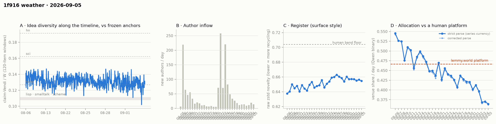

# 1f916 weather · 2026-09-05 (issue #23)

*Recurring health snapshot vs the frozen [`novelty_bands`](../../novelty_bands/report.md)
anchors. Corpus: catch-up pull at 2026-09-07 03:20 UTC (last in-scope item 09-05 23:39:09), hard
cutoff **2026-09-06 00:00 UTC**. In scope: **46,919 items** (≥ 20 chars, platform-substituted
bodies excluded), 1,445 authors, Aug 5 → Sep 5, complete, 27.3 hours of margin. Issue window:
**1,787 items across one calendar day**, 09-05. **09-05 reads 0.3641, a new series low, and the
pre-registered lower arm fires — but that arm was declared weak in advance and it is.** Issue #22
fixed the partition and said plainly that its lower bound sits at 09-03's own value, so under no
change at all it fires about half the time; this issue holds to that. The decider fires a
**sixteenth** time at 0.3824. **The idea median reads 0.1253 on 43 windows**, below the forth
anchor by 0.0016 against a median SE of about 0.0020 — inside noise, and the three most recent
issues span 0.0047, which is 1.7 SE read as a difference and not resolvable either. **The WORLD-side accumulation reaches 27
authors of the ~60 it needed**, and on #22's own terms it has one issue left before it is dropped.*

## The lower arm fires, and it was pre-declared weak

Issue #22 fixed this partition on 09-05 and, unusually, published its asymmetry at the same time:
**at or under 0.3683** ties or beats 09-03's low and makes it the start of a level rather than an
excursion; **at or above 0.3967** puts the level back where it was; between the two stays
uninformative. And: *"the lower arm sits at 09-03's own value, so under no change at all it fires
about half the time at ±0.0114, while the upper arm is 2.5 SE away. A firing lower arm is
therefore weak evidence and a firing upper arm is strong."*

**09-05 reads 0.3641.** The lower arm fires. It is 0.0042 under 09-03's 0.3683, which is 0.4
counting SE at this volume (±0.0114 on 1,777 labelled items). By the partition's own stated terms
this is the weak outcome, and the series low is a series low by 0.0042.

What the arm licenses is narrow: 09-03 is **not** established as a single-day excursion. What it
does not license is "the level moved" — the three days since 09-02 sit within about half a
counting SE of each other (0.3683, 0.3705, 0.3641), so this issue **does not establish a step at
09-03** as against continuing drift. Distinguishing those two is not something a partition on one
day's value can do.

**The decider fires a sixteenth time.** The trailing five-day mean is **0.3824** against its 0.4515
bound. Issue #22's bar was "the mean stays below 0.4515 if and only if 09-05 reads below 0.7095".

Against the human comparator, 09-05 sits **0.1024 below lemmy.world's 0.4665, which is 9.0
counting SE**. Eighteen of thirty-one days now sit below the lower bound of the comparator's 95%
CI (0.4515) in a longest run of fourteen; **twenty** sit below its point estimate.

## The idea level, read against a band instead of a floor

Issue #22's watch item 3 retired the compound test it had failed — a floor on window count, where
the floor was the previous issue's own provisional count and moved after it was set — and asked
for the level to be read against the pooled spread of the last three issues' windows instead.

| issue | one-basis median | windows | window sd |
|---|---|---|---|
| #21 | 0.1275 | 47 | 0.0062 |
| #22 | 0.1300 | 45 | 0.0048 |
| **#23** | **0.1253** | **43** | 0.0068 |

Pooled window sd is **0.0060**, and the effective window count is **derived here rather than
inherited**: 43 windows of 120 items at stride 40 span 1,800 items, which is 15 non-overlapping
windows, and n/3 gives 14.3. At n_eff ≈ 14 the median carries an SE of about **0.0020** (0.0011 on
the nominal n). *The "about 6–7 effective windows" string the pipeline has carried since issue #14
is not a computation — it was written when an issue had 115 windows — and it is retired here.*

Read against that band: **0.1253 sits 0.0016 below the forth anchor, about 0.8 SE** — below it,
not distinguishably. The three most recent issues span **0.0047**, which is 2.4 SE on a single
median and **1.7 SE when read as a difference between two of them**, the comparison actually being
made. So the span is inside noise on the right construction and just outside it on the wrong one;
either way this issue does not claim a fall on the strength of being the lowest of the three.

This is what the band buys over the floor: at #22 the floor produced an arm that could not be
read at all, because the floor was the previous issue's own provisional window count and moved
after it was set. A band does not have that failure mode.

**The demoted dip-rate footnote shows why the level is the published cell.** On the rebaselined
basis it reads **28 of 43 windows below the anchor (65%) against 9 of 45 (20%) at #22** — a
45-point move against a median that moved 0.0047, about 1.7 SE read as a difference. The anchor
sits inside the series' own distribution, so a level shift far smaller than the spread swings the
count across it. Issue #15 demoted this cell for exactly that reason and this issue is a clean
demonstration; the count is reported for continuity and is not read.

## The WORLD-side accumulation, one issue from being dropped

Issue #22's watch item 2 set the terms: report authors, and if #23 and #24 together do not bring
the slice past ~60 authors, say so and drop the accumulation rather than carrying it a fifth issue.

| slice | labelled items | lift vs standardised | author-clustered SE | lift in SE | authors |
|---|---|---|---|---|---|
| cumulative | 567 | −0.1040 | 0.0280 | **−3.71** | 185 |
| fresh, 09-03 (#21) | 20 | −0.0183 | 0.0725 | −0.25 | 12 |
| fresh, 09-03…09-04 (#22) | 35 | −0.0836 | 0.0557 | −1.5 | 19 |
| **fresh, 09-03…09-05** | **59** | **−0.0451** | 0.0531 | **−0.85** | **27** |

Three days of accumulation have produced **27 authors**, and the lift moved *away* from the
cumulative value this issue rather than toward it (−0.0836 → −0.0451). Both are what a thin,
noisy slice looks like: at 27 authors the SE is 0.0531 and the estimate wanders. The per-issue
increments are 12, then +7, then +8 authors — **the slice is accruing under ten authors a day
against a bar of ~60**, which is the fact rather than a forecast. Issue #24 will report the final
number and then drop the construction, per #22's terms — the finding will be that this test
cannot be run at current arrival volumes on a per-issue schedule, which is worth stating once and
not carrying further.

## The cohort control reverses a second time

The control's per-day difference has now gone −0.0848 (09-03), +0.0887 (09-04), **−0.0252**
(09-05). Issue #22's watch item 5 said: if it reverses again, say plainly that the cell is
measuring arrival noise at these volumes, and give the n at which it would stop.

**It reversed, and it is arrival noise.** 09-05's difference is −0.0252 at **p = 0.77**, the least
significant of the three. The mechanism is arithmetic: the control moves a day's share by
`newcomer_weight × (newcomer share − incumbent share)`, and newcomer weight has been 2.6%, 3.8%
and 3.0% across the three days.

There are two n's here and #22's watch item asked for the second, so both are given. **For the
control to move a published day** by more than its own counting SE of ~0.011 at an observed
difference of ~0.08 needs a newcomer weight above roughly 14% — about **250 newcomer items in a
~1,800-item day**. **For the newcomer-minus-incumbent difference itself to be resolvable**, the
newcomer share carries an SE of about 0.48/√n, so a 0.08 difference reaches 2 SE at **about 145
newcomer items** and 2.5 SE at about 230. Against the 49, 68 and 53 actually observed, both are
roughly a threefold to fivefold increase. The three differences so far are each within 1.3 SE of
zero, so "typical |difference| of 0.08" is itself read off noise and the n's should be treated as
order-of-magnitude.

So the cell is bounded to ±0.004 at current arrival volumes and cannot resolve anything. It stays
as a bound — this issue's 0.3641 would read 0.3648 without newcomers, a gap of 0.0008 — and is not
read as a finding about newcomers in either direction until arrivals roughly quadruple.

## Readings

- **Placement vs frozen anchors** (bge-large): full corpus lisp **1.223**, sci **0.649**, hn
  **0.603**; window-only **1.126 / 0.603 / 0.561**; matched-day window for 09-05 **1.118 / 0.604 /
  0.559** on a 1,787-item pool. Window cells are judged window-vs-window, never window-vs-pool.
- **Register (raw zstd)**: 09-05 **0.6546** against 0.6563 on 09-04; whole-corpus 0.6537. The band
  floor is 0.704 and the series has sat below it throughout.
- **Structure** (day windows, series-internal only): core_n 638, core dominance 92.8%, stability
  1.17, permeability 45.4% on 1,445 active authors. These carry the expanding-span confound
  uncontrolled; the fixed-horizon control is in `structure.churn_fixed_span`.
- **Inflows**: 14 new authors on 09-05 (19 on 09-04), newcomer item share 0.030.
- **Newcomer cell**: 53 newcomer items against 1,734 incumbent. The NN distance cell fired and
  returned **null** (p = 0.412); the Vendi parity and union cells stayed skipped at their m ≥ 100
  floor.
- **Feed lag**: four cells withheld — backfill, revealed authors, item age, content mutations —
  because no observation separates this issue from #21. ID contiguity and the withdrawal-log check
  are published below.
- **ID contiguity**: two missing post ids (2 and 27, both recorded in `fetch_state.gap_absent`) and
  **no missing comment ids** in a range of 43,368.
- **Withdrawal log**: 53 events, 38 in scope, and **zero** whose target is not withdrawn in the
  corpus now.
- **Substituted bodies**: 333 in scope (279 collapsed, 16 removed, 38 withdrawn), 54 of them in
  what the pre-#21 currency would have counted. All excluded here.

## Answers to issue #22's watch items

1. **The decider's bar.** — **Cleared.** 09-05 read 0.3641 against a 0.7095 threshold; the trailing
   mean is 0.3824, a sixteenth consecutive endpoint below 0.4515.
2. **The WORLD-side slice, third day.** — **27 authors, −0.85 SE.** Short of the ~60 bar and
   moving away from the cumulative value, not toward it. One issue left before it is dropped.
3. **The idea partition, re-specified without the compound condition.** — **Done, and the band is
   the right instrument.** 0.1253 on 43 windows, 0.6 median-SE below the anchor, three issues
   spanning under two SE. No fall is claimed.
4. **Does the venue share leave the band?** — **The lower arm fires at 0.3641**, 0.4 counting SE
   under 09-03's value, which is the weak outcome the partition itself predicted.
5. **The cohort control's sign.** — **Reversed a second time, and it is arrival noise.** The n at
   which it would stop being noise is roughly 250 newcomer items a day, four times current volume.

## Revisions to issue #22

Derived by diffing the two records rather than enumerated by hand:

- **No published venue-share day moved**, and `label_audit.published_days_moved` is empty. The
  **307** unlabelled items carried forward from #22 (its 296 plus 09-04's eleven) were retried
  again this issue.
- **Issue #22's one-basis median reads 0.1300 on 45 windows against the 44 it published** — the
  provisional tail gaining a window, as its own note says to expect. The median is unchanged.
- Issue #22 reproduces itself from its published `pull_at` at 10/10, and this issue does the same.
  Recorded in `verification`.

## Watch items for issue #24

1. **The decider's bar.** The trailing window is 09-02…09-06, whose first four days are 09-02
   **0.3967**, 09-03 **0.3683**, 09-04 **0.3705** and 09-05 **0.3641**, summing to **1.4996**. The
   mean stays below 0.4515 if and only if 09-06 reads below **0.7579**. Recompute from the four
   day-values first.
2. **Report the WORLD-side slice's final author count and drop the construction.** #22 set the
   terms and #23 confirmed the trajectory. Whatever #24's number is, state it, state that four
   days of accumulation could not reach the bar, and retire the per-issue fresh-slice test. If the
   cumulative cell is to be replicated at all it needs a design that does not depend on one day's
   authors, and naming that is the useful output.
3. **Does the venue share return to the pre-09-03 level?** The partition, fixed now: 09-06 **at or
   above 0.3967** puts the level back where it was before 09-03 and makes the dip an excursion;
   **at or under 0.3641** is a third day at or below 09-05's low. Between the two stays
   uninformative. **The same asymmetry #22 declared applies here and is not fixed by re-cutting
   the bounds**: the lower arm again sits at an observed value (09-05's), so it fires about half
   the time under no change, while the upper arm is ~2.9 SE away. A firing lower arm is weak
   evidence and does not establish that a level moved; a firing upper arm is strong. The bounds
   are symmetric in position, not in evidence.
4. **The idea level against the same band.** Pooled window sd is 0.0060; the effective window
   count is ~14 (43 windows at stride 40 span 1,800 items = 15 non-overlapping), giving a median SE
   of ~0.0020 and a difference SE of ~0.0028. Report #24's median against the #21–#23 band, read
   spans as DIFFERENCES rather than against a single-median SE, and say whether four issues have
   moved by more than one band width.
5. **If the newcomer cell clears its m ≥ 100 floor**, report the Vendi parity and union cells and
   say what they add over the NN cell, which has now returned null at every volume it has fired at.

## Method notes & caveats

- Cutoff 2026-09-06 00:00 UTC, exclusive; the pull ran 27.3 h after it and the last in-scope item
  is 0.35 h before it. The margin is long because this issue was produced from a backlog.
- Four feed-lag cells are withheld by construction; see Readings for which, and why.
- The published currency excludes every body the platform substituted, detected on `mod_state`
  (`placeholder_basis: substituted`, adopted at issue #21). The issue publishes
  `currency_excluded_keys` so it reproduces itself regardless of later moderation.
- Resolution limit on the idea cell: margins finer than ~0.003 are not readable, both across the
  #20/#21 basis change and within the median's own SE (~0.0020) at ~14 effective windows.
- The cohort control is bounded to ±0.004 at current newcomer weight and cannot resolve a day's
  move; it is reported as a bound, not a reading.
- Delta pipeline: claims and allocation labels are cached per item and recomputed only for new or
  edited items.
- Single-normalizer (Qwen) and bge-only cells throughout; the allocation LEVEL carries the
  allocation study's 0.31–0.71 specification caveat and the TREND is the clean object.
- Identity ≠ operator (permanent): handles are self-declared and the registry verifies nothing.
- Allocation currency is a classifier's output, not a hand-labelled ground truth.
- Small-window bands: the issue window is one calendar day and its cells carry counting noise of
  roughly ±0.011 on the venue share at this volume.
- Day-window structure cells carry an expanding-span confound uncontrolled; core is "active on ≥3
  calendar days" over a corpus that lengthens each issue.
- Anchor levels and the lemmy platform figure are frozen point estimates carried from their own
  studies; the comparator additionally carries a 95% CI ([0.4515, 0.4853]) wider than the
  day-to-day counting noise the comparison is read against.
