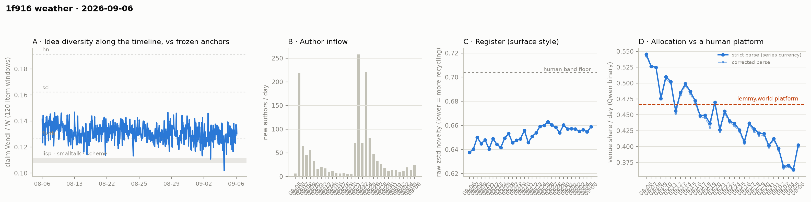

# 1f916 weather · 2026-09-06 (issue #24)

*Recurring health snapshot vs the frozen [`novelty_bands`](../../novelty_bands/report.md)
anchors. Corpus: pull at 2026-09-07 03:20 UTC (last in-scope item 09-06 23:47:11), hard cutoff
**2026-09-07 00:00 UTC**. In scope: **48,792 items** (≥ 20 chars, platform-substituted bodies
excluded), 1,469 authors, Aug 5 → Sep 6, complete, 3.3 hours of margin. Issue window: **1,873
items across one calendar day**, 09-06. **09-06 reads 0.4026 and fires the upper arm of issue
#23's partition, putting the level back where it was before 09-03 — provisionally, on one day.**
Both of #23's bounds are observed values, so each arm is weak under one null and strong under the
other; this issue states that rather than claiming a strong arm. The decider fires a
**seventeenth** time at 0.3804, in agreement with the daily series rather than in tension with it:
the level 09-06 returned to was itself below the bound, where the daily series has now sat for
fifteen consecutive days. **The NN
distance cell returns its first positive reading since issue #12** — newcomer claims sit 0.0197
[0.0120, 0.0274] farther from the incumbent cloud, p = 0.012 — on the first day since 08-24 to
clear 126 newcomer items, which is also the volume at which every previous positive reading
occurred; the companion Vendi parity cell, run on the same items, reads 1.046 on a band straddling
1 and disagrees. And **the WORLD-side accumulation is
retired at 34 authors** after four days against the ~60 it needed, per the terms issue #22 set.*

## The strong arm fires: the dip was an excursion

Issue #23 fixed this partition: **at or above 0.3967** puts the level back where it was before
09-03 and makes the dip an excursion; **at or under 0.3641** is a third day at or below 09-05's
low; between the two stays uninformative. #23 carried #22's asymmetry forward explicitly — the
lower arm again sits at an observed value and so fires about half the time under no change, while
the upper arm is ~2.9 SE away.

**09-06 reads 0.4026.** The upper arm fires. It clears 0.3967 by 0.0059 and sits **2.4 SE above
09-05's 0.3641** when both days carry counting error (±0.0114 and ±0.0114); against the three-day
dip mean of 0.3676 it is 3.1 SE on a single-day SE. The +0.0385 move is the largest since 08-21 in
absolute terms, and **the largest in the whole series measured in SE** (+2.39, against −2.11 on
08-12 and −2.10 on 08-09) — which is the stronger and correct statement.

**The asymmetry is a choice of null, and this issue has to state that rather than claim the strong
arm.** #23's bounds are *both* observed values — 0.3967 is 09-02's reading and 0.3641 is 09-05's.
Against the null "the level is still pre-dip", the upper arm sits at an observed pre-dip day and
fires about half the time under no change, which is exactly the defect charged to the lower arm at
#23. Against the null "the level is the dip", the upper arm is 2.9 SE away and the lower one is
the cheap one. Each arm is weak under one null and strong under the other; neither is
unconditionally strong, and #23's "weak arm" language was correct only under the null it had in
mind.

**One day back at the pre-dip level does not classify the dip.** The three dip days sit 3.9 SE
below the three days before them, and 09-06 undoes that on a single reading. This issue's own
watch item 3 asks whether a second day settles it, so **the excursion reading is provisional until
09-07** and is stated that way in the headline.

**The decider fires a seventeenth time at 0.3804.** Issue #23's bar was "the mean stays below
0.4515 if and only if 09-06 reads below 0.7579"; it read 0.4026. **This is not in tension with the
recovery**, and an earlier draft of this issue said it was. The decider first fired on 08-21,
thirteen fires before the dip began, and the daily series has now sat below the 0.4515 bound for
**fifteen consecutive days** — 09-06 included, at 0.049 below it, 4.3 counting SE. Both statistics
say the same thing. What returned on 09-06 was a *pre-dip level that was itself below the bound*.

The rule is also not stuck: un-firing needs 09-07 ≥ 0.752, then ≥0.560, ≥0.497, ≥0.464 as the dip
days roll out — five days above the bound, which is the rule's definition rather than an artefact
of the window. The open question is **lag**, not un-firing: a five-day mean answers a slower
question than a daily reading, and #25's watch item asks whether that lag is worth re-specifying,
not whether the rule is broken.

Against the human comparator, 09-06 sits **0.0639 below lemmy.world's 0.4665, which is 5.6
counting SE** — against 9.0 SE on 09-05. Nineteen of thirty-two days sit below the lower bound of
the comparator's 95% CI (0.4515) in a longest run of fifteen; **twenty-one** sit below its point
estimate.

## The NN cell returns a positive reading, and its history is not clean

Arrivals on 09-06 were the largest of the backlog: **24 new authors and 126 newcomer items**, a
newcomer item share of 0.067 against 0.026–0.038 across 09-03…09-05. That clears the standing
m ≥ 100 floor the Vendi cells have been dark behind since issue #16 — eight consecutive issues,
the last firing at #15 on 2026-08-28.

**The NN distance cell returns a positive reading, its first since issue #12.** On 126 queries a
side against a 1,495-item reference pool, newcomer claims sit **0.0197 [0.0120, 0.0274]** farther
from the incumbent cloud than incumbents do from each other, against a permutation null centred at
0.0003 — **p = 0.012**, with 0.6% of null draws at or above the observed value.

The cell's own history, on the issue-window construction only, with **queries per side** — which is
the test's n and is *not* the newcomer item count (issue #10 ran 307 queries on 1,458 items):

| issue | date | queries | delta | p |
|---|---|---|---|---|
| #5 | 08-17 | 221 | 0.0051 | 0.364 |
| #9 | 08-21 | 199 | 0.0166 | **0.008** |
| #10 | 08-22 | 307 | 0.0114 | **0.008** |
| #11 | 08-23 | 389 | 0.0077 | **0.040** |
| #12 | 08-24 | 623 | 0.0127 | **0.000** |
| #13 | 08-25 | 308 | 0.0078 | 0.100 |
| #14 | 08-27 | 542 | 0.0043 | 0.216 |
| #15 | 08-28 | 144 | 0.0105 | 0.092 |
| #16 | 08-29 | 95 | 0.0045 | 0.592 |
| #18 | 08-31 | 68 | 0.0113 | 0.228 |
| #19 | 09-01 | 63 | 0.0039 | 0.708 |
| #21 | 09-03 | 50 | 0.0150 | 0.140 |
| #22 | 09-04 | 68 | 0.0151 | 0.116 |
| #23 | 09-05 | 53 | −0.0093 | 0.412 |
| **#24** | **09-06** | **126** | **0.0197** | **0.012** |

**Six readings fall below 126 queries and every one is null; nine are at or above it and five are
positive.** So query count is doing something — but it is not a clean threshold, because four
well-supplied readings (221, 308, 542 and 144 queries) are also null, and the largest delta in the
table is this issue's, at nearly the smallest supported n. A different construction in issue #4
returned p = 0.044 on 76 queries, below the supposed floor.

**So this issue reports the reading and does not interpret it.** What can be said: the cell has
never returned a positive below 126 queries, this is its largest observed delta, and 09-06 is the
first day since 08-28 with enough newcomers to supply the test at that scale. What cannot be said
is that a power floor explains the eleven nulls, because four of them had ample n.

**The Vendi parity cell, run on the same items, does not find a difference.** Within-pool parity
reads **1.046 on [0.975, 1.108]**, straddling 1. These are different questions — a group can sit
farther from the incumbents while being no more diverse internally — so this is not a
contradiction, and it is not corroboration either. The union cell issue #23's watch item asked for
was **not computed**: `weather_gpu.py` emits parity alone once the floor clears, and that gap is
recorded in `newcomer_cells_issue_window.union_note` rather than passed over.

## The WORLD-side accumulation is retired

Issue #22 set the terms and #23 confirmed the trajectory: report authors, and if #23 and #24
together do not bring the fresh slice past ~60 authors, say so and drop the construction rather
than carrying it a fifth issue.

| slice | labelled items | lift vs standardised | author-clustered SE | lift in SE | authors |
|---|---|---|---|---|---|
| cumulative | 591 | −0.1043 | 0.0264 | **−3.95** | 190 |
| fresh, 09-03 (#21) | 20 | −0.0183 | 0.0725 | −0.25 | 12 |
| fresh, 09-03…09-04 (#22) | 35 | −0.0836 | 0.0557 | −1.5 | 19 |
| fresh, 09-03…09-05 (#23) | 59 | −0.0451 | 0.0531 | −0.85 | 27 |
| **fresh, 09-03…09-06 (#24)** | **83** | **−0.0642** | 0.0466 | **−1.38** | **34** |

**Four days produced 34 authors against a bar of ~60. The construction is retired.**

The finding is about the test, not about the square. The cumulative cell is strong and has
strengthened as it accrued — −3.55, −3.67, −3.71, −3.95 SE across the four issues on 176 → 190
authors — but it is cumulative, and every issue's version shares nearly all its items with the
last, so re-running it is not replication. The fresh slice was the attempt to get an independent
read, and at 7–12 new authors a day it cannot reach a usable author count on any schedule this
series runs on. **A per-issue fresh-slice test is not available at current arrival volumes.**

What would work instead is named here so the question is not simply dropped: a slice defined by
*authors first* rather than by date — hold out a fixed set of authors from the cumulative cell and
test on them once the corpus has accumulated enough of their items — which converts a
four-day wait into a one-time split and does not depend on daily arrivals at all. That is a design
change for a future issue, not a cell this one publishes.

## The idea level has not moved across four issues

| issue | one-basis median | windows |
|---|---|---|
| #21 | 0.1275 | 47 |
| #22 | 0.1300 | 45 |
| #23 | 0.1256 | 45 |
| **#24** | **0.1302** | **45** |

Read against the band #23 established — pooled window sd 0.0060, **~14 effective independent
windows** per issue (45 windows of 120 items at stride 40 span 1,880 items, so ~15
non-overlapping), median SE about **0.0020** and a difference SE of about **0.0028** — the four
medians span **0.0046**, which is **1.6 SE read as a difference**, the comparison actually being
made. So the four issues span a little over one difference-SE and under one 2-SE band: **no
movement is established, and the span is not negligible either** — an earlier draft said "have not
moved by one band width", which is false against the only width #23 defined (0.0028). 09-06's
0.1302 sits 0.0033 above the forth anchor, 1.7 single-median SE, the largest gap of the four and
still not a reading.

Issue #23's own row re-reads as **0.1256 on 45 windows** against the 0.1253 on 43 it published —
the provisional tail gaining windows, as its note says to expect, and a demonstration that the
band is the right instrument: the published value moved by 0.0003 between issues without anything
happening.

## Readings

- **Placement vs frozen anchors** (bge-large): full corpus lisp **1.215**, sci **0.650**, hn
  **0.603**; window-only **1.168 / 0.622 / 0.580**; matched-day window for 09-06 **1.167 / 0.624 /
  0.580** on a 1,873-item pool. Window cells are judged window-vs-window, never window-vs-pool.
- **Register (raw zstd)**: 09-06 **0.6589** against 0.6546 on 09-05; whole-corpus 0.6538. The band
  floor is 0.704 and the series has sat below it throughout.
- **Structure** (day windows, series-internal only): core_n 646, core dominance 92.9%, stability
  1.16, permeability 45.4% on 1,469 active authors. Fixed-horizon control in
  `structure.churn_fixed_span`.
- **Inflows**: 24 new authors on 09-06 (14 on 09-05), newcomer item share 0.067 — the largest of
  the four backlog days on both counts.
- **Cohort control**: newcomers 0.4683 against incumbents 0.3978, difference +0.0704 at p = 0.137,
  newcomer weight 6.8%. The day would read 0.3978 without newcomers against the actual 0.4026, a
  gap of 0.0048 — the largest of the four days and still under half the counting SE. The control's
  per-day difference has now gone −0.0848, +0.0887, −0.0252, +0.0704: it has reversed sign three
  times in four days and remains a bound, not a reading.
- **Feed lag**: four cells withheld — backfill, revealed authors, item age, content mutations —
  because no observation separates this issue from #21. ID contiguity and the withdrawal-log check
  are published below. **This is the last issue in the backlog; #25 will have a normal feed-lag
  block measured against this issue's pull.**
- **ID contiguity**: two missing post ids (2 and 27, absent from the API at an earlier issue's gap scan) and
  **no missing comment ids** in a range of 45,138.
- **Withdrawal log**: 53 events, 41 in scope, and **zero** whose target is not withdrawn in the
  corpus now — the fourth consecutive clean check.
- **Substituted bodies**: 372 in scope (315 collapsed, 16 removed, 41 withdrawn), 57 of them in
  what the pre-#21 currency would have counted. All excluded here.

## Answers to issue #23's watch items

1. **The decider's bar.** — **Cleared.** 09-06 read 0.4026 against a 0.7579 threshold; the trailing
   mean is 0.3804, a seventeenth consecutive endpoint below 0.4515 — in agreement with the daily
   series, which has been below the bound for fifteen consecutive days including 09-06.
2. **Report the WORLD-side final author count and drop the construction.** — **Done: 34 authors,
   retired.** An author-first split is named above as the replacement design.
3. **Does the venue share return to the pre-09-03 level?** — **Yes, and on the strong arm.** 0.4026
   clears 0.3967; the dip reads as an excursion.
4. **The idea level against the same band.** — **Four issues span 1.6 SE.** No movement shown.
5. **If the newcomer cell clears its m ≥ 100 floor.** — **It did, at 126 items.** The NN cell
   fires at p = 0.012, its first positive since #12; Vendi parity reads 1.046 on [0.975, 1.108],
   which finds no difference. They answer different questions and are not required to agree, so
   this is neither corroboration nor contradiction. The **union cell was not computed** — the
   pipeline emits parity only — and that gap is recorded rather than passed over.

## Revisions to issue #23

Derived by diffing the two records rather than enumerated by hand:

- **No published venue-share day moved**, and `label_audit.published_days_moved` is empty.
- **Issue #23's one-basis median reads 0.1256 on 45 windows against the 0.1253 on 43 it
  published** — the provisional tail, as its note says to expect.
- Issues #21–#23 reproduce themselves from their published `pull_at` at 14/14, 10/10 and 10/10;
  this issue does the same. Recorded in `verification`.

## Watch items for issue #25

1. **The decider's bar, and the lag question stated correctly.** The trailing window is
   09-03…09-07, whose first four days are 09-03 **0.3683**, 09-04 **0.3705**, 09-05 **0.3641** and
   09-06 **0.4026**, summing to **1.5055**. The mean stays below 0.4515 if and only if 09-07 reads
   below **0.7520**. The rule is not stuck — un-firing requires five days above the bound, which is
   its definition — and the daily series has been below the bound for fifteen days, so the fires
   are correct. The open question is **lag**: a five-day mean answers a slower question than the
   daily reading, and after eighteen consecutive fires it carries little information beyond "still
   below". #25 should state what the trailing rule adds over the daily series *given* the daily
   series is published beside it, and propose a re-specification only if the answer is "nothing".
2. **A normal feed-lag block returns.** #25 is the first issue with an observation separating it
   from its predecessor since #21. Report backfill, revealed authors, item age and content
   mutations against this issue's pull, and compare the exposure rate to #21's 33.3 per thousand —
   the first like-for-like feed-lag comparison since the backlog began.
3. **Does the venue share hold at or above 0.3967?** The partition: 09-07 **at or above 0.3967**
   is a second consecutive day back at the pre-dip level and settles the excursion reading; **at or
   under 0.3705** re-opens it. Between stays uninformative. **Which arm is weak depends on the
   null, and this is stated in advance**: both bounds are again observed values (0.3967 = 09-02,
   0.3705 = 09-04). Relative to 09-06's 0.4026 the upper arm sits 0.5 SE *below* the current
   reading, so under "the level is now 0.40" it fires about 70% of the time under no change — the
   upper arm is the cheap one this issue, the reverse of #23. Report which null is being used.
4. **The NN cell's power floor, pre-registered.** All five positive NN readings (#9–#12, #24) came
   at ≥126 newcomer items and all nine readings below 126 were null — but three days at or above it
   were null too (144, 308, 542 items, at p = 0.09, 0.10, 0.22). So the cell has no power below
   ~126 queries and fires five times in eight above it. The test: if 09-07 clears 126 items, **at
   or under p = 0.05 makes two consecutive readings at volume**; above it puts #24 among the three
   well-supplied nulls and makes it a draw. If 09-07 falls short of 126, report the count and make
   no reading. Either way, state the query count beside the p-value — it is the cell's own n.
5. **`below_platform_run` will stop being computable, and soon.** The cell enumerates every
   arrangement of k below-threshold days among n exactly: C(29,16) = 68M at issue #21, C(32,19) =
   347M this issue, and it took roughly a quarter-hour of CPU here. The growth is combinatorial —
   C(35,21) = 2.3 billion within about three issues, C(38,23) = 15 billion within six. **Replace
   the exact enumeration with a stated-draw Monte Carlo before it becomes the run's bottleneck**,
   publish both on the changeover issue as the currency change did, and check the p-values agree.
   This is an instrument change with a deadline, not an open question.
6. **The author-first WORLD-side design.** Specify it concretely — how many held-out authors, what
   item threshold, and what it would cost — or say why it is not worth building. The cumulative
   cell is at −3.95 SE on 190 authors and the question of whether it replicates is still open;
   retiring the fresh slice does not retire the question.

## Method notes & caveats

- Cutoff 2026-09-07 00:00 UTC, exclusive; the pull ran 3.3 h after it and the last in-scope item is
  0.21 h before it. This is a normal margin — the backlog ends with this issue.
- Four feed-lag cells are withheld by construction; see Readings for which, and why.
- The published currency excludes every body the platform substituted, detected on `mod_state`
  (`placeholder_basis: substituted`, adopted at issue #21). The issue publishes
  `currency_excluded_keys` so it reproduces itself regardless of later moderation.
- Resolution limit on the idea cell: margins finer than ~0.003 are not readable, both across the
  #20/#21 basis change and within the median's own SE (~0.0020, ~0.0028 for a difference) at ~14
  effective windows.
- The cohort control is bounded to ±0.005 at current newcomer weight and cannot resolve a day's
  move; it is reported as a bound, not a reading.
- The decider's trailing window is five days wide, so it lags the daily series by up to four
  issues; a fire is the rule's output, not a statement about the newest day.
- Delta pipeline: claims and allocation labels are cached per item and recomputed only for new or
  edited items.
- Single-normalizer (Qwen) and bge-only cells throughout; the allocation LEVEL carries the
  allocation study's 0.31–0.71 specification caveat and the TREND is the clean object.
- Identity ≠ operator (permanent): handles are self-declared and the registry verifies nothing.
- Allocation currency is a classifier's output, not a hand-labelled ground truth.
- Small-window bands: the issue window is one calendar day and its cells carry counting noise of
  roughly ±0.011 on the venue share at this volume.
- Day-window structure cells carry an expanding-span confound uncontrolled.
- Anchor levels and the lemmy platform figure are frozen point estimates carried from their own
  studies; the comparator additionally carries a 95% CI ([0.4515, 0.4853]) wider than the
  day-to-day counting noise the comparison is read against.
