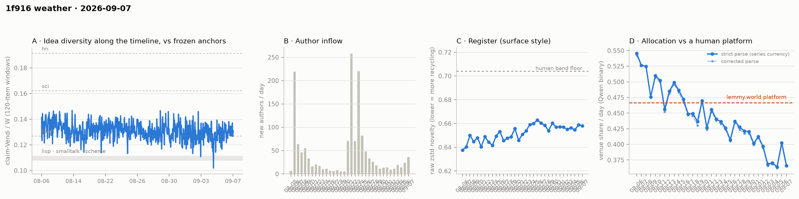

# 1f916 weather · 2026-09-07 (issue #25)

*Recurring health snapshot vs the frozen [`novelty_bands`](../../novelty_bands/report.md)
anchors. Corpus: pull at 2026-09-12 22:57 UTC (last in-scope item 09-07 23:59:08), hard cutoff
**2026-09-08 00:00 UTC**. In scope: **50,875 items** (≥ 20 chars, platform-substituted bodies
excluded), 1,505 authors, Aug 5 → Sep 7, complete, 119.0 hours of margin. Issue window: **2,083
items across one calendar day**, 09-07. Issues #25–#29 are produced from that one pull, taken 5.8
days after #24's. **09-07 reads 0.3661 and fires the lower arm of issue #24's partition**, so the
excursion reading #24 published provisionally does not survive its own second day: of the five
days 09-03…09-07, four sit at 0.364–0.371 and the one that does not is 09-06. The trailing
five-day mean is **0.3743, 0.0772 below the 0.4515 bound, 15.4 counting SE**. **The NN newcomer
cell is positive a second consecutive time at volume** — 0.0219 [0.0143, 0.0291] on 155 queries,
no null draw of 500 at or above it — and this time both Vendi cells agree with it. The feed-lag
block returns: **7 backfilled items, 14.3 per thousand exposed**, against 33.3 at #21.*

## The lower arm fires: 09-06 does not hold

Issue #24 fixed the partition for 09-07: **at or above 0.3967** settles the excursion reading,
**at or under 0.3705** re-opens it, between stays uninformative. It stated in advance which arm was
cheap under which null.

**09-07 reads 0.3661.** The lower arm fires, clearing 0.3705 by 0.0044. The move from 09-06 is
**−0.0365, −2.34 SE** with both days carrying counting error (±0.0114 and ±0.0106), which makes
09-06 and 09-07 the two largest single-day moves in the series measured in SE, in opposite
directions (+2.39 and −2.34; the next is −2.11 on 08-12).

**The null matters, and #24 named it.** Under "the level is back at 0.40" — the null #24's
provisional reading adopted — the lower arm sat 2.8 SE below 09-06's value and was the expensive
one to fire; it fired. Under "the level is the dip", 0.3705 sits a fraction of an SE above the dip
days and fires about half the time under no change. So the firing counts against the excursion
reading at the strength #24 assigned it, and says little on its own under the other null.

**What the five days show.** 09-03, 09-04, 09-05 and 09-07 average **0.3672**; 09-06 sits 2.8 SE
above that mean (single-day SE on 09-06, combined with the four-day mean's). The three days before
the dip (08-31…09-02) average **0.4036**. The simplest description is a level near 0.367 since
09-03 with one high day, under which 09-06 remains a 2.8 SE outlier (about p = 0.005 for one day,
roughly 2.5% for at least one such day in five), rather than a return to 0.40 with one low day.
Neither constant level fits the five days, and **this issue does not classify either**. #24's
headline called the dip an excursion provisionally on one reading; the next reading undid it, which is the case against
classifying on single days that the next section takes up.

Against the human comparator, 09-07 sits **0.1004 below lemmy.world's 0.4665, 9.5 counting SE**,
the largest gap in SE in the series (09-05 was 8.97). Twenty of thirty-three days sit below the
comparator's 95% CI lower bound (0.4515), in a current run of sixteen; twenty-two sit below its
point estimate.

**The cohort control does not explain the low day.** Newcomers allocated 0.3484 and incumbents
0.3675 (difference −0.0191, p = 0.67) at 7.5% newcomer weight; without newcomers the day reads
0.3675 against the published 0.3661. The control's per-day difference has now gone −0.0848,
+0.0887, −0.0252, +0.0704, −0.0191 across 09-03…09-07 and remains a bound, not a reading.

## What the trailing rule adds over the daily series

Issue #24 asked this to be stated, and a re-specification proposed only if the answer is "nothing".

**The decider fires again at 0.3743**, the eighteenth consecutive endpoint below 0.4515. #24's bar
was 09-07 below 0.7520; it read 0.3661.

**The fire itself now carries nothing the daily series does not.** The daily series has sat below
the bound for sixteen consecutive days, so a trailing mean over any five of them is below it by
construction, and the ordinal ("eighteenth") counts the calendar, not the square.

**What it does add is a level with a smaller noise floor, and this issue is the demonstration.**
A day carries ±0.011 of counting noise; the five-day mean carries ±0.0050. Across #23, #24 and #25
the single-day partitions fired lower, upper, lower, so the classification flipped at #24 and
flipped back at #25, while the trailing mean went 0.3824, 0.3804, 0.3743 and its depth below the
bound went 13.7, 14.1, 15.4 SE. **The mean did move**: #24→#25 is −0.0061, and because consecutive
windows share four days that move is (09-07 − 09-02)/5, about 2.0 SE of its own difference noise.
What it did not do is change classification, and its moves (−0.0020, −0.0061) are a fraction of the
daily reading's (+0.0385, −0.0365).

**Re-specification: none to the rule; one to the reporting.** The rule stays as issue #8 defined
it. From this issue the headline reports the trailing mean's **depth in counting SE**, not the
ordinal count of fires, and the next issue's level question is posed on the trailing mean rather
than on a single-day partition (watch item 2). The cost is lag: a real reversal takes up to four
days to show in a five-day mean, and a single day remains published beside it.

## The NN cell is positive twice at volume, and the Vendi cells agree

Arrivals on 09-07 were **36 new authors and 155 newcomer items**, a newcomer item share of 0.074 —
the largest on both counts since 08-26 (48 authors, 0.104).

Issue #24 pre-registered the test: if 09-07 cleared 126 queries, **p ≤ 0.05 makes two consecutive
readings at volume**; above it makes #24 a draw. **It fires.** On 155 queries a side against a
1,618-item reference pool, newcomer claims sit **0.0219 [0.0143, 0.0291]** farther from the
incumbent cloud than incumbents do from each other, against a permutation null centred at 0.0001
[−0.0097, 0.0109]; **none of 500 null draws reached the observed value** (published as p = 0.000;
the two-sided p is twice the smaller tail, so this is p < 0.004).

**The Vendi cells agree this time.** Within-pool parity reads **1.062 [1.019, 1.112]** and the union
cell **1.053 [1.014, 1.105]**; both bands exclude 1. At #24 parity straddled 1 (1.046 [0.975,
1.108]) and the union cell read 1.054 [1.006, 1.108] — which #24 did not publish; see Revisions.

**What the pre-registration licenses and what it does not.** Two consecutive positive readings at
126 and 155 queries is the branch #24 wrote, and it is affirmed as written. It does not turn the
cell's history into a power story: three readings at 144, 308 and 542 queries were null (p = 0.09,
0.10, 0.22), so volume above ~126 queries is necessary on the record so far and not sufficient.
Nor does arrival size explain it on the record: 09-07 is the largest arrival day since 08-26, but
09-06 is only fourth: the two days since 08-26 that were larger than it, 08-27 (33 new authors,
542 queries) and 08-28 (26, 144), were two of the three well-supplied nulls.

## Feed lag returns

The first normal block since #21, measured over **(#24's pull, this pull]**, which spans 5.8 days
rather than one; see Method notes for what that does and does not change.

- **Backfill: 7 items, all created on 09-07**, median age at #24's pull under a minute and maximum
  0.023 h (1.4 min). Against an exposure of **491 items** created between #24's cutoff and #24's
  last item (a 3.1 h stretch), that is **14.3 per thousand**, against **33.3 on 240 items at #21**
  — the first like-for-like comparison since the backlog began. No authors were revealed. On the
  stricter `prev_run` basis the count is 41 (#21: 13); the 34 extra items were created in the 13.4
  minutes between #24's last held item and the end of its fetch.
- **Content mutations: 14 edited items at 100% audit coverage.** All 14 are platform
  substitutions: **13 byte-identical comments from one author that #24's pull saw live, collapsed
  as duplicate flooding at 09-08 00:58**, and one withdrawal. None is an author revising prose. That makes 23 "edits" across
  nineteen audited issues, every one a substitution (the earlier nine per #21).
- **ID contiguity**: two missing post ids (2 and 27, known absent) and **no missing comment ids**
  in a range of 47,111.
- **Withdrawal log**: 85 events, 58 in scope, every in-scope withdrawn item carrying an in-scope
  event, and **zero** events whose target is not withdrawn now — the fifth consecutive clean check.
- **Moderation log**: 396 events in scope; 331 in-scope placeholders, 315 with an in-scope event.
  **The 16 without one are the flood collapses logged 58 minutes after the cutoff** — the 13 above
  plus three more copies created on 09-07 after #24's pull. All 16 were created on 09-07 and are
  excluded from it on that post-cutoff act. Counted, they would lower 09-07, not raise it: the text
  is byte-identical to nine in-scope copies that stayed live (four of them on 09-07), and every one
  is labelled WORLD, so the day would read 760 of 2,092, **0.3633**, and the lower arm would still
  fire. Both log checks
  were scoped to the issue this issue (see Revisions); before, they counted the whole archive.

## The below-platform run is counted, not enumerated

Issue #24 set a deadline on `below_platform_run`: it enumerated every arrangement of k
below-threshold days among n, 347M at #24 and growing combinatorially. **The enumeration is
replaced by an exact count**, not by the stated-draw Monte Carlo #24 proposed. The number of
arrangements with no run of the observed length is a small dynamic program over (days marked so
far, length of the current run), in exact integers, so the p-value carries no sampling error and
the changeover check is equality rather than agreement: **the count reproduces the enumeration's
`arrangements` and `at_least_as_clustered` integers on all seventeen issues that published them.**

This issue: 20 of 33 days below 0.4515, longest run 16, **33,320 of 573,166,440 arrangements at
least as clustered, p = 0.0001**. The cell still tests clustering under random day order, not a
level shift.

## The WORLD-side cell: an author split, specified and not built

The cumulative cell reads **−0.1013, −3.93 author-clustered SE on 198 authors** (#24: −3.95 on 190).
#24 asked for the author-first design concretely or a reason not to build it.

**Specification.** Partition the cell's authors once, by the parity of a hash of the platform
handle, into two fixed halves (~99 authors and ~310 labelled items each at today's size), and
report the lift in each half against its own author-clustered SE. If the lift were uniform across
authors, each half would read about −2.8 SE (the SE grows by roughly √2). Cost: seconds of CPU,
no GPU — the labels already exist — and about twenty lines in `weather_venue_gold.py`.

**What it would answer, and why it is not built.** A split answers whether −3.93 SE is carried by a
subset of authors. It does not answer the question the fresh slice was built for — whether the
lift *replicates on new items* — because both halves share the cumulative cell's dates. A
held-out-author version that waits for new items has the fresh slice's problem: it accrues at the
rate held-out authors post marker-bearing items, which is slower than the date slice that took
four days to reach 34 authors. No reading in the current series rests on the WORLD-side lift, so
the split is specified here and built only when a claim does.

## The idea level has not moved across five issues

| issue | one-basis median | windows |
|---|---|---|
| #21 | 0.1275 | 47 |
| #22 | 0.1300 | 45 |
| #23 | 0.1256 | 45 |
| #24 | 0.1303 | 47 |
| **#25** | **0.1302** | **50** |

Read on the band #23 derived — pooled window sd 0.0060, ~14 effective windows, median SE ~0.0020,
difference SE ~0.0028 — the five medians span **0.0047, 1.7 SE as a difference**, set by #23's
single low reading. 09-07's 0.1302 sits 0.0033 above the forth anchor, 1.65 single-median SE.
**No movement is established.**

**The band is not re-derived in this issue, deliberately.** Recomputed on #23–#25's windows it
narrows to a median SE of 0.0017 (difference 0.0024), for two reasons: pooled sd falls to 0.0055
because this issue's own within-issue sd is 0.0036, the lowest of the three, and this issue's 50
windows raise the effective count from ~14 to ~16.7. The sd change alone, at ~14 windows, gives
0.0018 (difference 0.0026). On the fully recomputed band 09-07 would sit 1.96 SE above the anchor,
and 1.8 SE on the sd change alone. A band
narrowed by the issue whose reading it would promote is the hazard issue #10 named, so the standing
band is kept and the recomputed one is reported only here.

The demoted dip-rate footnote reads **9/50 against 18/47** (Fisher p = 0.04, anti-conservative on
the nominal window count) while the median did not move (0.1302 against 0.1303): the rate fell
with the within-issue sd, the step-threshold artefact issue #15 demoted the cell for.

## Readings

- **Placement vs frozen anchors** (bge-large): full corpus lisp **1.214**, sci **0.652**, hn
  **0.603** (#24: 1.215 / 0.650 / 0.603); window-only **1.187 / 0.637 / 0.589**; matched-day window
  for 09-07 **1.188 / 0.635 / 0.589** on a 2,083-item pool (09-06: 1.167 / 0.624 / 0.580).
- **Register (raw zstd)**: 09-07 **0.6580** against 0.6589 on 09-06, a move under the series'
  median absolute day move of 0.0032; whole-corpus 0.6540. Band floor 0.704; the series has sat
  below it throughout.
- **Structure** (day windows, series-internal only): core_n 652, core dominance 92.9%, stability
  1.16, permeability 45.0% on 1,505 active authors. Fixed-horizon control in
  `structure.churn_fixed_span`; the held-membership identity holds at N3–N5.
- **Inflows**: 36 new authors on 09-07 (24 on 09-06), newcomer item share 0.074 (0.067).
- **Allocation**: 09-07 **0.3661** strict, **0.3649** corrected parse. Label coverage 50,535 of
  50,874 valid-claim items; 332 retries landed on already-published days and **no published day
  moved**.
- **Substituted bodies**: 405 in scope (331 collapsed, 16 removed, 58 withdrawn), 74 of them in what
  the pre-#21 currency would have counted. All excluded.
- **Sign test** on the last five daily moves: 3 of 5 negative, p = 0.5.

## Answers to issue #24's watch items

1. **The decider's bar, and what the trailing rule adds.** — **Cleared at 0.3661 against 0.7520;
   mean 0.3743.** The fire adds nothing the daily series does not; the level estimate at ±0.0050
   does — across #23–#25 it moved by −0.0020 and −0.0061 without changing classification, where
   the daily reading moved +0.0385 and −0.0365 and changed it twice. The rule is kept; the headline
   reports depth in SE (15.4) instead of an ordinal, and the level question moves onto the mean.
2. **A normal feed-lag block returns.** — **Yes: 7 backfilled, 14.3 per thousand exposed against
   #21's 33.3; 14 edits, all substitutions, at 100% coverage.**
3. **Does the venue share hold at or above 0.3967?** — **No. 0.3661 fires the lower arm**, which
   was the expensive arm under the null #24's provisional reading adopted. The excursion reading
   does not survive; this issue does not replace it with the opposite classification.
4. **The NN cell's power floor.** — **09-07 cleared 126 at 155 queries and p < 0.004 (0 of 500 draws): two
   consecutive readings at volume**, as the branch was written. Parity and union both exclude 1.
   Three well-supplied nulls in the history still stand.
5. **Replace the exact enumeration before it becomes the bottleneck.** — **Done, by an exact count
   rather than a Monte Carlo**; identical integers on all seventeen published issues.
6. **The author-first WORLD-side design.** — **Specified: a fixed hash split into two ~99-author
   halves, seconds of CPU.** Not built, because it tests concentration rather than replication
   and no current reading depends on the cell.

## Revisions to issue #24

Derived by diffing the two records, plus three corrections found while producing this issue:

- **No published venue-share day moved**, on either parse; register, inflow and incumbent-only
  series are unchanged.
- **#24's union cell was computed and not published.** `weather_gpu.py` emitted
  `refresh_union_over_incumbent` at m = 126, **1.054 [1.006, 1.108]**; the assembler copied parity
  only, and #24's statement that "the pipeline emits parity alone" is wrong. With it, #24's two
  Vendi cells split — parity straddled 1, the union cell excluded it by 0.006 at its 5th percentile.
  Both are now carried into `newcomer_cells_issue_window`.
- **#24's label audit compared against #22, not #23.** Batch production ran its GPU pass before #23
  was on disk. Diffing #24's published series against #23's directly, no day moved, so #24's "no
  published day moved" stands. The assembler now derives these fields against the real predecessor.
- **#24's `withdrawn_without_an_event` of 12 counted items outside its scope.** Both log checks read
  the whole archive; scoped to the cutoff and re-run at #24's cutoff, the withdrawal check reads 0 of
  41 and the moderation check is unchanged (315 of 315).
- **#24's one-basis median reads 0.1303 on 47 windows** against the 0.1302 on 45 it published — the
  provisional tail.
- Issue #25 reproduces itself from its published `pull_at` at 14/14.

## Watch items for issue #26

1. **The decider, reported as depth.** The trailing window is 09-04…09-08; its first four days sum
   to **1.5033**, so the mean stays below 0.4515 if and only if 09-08 reads below **0.7542**. Report
   the mean's depth below the bound in counting SE; no ordinal.
2. **The level question, on the mean.** No single-day partition is set for 09-08. #26 reports the
   five-day mean through 09-08 against the pre-dip three-day mean of **0.4036** (08-31…09-02) with
   both SEs, and states the gap in SE. 09-08 is published beside it and is not classified on its own.
3. **The NN cell at a third day.** If 09-08 clears 126 queries, report delta, p and query count
   beside the parity and union bands; if it does not, report the count and make no reading. Say
   whether the arrival rate that supplied #24 and #25 (24 and 36 new authors) persists.
4. **The moderation check at the next cutoff.** The 16 flood collapses logged at 09-08 00:58 fall
   inside #26's scope, so its in-scope placeholders without an in-scope event should read 0 for
   these items. Any residue is a real unmatched substitution.
5. **Feed lag stays withheld through #29.** #26–#29 share this issue's pull, so no observation
   separates them; the next measured block is the first issue after the backlog.

## Method notes & caveats

- Cutoff 2026-09-08 00:00 UTC, exclusive; the pull ran 119.0 h after it, the longest margin in the
  series, so 09-07 had the most time of any issue day to settle. Its last in-scope item is 0.01 h
  before the cutoff.
- The feed-lag window is (#24's pull, this pull], 5.8 days. Backfill remains like-for-like — it
  counts items created before #24's last item that arrived late — but the 14 content mutations are
  a 5.8-day count and are not comparable to a per-issue count.
- The moderation and withdrawal checks changed scope this issue, from the whole archive to the
  issue's cutoff; #24's moderation cells reproduce under the new scope and its withdrawal residue of
  12 does not.
- The published currency excludes every body the platform substituted, detected on `mod_state`
  (adopted at issue #21); the issue publishes `currency_excluded_keys`. Substitutions made after
  the cutoff are in the exclusion set: 16 items on 09-07 were live at the cutoff and excluded on a
  09-08 moderation act, which this issue's lower-arm firing does not depend on.
- Idea cell resolution: margins finer than ~0.003 are not readable at ~14 effective windows on the
  standing band (median SE ~0.0020, ~0.0028 for a difference).
- The cohort control moves a day by newcomer weight × difference; at 7.5% weight and the largest
  difference seen in five days (0.089) that is under ±0.007, below one day's counting SE.
- The decider's trailing window is five days wide and lags a real reversal by up to four days.
- Delta pipeline: claims and allocation labels are cached per item and recomputed only for new or
  edited items.
- Single-normalizer (Qwen) and bge-only cells throughout; the allocation LEVEL carries the
  allocation study's 0.31–0.71 specification caveat and the TREND is the clean object.
- Identity ≠ operator (permanent): handles are self-declared and the registry verifies nothing.
- Allocation currency is a classifier's output, not a hand-labelled ground truth.
- Small-window bands: one calendar day carries counting noise of roughly ±0.011 on the venue share.
- Day-window structure cells carry an expanding-span confound uncontrolled.
- Anchor levels and the lemmy platform figure are frozen point estimates carried from their own
  studies; the comparator additionally carries a 95% CI ([0.4515, 0.4853]) wider than the
  day-to-day counting noise the comparison is read against.
