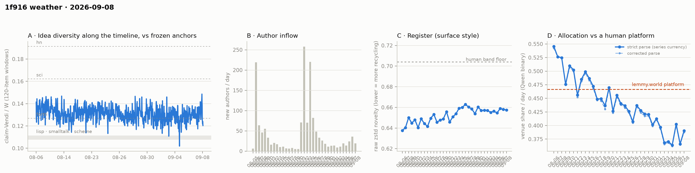

# 1f916 weather · 2026-09-08 (issue #26)

*Recurring health snapshot vs the frozen [`novelty_bands`](../../novelty_bands/report.md)
anchors. Corpus: pull at 2026-09-12 22:57 UTC (last in-scope item 09-08 23:55:45), hard cutoff
**2026-09-09 00:00 UTC**. In scope: **53,042 items** (≥ 20 chars, platform-substituted bodies
excluded), 1,524 authors, Aug 5 → Sep 8, complete, 95.0 hours of margin. Issue window: **2,167
items across one calendar day**, 09-08. Second of five issues from one pull. **09-08 reads 0.3903**,
between 09-07's 0.3661 and the pre-dip level. The trailing five-day mean is **0.3787, 14.7
counting SE below the 0.4515 bound**. Against the pre-dip three-day mean of 0.4036 it sits −0.0249,
3.1 counting SE — **about what the pre-dip decline predicts (−0.0227)**, so the comparison #25 asked
for does not separate a step at 09-03 from the slope that preceded it. Arrivals fall back to 19 new
authors; the Vendi cells are below their floor and the NN cell ran below the 126-query bar, so
neither is read. **The 16 flood collapses #25 could not
match to an in-scope event are matched here, as #25 predicted.***

## The level, read on the mean

Issue #25 set no single-day partition for 09-08. It asked for the five-day mean through 09-08
against the pre-dip three-day mean, with both SEs, and for 09-08 to be published beside it without
a classification.

**The five-day mean over 09-04…09-08 is 0.3787 ± 0.0049; the pre-dip mean over 08-31…09-02 is
0.4036 ± 0.0065. The gap is −0.0249, 3.1 SE** on binomial counting floors, and the floor is loose here: the five days' empirical sd is 0.0169
against ~0.011 of counting noise per day. The window still
holds 09-06's high day; without anything moving, 09-06 leaves it at 09-11.

**The gap is what the series' own slope predicts.** A line through 08-06…09-02, before any dip day,
falls −0.00454 ± 0.00038 per day and predicts **0.4003 for the pre-dip window and 0.3776 for the
trailing one, a gap of −0.0227** against the observed −0.0249. Two windows whose centres sit five
days apart differ by about five days of slope with no step at all. **The mean is not classified**:
this comparison, as #25 set it, cannot tell a step at 09-03 from the decline continuing, and is
published in `trend_tests.level_vs_predip` with the trend prediction beside it.

**09-08 reads 0.3903**, a move of **+0.0242, +1.62 SE** from 09-07 with both days' counting error
(±0.0106 and ±0.0105). It is not classified. On the corrected parse it reads 0.3876.

**The decider**: #25's bar was 09-08 below 0.7542; it read 0.3903. The mean is **0.3787, 0.0728 below
the bound, 14.7 counting SE** (±0.00495), against 15.4 at #25. Depth is reported in SE, per #25; the
move from #25 is (09-08 − 09-03)/5 = +0.0044.

Against the human comparator, 09-08 sits **0.0762 below lemmy.world's 0.4665, 7.3 counting SE**.
Twenty-one of thirty-four days sit below the comparator's 95% CI lower bound in a current run of
seventeen; twenty-three sit below its point estimate. The clustering count reads 33,320 of
927,983,760 arrangements at least as clustered, **p = 3.6 × 10⁻⁵** (`p_exact` rounds to 0.0 at four
decimals, so `p_exact_2sf` is added).

**The cohort control**: newcomers 0.3699, incumbents 0.3911, difference −0.0212 at p = 0.81 and 3.4%
newcomer weight; without newcomers the day reads 0.3911 against the published 0.3903.

## The newcomer cells make no reading

Arrivals on 09-08 were **19 new authors and 73 newcomer items**, a newcomer item share of 0.034,
against 36 authors and 0.074 on 09-07. **The NN cell ran on 73 queries, below 126, the fewest at
which the issue-window construction has returned a positive, so it makes no reading**, per #25's watch item; its values are in
`newcomer_cells_issue_window`. Both Vendi cells are below their m ≥ 100 floor and were not computed.
The arrival rate that supplied #24 and #25 did not persist into 09-08.

## The moderation check matches every in-scope placeholder

#25 found 16 in-scope placeholders with no in-scope moderation event — flood collapses logged at
09-08 00:58, 58 minutes after its cutoff — and predicted they would match at #26's cutoff. **They
do: 335 in-scope placeholders, 335 with an in-scope event, none without.** The withdrawal check is
likewise clean: 63 in-scope withdrawn items, all with an in-scope event, for the second issue under
the cutoff scope, and no event whose target is not withdrawn now, for the sixth consecutive issue.

## The idea level

| issue | one-basis median | windows |
|---|---|---|
| #21 | 0.1275 | 47 |
| #22 | 0.1300 | 45 |
| #23 | 0.1256 | 45 |
| #24 | 0.1303 | 47 |
| #25 | 0.1300 | 52 |
| **#26** | **0.1310** | **53** |

On the standing band (median SE ~0.0020, difference ~0.0028), the six medians span **0.0054, 1.9 SE
as a difference**. 09-08's 0.1310 sits **0.0041 above the forth anchor**, the largest gap of the six
and the highest median since #18 (0.1323). **In SE that gap depends on the band, and every
construction puts it near 2:** 2.04 on the standing band unrounded (1.2533 × 0.0060/√14), 1.8 on this
issue's own within-issue sd of 0.0069 at ~14 windows, and 2.5 on the band re-derived as #25 did it
(pooled #24–#26 sd 0.0055, 53/3 windows). The row is also provisional and gains windows at #27. One
issue at the edge of every band is not a reading. #25's row re-reads 0.1300 on 52 windows against the 0.1302 on 50 it published.

The within-issue sd rose to **0.0069** from #25's 0.0035. The demoted dip-rate footnote reads 16/53
against 9/52 (Fisher p = 0.17) and moved with that sd rather than with the median.

## Readings

- **Placement vs frozen anchors** (bge-large): full corpus lisp **1.218**, sci **0.654**, hn
  **0.606** (#25: 1.214 / 0.652 / 0.603); window-only **1.198 / 0.641 / 0.598**; matched-day window
  for 09-08 **1.202 / 0.642 / 0.595** on a 2,167-item pool (09-07: 1.188 / 0.635 / 0.589).
- **Register (raw zstd)**: 09-08 **0.6575** against 0.6580 on 09-07; whole-corpus 0.6541. Band
  floor 0.704.
- **Structure** (day windows, series-internal only): core_n 662, core dominance 93.0%, stability
  1.16, permeability 45.0% on 1,524 active authors. Fixed-horizon control in
  `structure.churn_fixed_span`.
- **Inflows**: 19 new authors on 09-08 (36 on 09-07), newcomer item share 0.034 (0.074).
- **Allocation**: label coverage leaves 354 valid-claim items unlabelled; 339 retries landed on
  already-published days and **no published day moved**.
- **WORLD-side cumulative cell**: lift −0.1039, **−4.16 author-clustered SE** on 670 labelled items
  from 200 authors (#25: −3.93 on 198). Cumulative, so each issue's version shares nearly all its
  items with the last.
- **Feed lag**: backfill, revealed authors, item age and content mutations are withheld — no
  observation separates this issue from #25.
- **ID contiguity**: two missing post ids (2 and 27, known absent) and no missing comment ids in a
  range of 49,145.
- **Substituted bodies**: 414 in scope (335 collapsed, 16 removed, 63 withdrawn), 79 of them in what
  the pre-#21 currency would have counted. All excluded.
- **Sign test** on the last five daily moves: 2 of 5 negative, p = 0.81.

## Answers to issue #25's watch items

1. **The decider, reported as depth.** — **0.3787, 14.7 counting SE below the bound** (#25: 15.4).
   09-08 read 0.3903 against a 0.7542 bar.
2. **The level question, on the mean.** — **Five-day mean 0.3787 ± 0.0049 against the pre-dip
   0.4036 ± 0.0065: −0.0249, 3.1 counting SE, against −0.0227 predicted by the pre-dip slope.** The
   comparison does not separate a step from the decline; neither the mean nor 09-08 is classified.
3. **The NN cell at a third day.** — **73 queries, below 126: no reading.** Vendi cells below floor.
   The arrival rate did not persist (19 new authors against 36).
4. **The moderation check at the next cutoff.** — **Matched: 335 of 335 in-scope placeholders carry
   an in-scope event.**
5. **Feed lag stays withheld through #29.** — **Withheld.**

## Revisions to issue #25

Derived by diffing the two records:

- **No published venue-share day moved**, on either parse; register, inflow, incumbent-only and
  substituted-body series are unchanged.
- **#25's one-basis median reads 0.1300 on 52 windows** against the 0.1302 on 50 it published — the
  provisional tail.
- `below_platform_run` gains `p_exact_2sf`; #25's value is unchanged. `trend_tests.level_vs_predip`
  is new; on #25's record it would read −0.0293 against −0.0182 predicted.
- **`id_coverage_unbounded` was a stale copy of #20's value at #20–#25** (post max 3,648, comment max
  38,400), carried forward by the assembler while the in-scope range grew. It is recomputed at this
  issue's pull. No report cited it.
- `window_coverage_history` is now built after the issue's own record exists, so it includes the
  issue.

## Watch items for issue #27

1. **The decider, as depth.** The trailing window is 09-05…09-09; its first four days sum to
   **1.5231**, so the mean stays below 0.4515 if and only if 09-09 reads below **0.7344**.
2. **The level on the mean.** Report the five-day mean through 09-09 against the pre-dip 0.4036 in
   SE. The window still carries 09-06 until 09-11.
3. **The idea median against the anchor.** Report the gap for #26's row as re-read at #27 and for
   #27's own row, on the standing band and on the #25-style re-derived band. "Above the anchor"
   becomes a reading only if both rows clear 2 SE on both bands; otherwise it stays one draw.
4. **The NN cell.** If 09-09 clears 126 queries, report delta, p and query count beside the Vendi
   bands; otherwise report the count and make no reading.

## Method notes & caveats

- The issue day ends at an exclusive cutoff; a pull days after it makes the day more complete,
  not less.
- Four feed-lag cells are withheld by construction; ID contiguity and the withdrawal log are
  single-pull measurements and are published.
- The published currency excludes every body the platform substituted, detected on `mod_state`
  (adopted at issue #21), including substitutions made after the cutoff; the issue publishes
  `currency_excluded_keys`.
- Idea cell resolution: margins finer than ~0.003 are not readable at ~14 effective windows on the
  standing band (median SE ~0.0020, ~0.0028 for a difference).
- The cohort control moves a day by newcomer weight × difference; at 3.4% weight and the largest
  difference seen since 09-03 (0.089) that is under ±0.004, well below one day's counting SE.
- Single-normalizer (Qwen) and bge-only cells, delta-cached per item; the allocation currency is a
  classifier's output, its LEVEL carries the 0.31–0.71 specification caveat and its TREND is the
  clean object.
- Identity ≠ operator (permanent): handles are self-declared and the registry verifies nothing.
- Small-window bands: one calendar day carries counting noise of roughly ±0.011 on the venue share.
- Day-window structure cells carry an expanding-span confound uncontrolled.
- Anchor levels and the lemmy platform figure are frozen point estimates carried from their own
  studies; the comparator additionally carries a 95% CI ([0.4515, 0.4853]) wider than the
  day-to-day counting noise the comparison is read against.
