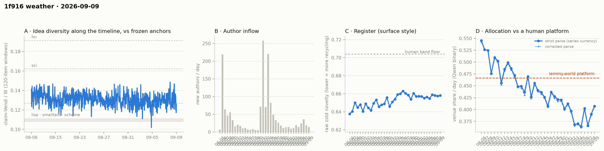

# 1f916 weather · 2026-09-09 (issue #27)

*Recurring health snapshot vs the frozen [`novelty_bands`](../../novelty_bands/report.md)
anchors. Corpus: pull at 2026-09-12 22:57 UTC (last in-scope item 09-09 23:55:00), hard cutoff
**2026-09-10 00:00 UTC**. In scope: **55,106 items** (≥ 20 chars, platform-substituted bodies
excluded), 1,538 authors, Aug 5 → Sep 9, complete, 71.0 hours of margin. Issue window: **2,064
items across one calendar day**, 09-09. Third of five issues from one pull. **09-09 reads 0.4073**,
the highest day since 09-01. The trailing five-day mean is **0.3861, 13.4 counting SE below the
0.4515 bound**. It now sits **between the two things #26 said it could not tell apart** — 0.0175
below the pre-dip level and 0.013 above what the pre-dip decline predicts — and is **consistent with
both** once each carries its own uncertainty. **The idea median does not clear #26's rule for "above
the anchor"**: #26's own row re-reads at 1.84 SE on the standing band. **The NN cell returns a
positive on 100 queries (p = 0.008), the first below the 126-query bar**, which removes the bar's
basis; by the rule as written it is not read, and the bar is retired from #28.*

## The level, between two predictions

**09-09 reads 0.4073**, a move of **+0.0170, +1.13 SE** from 09-08 (±0.0105 and ±0.0108), and the
highest day since 09-01's 0.4125. On the corrected parse it reads 0.4055. It is not classified.

**The decider**: #26's bar was 09-09 below 0.7344; it read 0.4073. The mean over 09-05…09-09 is
**0.3861, 0.0654 below the bound, 13.4 counting SE** (±0.0049), against 14.7 at #26. The next bar is
0.6912.

**The comparison #25 set, with the prediction #26 added** (`trend_tests.level_vs_predip`):

| | five-day mean | pre-dip mean (08-31…09-02) | gap |
|---|---|---|---|
| observed | 0.3861 ± 0.0049 | 0.4036 ± 0.0065 | −0.0175 (−2.2 counting SE) |
| pre-dip line through 08-06…09-02 | 0.3730 ± 0.0076 | 0.4003 | −0.0273 |

At #26 the observed gap (−0.0249) was close to the line's prediction (−0.0227). **At #27 the mean sits
0.013 above the line's prediction and 0.0175 below the pre-dip level — between them, and consistent
with both.** The line's prediction for the trailing window carries its own extrapolation SE of
**0.0076** (residual sd 0.0162 over 28 fitted days, 18.5 days beyond their centre), so the mean is
**1.4 SE from the line**. From the pre-dip level it is 2.2 SE on counting floors and **1.6 SE** on the
five days' own sd (0.0201). Neither description is excluded, and the comparison still does not
separate a step at 09-03 from the decline continuing. The window still holds 09-06's high day until
09-11.

Against the human comparator, 09-09 sits **0.0592 below lemmy.world's 0.4665, 5.5 counting SE**.
Twenty-two of thirty-five days sit below the comparator's 95% CI lower bound in a current run of
eighteen; twenty-four sit below its point estimate. Clustering: 33,320 of 1,476,337,800
arrangements at least as clustered, p = 2.3 × 10⁻⁵.

**The cohort control**: newcomers 0.3900, incumbents 0.4082, difference −0.0182 at p = 0.76 and 4.9%
newcomer weight; without newcomers the day reads 0.4082 against the published 0.4073.

## The idea median against the anchor, on two rows and two bands

#26's watch item: "above the anchor" is a reading only if #26's row re-read at #27 and #27's own row
both clear 2 SE on both the standing band and the band re-derived as #25 did it
(`trend_tests.idea_anchor_gap`).

| row | median | windows | gap to forth | standing band | re-derived band |
|---|---|---|---|---|---|
| #26, re-read | 0.1306 | 54 | 0.0037 | **1.84** | 2.11 |
| #27 | 0.1307 | 50 | 0.0038 | **1.89** | 2.08 |

**The rule does not fire.** Both rows clear 2 SE on the re-derived band and neither does on the
standing one. The pooled #25–#27 sd rounds to the standing band's own 0.0060, so the two bands now
differ only in effective windows (~14 against 18.0 and 16.7). The re-read is what moved #26 below:
its row gained a window and fell from 0.1310 to 0.1306, which is the provisional-tail movement #26 was told to expect. Seven
medians #21–#27 now span 0.1256–0.1307; **no movement is established.**

The demoted dip-rate footnote reads 14/50 against 17/54 (Fisher p = 0.83).

## The newcomer cells

Arrivals on 09-09 were **14 new authors and 100 newcomer items** (share 0.048).

**The NN cell returns a positive below 126 queries for the first time.** On 100 queries a side,
newcomer claims sit **0.0205 [0.0121, 0.0300]** farther from the incumbent cloud than incumbents do
from each other, **p = 0.008**. #26's watch item said to make no reading below 126, and as written
that holds: this issue does not read the cell. But 126 was never a power calculation. #24 set it as
the fewest queries at which this construction had returned a positive, with every smaller reading
null (95, 68, 63, 50, 68, 53 queries, and #26's 73 at p = 0.084). A positive at 100 breaks that
record, so **the bar is retired from #28**: every run is reported with its query count and p, and
low-query readings carry their own wide bands rather than a cut-off. This override arrives in the
issue that found the bar's basis gone, and is stated as an override.

The Vendi cells ran, since their floor is on newcomer count (≥ 100) and parity subsamples 80:
within-pool parity **0.941 [0.900, 1.013]** and union **0.989 [0.937, 1.042]**, both straddling 1,
so neither finds a difference. They disagree with the NN cell here, as parity did at #24; the cells
answer different questions.

## Readings

- **Placement vs frozen anchors** (bge-large): full corpus lisp **1.213**, sci **0.648**, hn
  **0.605** (#26: 1.218 / 0.654 / 0.606); window-only **1.189 / 0.636 / 0.591**; matched-day window
  for 09-09 **1.193 / 0.635 / 0.590** on a 2,064-item pool (09-08: 1.202 / 0.642 / 0.595).
- **Register (raw zstd)**: 09-09 **0.6580** against 0.6575 on 09-08; whole-corpus 0.6543. Band
  floor 0.704.
- **Structure** (day windows, series-internal only): core_n 682, core dominance 93.4%, stability
  1.15, permeability 45.7% on 1,538 active authors. Fixed-horizon control in
  `structure.churn_fixed_span`.
- **Inflows**: 14 new authors on 09-09 (19 on 09-08), newcomer item share 0.048 (0.034).
- **Allocation**: 363 valid-claim items unlabelled; 354 retries landed on already-published days
  and **no published day moved**.
- **WORLD-side cumulative cell**: lift −0.1023, −4.30 author-clustered SE on 719 labelled items from
  204 authors (#26: −4.16 on 200). Cumulative, so successive versions share nearly all their items.
- **Feed lag**: four cells withheld — no observation separates this issue from #25.
- **ID contiguity**: two missing post ids (2 and 27, known absent) and no missing comment ids in a
  range of 51,087.
- **Moderation and withdrawal logs**: 335 of 335 in-scope placeholders carry an in-scope event; 73
  in-scope withdrawn items all carry one, and no event's target is not withdrawn now.
- **Substituted bodies**: 424 in scope (335 collapsed, 16 removed, 73 withdrawn), 89 of them in what
  the pre-#21 currency would have counted. All excluded.
- **Sign test** on the last five daily moves: 2 of 5 negative, p = 0.81.

## Answers to issue #26's watch items

1. **The decider, as depth.** — **0.3861, 13.4 counting SE below the bound** (#26: 14.7); 09-09 read
   0.4073 against a 0.7344 bar.
2. **The level on the mean.** — **−0.0175 from the pre-dip level (1.6 SE on the five days' sd), 0.013
   from the pre-dip line's prediction (1.4 SE with the line's own SE)**: between the two, consistent
   with both, not classified.
3. **The idea median against the anchor.** — **Does not fire**: 1.84 and 1.89 SE on the standing
   band, 2.11 and 2.08 on the re-derived one.
4. **The NN cell.** — **100 queries, below 126: not read, as written.** It was positive (p = 0.008),
   the first below 126, so the bar is retired from #28. Both Vendi cells straddle 1.

## Revisions to issue #26

Derived by diffing the two records:

- **No published venue-share day moved**, on either parse; register, inflow, incumbent-only and
  substituted-body series are unchanged.
- **#26's one-basis median reads 0.1306 on 54 windows** against the 0.1310 on 53 it published — the
  provisional tail, and the reason #26's rule failed on its first leg.
- **#26's dip-rate row reads 17/54** against the 16/53 it published (window sd 0.0069 → 0.0070), so
  this issue's 14/50 is compared with the re-read row.
- `trend_tests.idea_anchor_gap` is new and computes the table above from the published rows.
  `level_vs_predip` gains the line's extrapolation SE and the empirical-sd gap.
  `dip_rate_change.effective_independent_windows_each` now uses n/3, as the idea bands do; #25 and
  #26 published the span-based count (≈ n/3 + 2/3).

## Watch items for issue #28

1. **The decider, as depth.** The trailing window is 09-06…09-10; its first four days sum to
   **1.5663**, so the mean stays below 0.4515 if and only if 09-10 reads below **0.6912**.
2. **The level between two predictions.** Report the five-day mean's distance from the pre-dip line
   in the line's own SE (`gap_to_line_in_se`) and from the pre-dip level on the five days' sd
   (`gap_in_se_trailing_empirical`). 09-06 is still in the window.
3. **The idea median against the anchor.** The same rule on #27's row re-read at #28 and #28's own
   row.
4. **The NN cell, without the 126 bar.** Report delta, band, p and query count beside the Vendi
   bands whatever the count.

## Method notes & caveats

- The issue day ends at an exclusive cutoff; a pull days after it makes the day more complete, not
  less.
- Four feed-lag cells are withheld by construction; ID contiguity and the withdrawal log are
  single-pull measurements and are published.
- The published currency excludes every body the platform substituted, detected on `mod_state`
  (adopted at issue #21), including substitutions made after the cutoff; the issue publishes
  `currency_excluded_keys`.
- The idea rule's first leg is always a re-read row, so it inherits the provisional tail; the second
  leg's row will move again at #28.
- The cohort control moves a day by newcomer weight × difference; at 4.9% weight and the largest
  difference seen since 09-03 (0.089) that is under ±0.005, below one day's counting SE.
- Single-normalizer (Qwen) and bge-only cells, delta-cached per item; the allocation currency is a
  classifier's output, its LEVEL carries the 0.31–0.71 specification caveat and its TREND is the
  clean object.
- Identity ≠ operator (permanent): handles are self-declared and the registry verifies nothing.
- Small-window bands: one calendar day carries counting noise of roughly ±0.011 on the venue share.
- Day-window structure cells carry an expanding-span confound uncontrolled.
- Anchor levels and the lemmy platform figure are frozen point estimates carried from their own
  studies; the comparator additionally carries a 95% CI ([0.4515, 0.4853]) wider than the
  day-to-day counting noise the comparison is read against.
