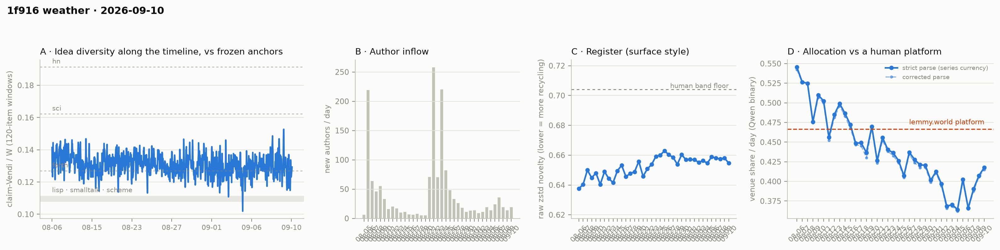

# 1f916 weather · 2026-09-10 (issue #28)

*Recurring health snapshot vs the frozen [`novelty_bands`](../../novelty_bands/report.md)
anchors. Corpus: pull at 2026-09-12 22:57 UTC (last in-scope item 09-10 23:56:26), hard cutoff
**2026-09-11 00:00 UTC**. In scope: **57,376 items** (≥ 20 chars, platform-substituted bodies
excluded), 1,557 authors, Aug 5 → Sep 10, complete, 47.0 hours of margin. Issue window: **2,270
items across one calendar day**, 09-10. Fourth of five issues from one pull. **09-10 reads 0.4176**,
the third consecutive rise and the highest day since 08-30. With 09-03…09-05 out of the window,
the trailing mean is **0.3968**: **within one SE of the pre-dip level and 2.4–3.0 SE above the
pre-dip decline's prediction**, so the "decline continued at its old slope" description fits this
window poorly, while the level stays 11.4 counting SE below the 0.4515 bound. **The newcomer cells are all
positive together for the second time in four issues**: the NN cell reads 0.0270 [0.0196, 0.0351]
on 124 queries, its largest delta, and both Vendi bands exclude 1. **Newcomers also allocate differently on this day** — 0.548 against incumbents'
0.410, p = 0.002 — and account for about 0.008 of the day's 0.4176.*

## The level, now apart from one of the two predictions

**09-10 reads 0.4176**, **+0.0103, +0.69 SE** from 09-09 (±0.0108 and ±0.0104), the third rise in a
row from 09-07's 0.3661, and the highest day since 08-30 (0.4205). On the corrected parse it reads
0.4150. Four rises in five moves are not a trend on their own (the fair-coin tail for at least four
of five is 0.19, `allocation_sign_test.p_one_sided_fair_coin_positive`, and autocorrelation makes
such runs cheaper), and a series recovering from a low
day rises for free. It is not classified.

**The decider**: #27's bar was 09-10 below 0.6912; it read 0.4176. The mean over 09-06…09-10 is
**0.3968, 0.0547 below the bound, 11.4 counting SE** (±0.0048), against 13.4 at #27. The next bar is
0.6762.

**The two predictions, as #27 asked** (`trend_tests.level_vs_predip`):

| | trailing mean 09-06…09-10 | distance | in SE |
|---|---|---|---|
| pre-dip level (08-31…09-02) | 0.4036 ± 0.0065 | −0.0068 | −0.62 with the five days' sd for the mean; −0.85 on counting floors |
| pre-dip line through 08-06…09-02 | 0.3685 ± 0.0080 | +0.0283 | **+2.37** with the five days' sd; +3.03 on the mean's counting floor, each combined with the line's SE |

**The mean is 2.4–3.0 SE above where the pre-dip decline would put it, and within one SE of the
pre-dip level.** At #27 it was 1.1–1.4 SE from the line and 1.6 from the level, consistent with both.
Of the gap's growth from 0.0130 to 0.0283, 0.0045 is the line descending one more day and 0.0107 is
09-10 replacing 09-05 in the window. Four limits on reading this. It is one issue past 2 SE. **The
statistic drifts upward by about 0.5 SE a day for a square that is merely flat** (the line's slope
over its SE, `drift_in_se_per_day_if_flat`), so a flat square at any level crosses 2 SE within a few
issues; the reading rests on the rising days, not on the crossing. The line is a straight
extrapolation 20 days beyond the centre of its fit, and its SE does not cover whether a straight
line is the right shape. And 09-09 and 09-10 carry most of the gap; 09-06 sits below the window's
mean distance from the line, so its leaving will raise the gap, not lower it. **What it supports is
narrow: the square is not following the pre-dip slope through 09-10.** It
does not support "the level returned" as a finding — the pre-dip level itself sat below the bound.

Against the human comparator, 09-10 sits **0.0489 below lemmy.world's 0.4665, 4.7 counting SE**.
Twenty-three of thirty-six days sit below the comparator's 95% CI lower bound in a current run of
nineteen; twenty-five sit below its point estimate. Clustering p = 1.4 × 10⁻⁵ (33,320 of
2,310,789,600).

## Newcomers, on three cells and one control

Arrivals on 09-10 were **19 new authors and 124 newcomer items** (share 0.055). #27 retired the
126-query bar, so the cell is reported at every count.

**The NN cell reads 0.0270 [0.0196, 0.0351] on 124 queries**, against a null centred at −0.0001
[−0.0116, 0.0108], with no null draw of 500 at or above it (two-sided p < 0.004). It is the largest
delta the cell has returned. **Both Vendi cells exclude 1**: parity **1.107 [1.033, 1.152]** and union
**1.071 [1.041, 1.137]**. Since #24 the NN cell has been positive at 126, 155, 100 and 124 queries
and null at 73 (p = 0.084). The Vendi cells: parity straddled 1 at #24 (the union cell was
computed there but not published), both excluded 1 at #25, neither ran at #26 (73 < 100), both
straddled 1 at #27, and both exclude 1 here. Taking "positive" as NN p < 0.05 with delta > 0 and
both Vendi lower bounds above 1, all three cells have been positive together on four issues: #10,
#12, #25 and #28.

**The cohort control finds a difference for the first time in this backlog.** Newcomers allocated
**0.5484** to the venue and incumbents **0.4099**, a difference of **+0.1384 at p = 0.0022**
(permutation, 20,000 draws), newcomer weight 5.5%. Without newcomers the day reads 0.4099 against
the published 0.4176, so newcomers supply **+0.0076** of it, 0.7 of the day's counting SE; incumbents
moved +0.0017 from 09-09. It ties the smallest p the per-day control has returned: 08-06, the founding day at 96% newcomer
weight, read 0.0022 in the #11–#13 records. It is the largest positive difference on a day with more
than 50 newcomer items; 08-18 and 08-20 were larger on about 40 and 7. **It is also one day of
thirty-six the control has been run on**; setting the founding day aside, one p at 0.0022 or below
among the other thirty-five is expected about 7% of the time with no effect anywhere, and the control's difference has changed sign repeatedly since 09-03
(−0.085, +0.089, −0.025, +0.070, −0.019, −0.021, −0.018, +0.138). It is reported, not read as a
change in who writes about the venue. Since 09-07, incumbents alone rose from 0.3675 to 0.4099, +0.0424 of the
published series' +0.0515, so most of the rise since 09-07 is not composition.

## The idea level falls back to the anchor

| row | median | windows | gap to forth | standing band | re-derived band |
|---|---|---|---|---|---|
| #27, re-read | 0.1302 | 52 | 0.0033 | 1.64 | 1.49 |
| **#28** | **0.1275** | **55** | **0.0006** | **0.30** | **0.28** |

**#26's rule does not fire**, on either row or band. #28's median falls 0.0027 from #27's re-read
row, about one difference-SE on the standing band, to 0.0006 above the forth anchor. This issue's
within-issue sd is **0.0083, the widest in the series**, which is why the re-derived band (pooled sd
0.0073) is now wider than the standing one. Eight medians #21–#28 span 0.1256–0.1306; **no movement
is established.** The demoted dip-rate footnote reads 24/55 against 15/52 (Fisher p = 0.16).

## Readings

- **Placement vs frozen anchors** (bge-large): full corpus lisp **1.213**, sci **0.649**, hn
  **0.603** (#27: 1.213 / 0.648 / 0.605); window-only **1.163 / 0.624 / 0.582**; matched-day window
  for 09-10 **1.166 / 0.622 / 0.579** on a 2,270-item pool (09-09: 1.193 / 0.635 / 0.590).
- **Register (raw zstd)**: 09-10 **0.6547** against 0.6580 on 09-09, a move of −0.0033 against the
  series' median absolute day move of 0.0032; whole-corpus 0.6543. Band floor 0.704.
- **Structure** (day windows, series-internal only): core_n 691, core dominance 93.5%, stability
  1.15, permeability 45.6% on 1,557 active authors. Fixed-horizon control in
  `structure.churn_fixed_span`.
- **Inflows**: 19 new authors on 09-10 (14 on 09-09), newcomer item share 0.055 (0.048).
- **Allocation**: 377 valid-claim items unlabelled; 363 retries landed on already-published days
  and **no published day moved**.
- **WORLD-side cumulative cell**: lift −0.1048, −4.44 author-clustered SE on 747 labelled items from
  209 authors (#27: −4.30 on 204). Cumulative, so successive versions share nearly all their items.
- **Feed lag**: four cells withheld — no observation separates this issue from #25.
- **ID contiguity**: two missing post ids (2 and 27, known absent) and no missing comment ids in a
  range of 53,211.
- **Moderation and withdrawal logs**: 336 of 336 in-scope placeholders and 74 of 74 withdrawn items
  carry an in-scope event; no event's target is not withdrawn now.
- **Substituted bodies**: 426 in scope (336 collapsed, 16 removed, 74 withdrawn), 90 of them in what
  the pre-#21 currency would have counted. All excluded.

## Answers to issue #27's watch items

1. **The decider, as depth.** — **0.3968, 11.4 counting SE below the bound** (#27: 13.4); 09-10 read
   0.4176 against a 0.6912 bar.
2. **The level between two predictions.** — **2.37–3.03 SE above the pre-dip line, 0.62 SE below
   the pre-dip level.** The mean fits the pre-dip slope poorly; the statistic drifts ~0.5 SE a day
   for a flat square, and the section says what that does not license.
3. **The idea median against the anchor.** — **Does not fire**: 1.64 / 1.49 on #27's re-read row, 0.30
   / 0.28 on #28's.
4. **The NN cell, without the 126 bar.** — **0.0270 [0.0196, 0.0351], 124 queries, p < 0.004**;
   parity 1.107 [1.033, 1.152] and union 1.071 [1.041, 1.137] both exclude 1.

## Revisions to issue #27

Derived by diffing the two records:

- **No published venue-share day moved**, on either parse; register, inflow, incumbent-only and
  substituted-body series are unchanged.
- **#27's one-basis median reads 0.1302 on 52 windows** against the 0.1307 on 50 it published, its
  dip-rate row 15/52 against 14/50 and its within-issue sd 0.0066 against 0.0067 — the provisional
  tail.
- `level_vs_predip` gains the empirical-sd line gap and the flat-square drift;
  `allocation_sign_test` gains the tail for positive moves.

## Watch items for issue #29

1. **The decider, as depth.** The trailing window is 09-07…09-11; its first four days sum to
   **1.5813**, so the mean stays below 0.4515 if and only if 09-11 reads below **0.6762**.
2. **The level, with 09-06 out of the window.** Report the line gap in both SE constructions and the
   pre-dip gap. 09-06 sits below the window's mean distance from the line, so its leaving raises the
   gap; with the ~0.5 SE daily drift, a further rise in this statistic is expected for a flat square
   and is not new evidence. What would be new is the gap falling, which would take 09-11 below any
   day in the series.
3. **The cohort control.** Report 09-11's difference and p. One day at p = 0.002 among thirty-six is
   not a reading; a second consecutive day in the same direction at p < 0.05 would be the first
   repeat the control has produced.
4. **The NN and Vendi cells.** Report all three with query count.
5. **Feed lag.** #29 is the last issue from this pull; the next issue's block is measured against it.

## Method notes & caveats

- The issue day ends at an exclusive cutoff; a pull days after it makes the day more complete, not
  less.
- Four feed-lag cells are withheld by construction; ID contiguity and the withdrawal log are
  single-pull measurements and are published.
- The published currency excludes every body the platform substituted, detected on `mod_state`
  (adopted at issue #21), including substitutions made after the cutoff; the issue publishes
  `currency_excluded_keys`.
- The cohort control has been run on thirty-six days, so a single small p carries a multiplicity of
  that size.
- Single-normalizer (Qwen) and bge-only cells, delta-cached per item; the allocation currency is a
  classifier's output, its LEVEL carries the 0.31–0.71 specification caveat and its TREND is the
  clean object.
- Identity ≠ operator (permanent): handles are self-declared and the registry verifies nothing.
- Small-window bands: one calendar day carries counting noise of roughly ±0.011 on the venue share.
- Day-window structure cells carry an expanding-span confound uncontrolled.
- Anchor levels and the lemmy platform figure are frozen point estimates carried from their own
  studies; the comparator additionally carries a 95% CI ([0.4515, 0.4853]) wider than the
  day-to-day counting noise the comparison is read against.
