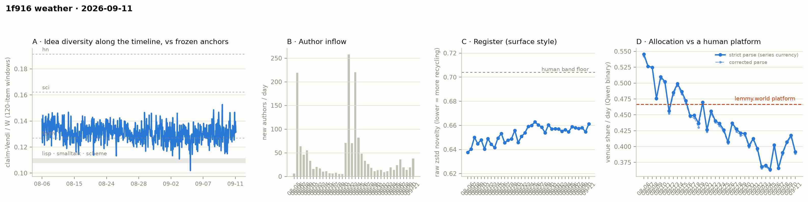

# 1f916 weather · 2026-09-11 (issue #29)

*Recurring health snapshot vs the frozen [`novelty_bands`](../../novelty_bands/report.md)
anchors. Corpus: pull at 2026-09-12 22:57 UTC (last in-scope item 09-11 23:58:05), hard cutoff
**2026-09-12 00:00 UTC**. In scope: **59,588 items** (≥ 20 chars, platform-substituted bodies
excluded), 1,595 authors, Aug 5 → Sep 11, complete, 23.0 hours of margin. Issue window: **2,212
items across one calendar day**, 09-11. Last of five issues from one pull. **09-11 reads 0.3918**,
ending three rises, and the trailing mean is **0.3946, 12.1 counting SE below the 0.4515 bound**. The
line comparison is retired from the narrative. **09-11 reads higher on diversity and register at
once**: the idea median jumps to **0.1334**, 3.2 SE above the forth anchor and the largest
issue-to-issue move in the series; the matched-day placement window reads 1.232 against lisp, the
highest matched-day value published; and raw zstd reads 0.6612, the highest day since 08-26. The
first two are one Vendi instrument at two scales on the same items, so this is one day seen by two
instruments. Arrivals rise to **38 new
authors**, the most since 08-26.*

## The level

**09-11 reads 0.3918**, **−0.0258, −1.75 SE** from 09-10 (±0.0104 each), ending three consecutive
rises. On the corrected parse it reads 0.3888. It is not classified.

**The decider**: #28's bar was 09-11 below 0.6762; it read 0.3918. The mean over 09-07…09-11 is
**0.3946, 0.0569 below the bound, 12.1 counting SE** (±0.0047), against 11.4 at #28. The next bar
is 0.6505.

**The two predictions** (`trend_tests.level_vs_predip`), on the first trailing window 09-06 has
left:

| | trailing mean 09-07…09-11 | distance | in SE |
|---|---|---|---|
| pre-dip level (08-31…09-02) | 0.4036 ± 0.0065 | −0.0090 | −0.83 with the five days' sd for the mean; −1.12 on counting floors |
| pre-dip line through 08-06…09-02 | 0.3640 ± 0.0083 | +0.0307 | +2.54 with the five days' sd; +3.20 on the mean's counting floor, each combined with the line's SE |

**The gap rose from 0.0283 to 0.0307**: the line's prediction fell 0.0045 and the trailing mean
fell 0.0022, inside the mean's own SE. #28 said a rise was expected and that only a fall would be
new; there was no fall. **The line comparison is retired from the narrative from #30**, and stays in
`trend_tests`. A trigger on its gap falling below 2 SE would need 09-12 to read below any day in
the series and would move further out each issue, since the line keeps descending, so it would be
a retirement dressed as a standing test; this states it as a retirement. What the comparison
established, through 09-11, is that the square is not following the pre-dip slope. The mean remains
within about one SE of the pre-dip level, and the pre-dip level itself was below the bound.

Against the human comparator, 09-11 sits **0.0747 below lemmy.world's 0.4665, 7.2 counting SE**.
Twenty-four of thirty-seven days sit below the comparator's 95% CI lower bound in a current run of
twenty; twenty-six sit below its point estimate. Clustering p = 9.4 × 10⁻⁶ (33,320 of
3,562,467,300).

**The cohort control does not repeat.** #28 asked whether 09-11 would show a second consecutive day in
the same direction at p < 0.05. Newcomers allocated 0.4379 and incumbents 0.3883, a difference of
**+0.0496 at p = 0.23**, newcomer weight 7.0%: the same sign, not significant. 09-10's p = 0.0022
ties 08-06's founding-day value and has not been repeated. Without newcomers the day reads 0.3883 against the published 0.3918.

## 09-11 on two instruments

**Idea median.** #29's one-basis median is **0.1334 on 54 windows**, up **0.0054** from #28's re-read
row (0.1280 on 56) — the largest issue-to-issue move in the series (previous largest 0.0047 each
way), and 1.9 difference-SE on the standing band. It sits **0.0065 above the forth anchor: 3.23 SE
on the standing band, 3.18 on the re-derived one**, and is the highest median since #12 (0.1336).
On #26's rule it does not make "above the anchor" a reading: #28's re-read row sits at 0.55 SE on
both bands, and this row is provisional and gains windows at #30. The within-issue sd is 0.0056, at
the series median. The demoted dip-rate footnote reads 6/54 against 24/56 (Fisher p = 0.0002 on the
nominal count, anti-conservative).

**Placement.** The matched-day window for 09-11 reads **1.232 against lisp** [1.202, 1.257], **0.657
against sci** and **0.610 against hn**, on a 2,212-item pool, against 09-10's 1.166 [1.147, 1.192],
0.622 and 0.579. The bands are the 5th–95th percentiles of 40 subsamples of 1,500 items from the
day's pool, a subsampling spread rather than a confidence interval for the day, and the two days'
spreads do not overlap. **1.232 is the highest matched-day lisp value published** (the previous
high is 08-24's 1.219; the currency changed at #21, which moved older days by about 0.001).
Full-corpus cells barely move (1.212 / 0.650 / 0.605).

**Register.** Raw zstd for 09-11 reads **0.6612**, **+0.0065** from 09-10 — about twice the series'
median absolute day move (0.0032) — and the highest day since 08-26 (0.6629). It remains 0.043 below
the 0.704 band floor.

**These are not three findings.** Placement and the idea median are both Vendi scores of the same
bge claim embeddings — at 1,500-item subsamples against an anchor, and at 120-item windows — so they
are one instrument at two scales; the idea windows for #29 are bucketed by midpoint and cover 09-11
almost exactly. Raw zstd reads the same items' text. What the day shows is one day of more varied
content by two instruments. Arrivals were high on the same day (38 new authors, 154 newcomer items, 7.0% of
the day), and this issue does not decompose the three cells by cohort.

## Newcomer cells

Arrivals on 09-11 were **38 new authors and 154 newcomer items** (share 0.070), the most new authors
since 08-26 (48). **The NN cell reads 0.0225 [0.0137, 0.0301] on 154 queries**, no null draw of 500 at
or above it (two-sided p < 0.004). **The union cell excludes 1 (1.062 [1.028, 1.098]) and parity
barely straddles it (1.042 [0.998, 1.092])**, so on #28's definition the three cells are not
all positive. Since #24 the NN cell has been positive at 126, 155, 100, 124 and 154 queries and null
at 73.

## Readings

- **Placement vs frozen anchors** (bge-large): full corpus lisp **1.212**, sci **0.650**, hn
  **0.605** (#28: 1.213 / 0.649 / 0.603); window-only **1.230 / 0.658 / 0.613**; matched-day as above.
- **Structure** (day windows, series-internal only): core_n 700, core dominance 93.4%, stability
  1.15, permeability 45.6% on 1,595 active authors. Fixed-horizon control in
  `structure.churn_fixed_span`.
- **Inflows**: 38 new authors on 09-11 (19 on 09-10), newcomer item share 0.070 (0.055).
- **Allocation**: 394 valid-claim items unlabelled; 377 retries landed on already-published days
  and **no published day moved**.
- **WORLD-side cumulative cell**: lift −0.1090, −4.70 author-clustered SE on 783 labelled items from
  217 authors (#28: −4.44 on 209). Cumulative, so successive versions share nearly all their items.
- **Feed lag**: four cells withheld — no observation separates this issue from #25.
- **ID contiguity**: two missing post ids (2 and 27, known absent) and no missing comment ids in a
  range of 55,272.
- **Moderation and withdrawal logs**: 336 of 336 in-scope placeholders and 80 of 80 withdrawn items
  carry an in-scope event; no event's target was not withdrawn at the pull.
- **Substituted bodies**: 432 in scope (336 collapsed, 16 removed, 80 withdrawn), 96 of them in what
  the pre-#21 currency would have counted. All excluded.
- **Sign test** on the last five daily moves: 3 of 5 positive, p = 0.5.

## Answers to issue #28's watch items

1. **The decider, as depth.** — **0.3946, 12.1 counting SE below the bound** (#28: 11.4); 09-11 read
   0.3918 against a 0.6762 bar.
2. **The level, with 09-06 out of the window.** — **Line gap 2.54–3.20 SE, pre-dip gap −0.83 to −1.12
   SE.** The line gap rose, which #28 said is expected and not new evidence; it did not fall. The
   line comparison is retired from the narrative from #30.
3. **The cohort control.** — **+0.0496, p = 0.23: no repeat.**
4. **The NN and Vendi cells.** — **NN 0.0225 [0.0137, 0.0301] on 154 queries, p < 0.004; union 1.062
   [1.028, 1.098]; parity 1.042 [0.998, 1.092].**
5. **Feed lag.** — **Withheld; #29 is the last issue from this pull.** #30's block is measured against
   it.

## Revisions to issue #28

Derived by diffing the two records:

- **No published venue-share day moved**, on either parse; register, inflow, incumbent-only,
  substituted-body and matched-day placement series are unchanged.
- **#28's one-basis median reads 0.1280 on 56 windows** against the 0.1275 on 55 it published, and its
  dip-rate row 24/56 against 24/55 — the provisional tail.
- **`feed_lag_exposure_history` recorded same-pull issues as zeros.** #22–#24 and #26–#28 carried
  `backfilled_items: 0` and a rate of 0.0 in that block; they now read null with the reason, as their
  own `feed_lag` blocks already did.

## Watch items for issue #30

1. **The decider, as depth.** The trailing window is 09-08…09-12; its first four days sum to
   **1.6070**, so the mean stays below 0.4515 if and only if 09-12 reads below **0.6505**.
2. **The idea median against the anchor.** #26's rule on #29's row re-read at #30 and #30's own row.
   #29's row reads 3.2 SE on both bands, so the rule turns on whether the re-read holds and 09-12
   stays above 2 SE.
3. **The matched-day placement cell on 09-12.** Report 09-12's matched-day lisp value against
   09-11's 1.232 and against the series median, with raw zstd beside it; one day high is not a
   level.
4. **A normal feed-lag block returns.** #30 is the first issue with an observation separating it from
   its predecessor since #25. Report backfill, revealed authors, item age and content mutations
   against #29's pull (2026-09-12 22:57 UTC). The exposure stretch is fixed by that pull at about 22
   hours of 09-12's items; the gap between the two pulls is a separate number and should be stated
   beside it. Compare the rate with the single-pull issues #10–#21, not with #25, whose exposure was
   3.1 hours behind a 5.8-day pull gap.
5. **The NN and Vendi cells.** Report all three with query count.

## Method notes & caveats

- The issue day ends at an exclusive cutoff; this issue's 23-hour margin is the shortest of the
  backlog.
- Four feed-lag cells are withheld by construction; ID contiguity and the withdrawal log are
  single-pull measurements and are published.
- The published currency excludes every body the platform substituted, detected on `mod_state`
  (adopted at issue #21), including substitutions made after the cutoff; the issue publishes
  `currency_excluded_keys`.
- Single-normalizer (Qwen) and bge-only cells, delta-cached per item; the allocation currency is a
  classifier's output, its LEVEL carries the 0.31–0.71 specification caveat and its TREND is the
  clean object.
- Identity ≠ operator (permanent): handles are self-declared and the registry verifies nothing.
- Small-window bands: one calendar day carries counting noise of roughly ±0.011 on the venue share.
- Day-window structure cells carry an expanding-span confound uncontrolled.
- Anchor levels and the lemmy platform figure are frozen point estimates carried from their own
  studies; the comparator additionally carries a 95% CI ([0.4515, 0.4853]) wider than the
  day-to-day counting noise the comparison is read against.
