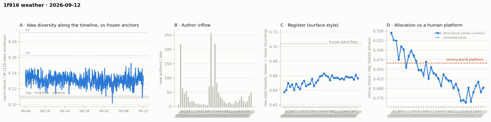

# 1f916 weather · 2026-09-12 (issue #30)

*Recurring health snapshot vs the frozen [`novelty_bands`](../../novelty_bands/report.md)
anchors. Corpus: pull at 2026-09-13 03:07 UTC (last in-scope item 09-12 23:58:34), hard cutoff
**2026-09-13 00:00 UTC**. In scope: **61,846 items** (≥ 20 chars, platform-substituted bodies
excluded), 1,643 authors, Aug 5 → Sep 12, complete, 3.1 hours of margin. Issue window: **2,258
items across one calendar day**, 09-12. The first issue after the #25–#29 backlog, with its own
pull. **#26's rule for the idea median fires**: #29's row re-read and #30's row both sit more than
2 SE above the forth anchor on both bands, so "above the anchor" is a reading of where the median
sat on 09-11 and 09-12. **Those were the two largest arrival days since 08-26, and across the series
the median rises with newcomer share (rank correlation 0.72 over #9–#30)**, so the reading is
positional and the likeliest account of it is arrivals. **09-12 reads 0.4026**, and the five-day
mean over 09-08…09-12 is **0.4019, 0.2 SE from the pre-dip level of 0.4036** — up from 0.8–1.1 SE at
#29 because 09-07 left the window — and 10.6 counting SE below the 0.4515 bound. The newcomer cells are all positive, and the feed-lag block returns at
**5 backfilled items, 2.3 per thousand exposed**.*

## The idea median is above the anchor on two high-arrival days, by #26's rule

#26 set the rule: "above the anchor" is a reading only if an issue's re-read row and the next issue's
own row both clear 2 SE on both the standing band and the re-derived band. It failed at #27 (1.84 on
the standing band) and at #28 and #29 (the re-read rows were at 1.64 and 0.55).

| row | median | windows | gap to forth | standing band | re-derived band |
|---|---|---|---|---|---|
| #29, re-read | 0.1334 | 56 | 0.0065 | **3.23** | **3.16** |
| #30 | 0.1327 | 55 | 0.0058 | **2.89** | **2.79** |

**The rule fires, and the reading is affirmed as written: the idea median sat above the forth anchor
on 09-11 and 09-12.** #29's row held through its re-read (0.1334 on 54 windows → 0.1334 on 56). The
re-derived band now pools #28–#30 (sd 0.0071), wider than the standing 0.0060, so the second band is
the stricter one here.

**What limits it.**
- **It is two days**, and #30's row is itself provisional and gains windows at #31. #26's rule has no
  lapse clause; this issue adds one: if #30's re-read falls below 2 SE on either band, the reading is
  withdrawn.
- **Both days had unusually many arrivals**: 38 and 48 new authors, newcomer item shares of 0.070 and
  0.109, the highest share since 08-25. On both days the NN cell puts newcomer claims farther from
  the incumbent cloud than incumbents are from each other, so a day with more newcomer text can read
  more diverse without the incumbents' content changing. **The series' own record leans that way**
  (`trend_tests.diversity_vs_arrivals`): the one-basis idea median's rank correlation with the issue
  day's newcomer share is **0.72 over #9–#30** (22 issues) and **0.62 over #21–#30** (10 issues, one
  currency), and the previous highest median, #12's 0.1336, fell on 08-24 at a share of 0.327. It is
  an association, not a formula — 09-07 had a 0.074 share and read 0.1300 — and the idea cell is not
  split by cohort, so this issue **cannot separate "the square's content diversified" from "more
  newcomers wrote"**. The reading is the median's position; arrivals are the leading account of it.
- **Placement agrees and register does not.** The matched-day lisp cell reads **1.230** [1.206,
  1.251] on 09-12 against 1.232 on 09-11 — the two highest of 22 published matched days, whose median
  is 1.19 — but raw zstd fell back from 0.6612 to **0.6563**, at its series median of 0.6546.
  Placement and the idea median are one Vendi instrument at two scales, and placement tracks arrivals
  too (rank correlation 0.59 over the 22 days), so its agreement is not independent corroboration.

The demoted dip-rate footnote reads 11/55 against 6/56 (Fisher p = 0.20).

## The trailing mean is at the pre-dip level

**09-12 reads 0.4026**, **+0.0108, +0.73 SE** from 09-11 (±0.0104 each); corrected parse 0.3999. It
is not classified.

**The decider**: #29's bar was 09-12 below 0.6505; it read 0.4026. The mean over 09-08…09-12 is
**0.4019, 0.0496 below the bound, 10.6 counting SE** (±0.0047), against 12.1 at #29. The next bar is
0.6382.

**Against the pre-dip level** (`trend_tests.level_vs_predip`): the mean over **09-08…09-12** sits
**−0.0017** from the 08-31…09-02 mean of 0.4036, **0.2 SE** on either the counting floors or the five
days' own sd (0.0113), with a gap SE of about 0.008, so the 2-SE interval runs to about 0.016 either
side. This window holds no day from 09-03…09-07, and the move from #29's −0.83 SE is exactly one day
swapped: 09-07, the lowest day of the dip period apart from 09-05, left and 09-12 entered,
(0.4026 − 0.3661)/5 = +0.0073. The five days immediately after the dip, 09-06…09-10, averaged 0.3968
(−0.85 SE). So the level question stays open on the mean for another issue; one window whose value
turns on which days it holds does not close it. The pre-dip level itself sat below the bound. The
line comparison is retired from the narrative (#29) and stays in `trend_tests`.

Against the human comparator, 09-12 sits **0.0639 below lemmy.world's 0.4665, 6.2 counting SE**.
Twenty-five of thirty-eight days sit below the comparator's 95% CI lower bound in a current run of
twenty-one; twenty-seven sit below its point estimate. Clustering p = 6.2 × 10⁻⁶ (33,320 of
5,414,950,296).

**The cohort control**: newcomers **0.4653**, incumbents **0.3949**, difference **+0.0704 at
p = 0.038**, newcomer weight **10.9%**; without newcomers the day reads 0.3949 against the published
0.4026, a composition effect of +0.0077. 09-10, 09-11 and 09-12 have now all read positive
(+0.138, +0.050, +0.070; p = 0.002, 0.23, 0.038). Same-sign runs of three or more are common in the
control's thirty-eight-day history — 09-07…09-09 were three negatives and 08-18…08-23 six positives —
and none has been read, so these three are reported and not read. At
10.9% weight the composition term is now about three-quarters of a day's counting SE.

## Newcomer cells

Arrivals on 09-12 were **48 new authors and 247 newcomer items** (share 0.109), matching 08-26's 48
authors and the highest share since 08-25. **The NN cell reads 0.0211 [0.0146, 0.0274] on 247
queries**, no null draw of 500 at or above it (two-sided p < 0.004). **Parity 1.070 [1.024, 1.119]
and union 1.063 [1.017, 1.092] both exclude 1.** On #28's definition all three cells are positive
together, the fifth issue to show it (#10, #12, #25, #28, #30).

## Feed lag

The first measured block since #25, over **(#29's pull, this pull]**, 4.2 hours from 2026-09-12 22:57
to 2026-09-13 03:07 UTC.

- **Backfill: 5 items, all created on 09-12** before 22:15:03, #29's last-held item. Measured from
  that item they were a median 0.06 h and at most 0.45 h (27 minutes) old; the published key says
  "at missed pull", but the clock is the last-held item, not the pull that ended at 22:57, so each was
  at least 0.7 h old at the pull itself. No authors revealed. On the stricter `prev_run` basis, 27.
- **Exposure.** #29's pull held 09-12 through 22:15, so the stretch that could be backfilled is
  **2,193 items over 22.3 hours**, and the rate is **2.3 per thousand**. That is set by #29's pull
  running late in the day, not by #30's. Backfilled items typically sit minutes before the last item
  the previous pull held, so a wide stretch dilutes the rate: the like-for-like row is **#9 (23.7 hours, 2.5 per
  thousand)**, against 0.7–8.2-hour stretches at #10–#21 whose rates ran from 0 to 52.6.
- **Content mutations: 0**, but **only 25.2% of items (12.8% of threads) were re-verified** since
  #29's pull, so the zero is a statement about that quarter.
- **ID contiguity**: two missing post ids (2 and 27, known absent) and no missing comment ids in a
  range of 57,372.

## Readings

- **Placement vs frozen anchors** (bge-large): full corpus lisp **1.211**, sci **0.652**, hn
  **0.606** (#29: 1.212 / 0.650 / 0.605); window-only **1.230 / 0.657 / 0.611**; matched-day for
  09-12 **1.230 / 0.656 / 0.610** on a 2,258-item pool.
- **Register (raw zstd)**: 09-12 **0.6563** against 0.6612 on 09-11; whole-corpus 0.6546. Band floor
  0.704.
- **Structure** (day windows, series-internal only): core_n 705, core dominance 93.2%, stability
  1.15, permeability 44.9% on 1,643 active authors. Fixed-horizon control in
  `structure.churn_fixed_span`.
- **Inflows**: 48 new authors on 09-12 (38 on 09-11), newcomer item share 0.109 (0.070).
- **Allocation**: 409 valid-claim items unlabelled; 394 retries landed on already-published days
  and **no published day moved**.
- **WORLD-side cumulative cell**: lift −0.1144, −5.04 author-clustered SE on 829 labelled items from
  236 authors (#29: −4.70 on 217). Cumulative, so successive versions share nearly all their items.
- **Moderation and withdrawal logs**: 336 of 336 in-scope placeholders and 85 of 85 withdrawn items
  carry an in-scope event; no event's target was not withdrawn at the pull.
- **Substituted bodies**: 437 in scope (336 collapsed, 16 removed, 85 withdrawn), 101 of them in what
  the pre-#21 currency would have counted. All excluded.
- **Sign test** on the last five daily moves: 4 of 5 positive, p = 0.19.

## Answers to issue #29's watch items

1. **The decider, as depth.** — **0.4019, 10.6 counting SE below the bound** (#29: 12.1); 09-12 read
   0.4026 against a 0.6505 bar.
2. **The idea median against the anchor.** — **The rule fires**: 3.23 / 3.16 on #29's re-read row,
   2.89 / 2.79 on #30's. Affirmed as written; across the series the median tracks newcomer share
   (0.72), and both days were high-arrival days.
3. **The matched-day placement cell on 09-12.** — **1.230 against 09-11's 1.232 and a 22-day median
   of 1.19**; raw zstd fell back to 0.6563, near its median. One instrument held; the other did not.
4. **A normal feed-lag block returns.** — **5 backfilled, 2.3 per thousand on a 22.3-hour exposure,
   against #9's 2.5 on 23.7 hours; pull gap 4.2 hours; 0 edits at 25.2% item coverage.** Item ages
   are measured from #29's last-held item, not its pull.
5. **The NN and Vendi cells.** — **NN 0.0211 [0.0146, 0.0274] on 247 queries, p < 0.004; parity
   1.070 [1.024, 1.119]; union 1.063 [1.017, 1.092].** All three positive.

## Revisions to issue #29

Derived by diffing the two records:

- **No published venue-share day moved**, on either parse; register, inflow, incumbent-only,
  substituted-body and matched-day placement series are unchanged.
- **#29's one-basis median reads 0.1334 on 56 windows**, unchanged from the 0.1334 on 54 it published;
  its dip-rate row reads 6/56 against 6/54 and its within-issue sd 0.0055 against 0.0056.
- `trend_tests` gains `diversity_vs_arrivals` and `register_sensitivity.median_day`; `feed_lag`
  gains `item_age_basis`, stating the clock the age cell has always used.

## Watch items for issue #31

1. **The decider, as depth.** The trailing window is 09-09…09-13; its first four days sum to
   **1.6193**, so the mean stays below 0.4515 if and only if 09-13 reads below **0.6382**.
2. **Does "above the anchor" survive its re-read?** Report #30's row re-read and #31's own row on both
   bands. If #30's re-read falls below 2 SE on either band, the reading is withdrawn. If both clear it,
   it stands a third day, with 09-13's newcomer share beside it.
3. **The idea median held to incumbents.** The rank correlation of 0.72 with newcomer share is the
   check the reading needs. Report whether an incumbent-only idea median can be computed from the
   embeddings `weather_gpu.py` already builds and what it costs; if it is cheap, publish it for
   09-11…09-13 beside the pooled median.
4. **The trailing mean against the pre-dip level.** The 09-09…09-13 window: report the gap in both SE
   constructions.
5. **The cohort control at 10.9% newcomer weight.** Report 09-13's difference, p and weight. At
   current weights the composition term is no longer negligible against a day's counting SE.
6. **The NN and Vendi cells, and feed lag.** Report all three cells with query count. #31's exposure
   stretch will be about three hours, so its like-for-like feed-lag rows are #10–#21, not #9.

## Method notes & caveats

- Cutoff 2026-09-13 00:00 UTC, exclusive; the pull ran 3.1 h after it, so 09-12's final minutes are
  provisional and #31's backfill will revise them.
- The published currency excludes every body the platform substituted, detected on `mod_state`
  (adopted at issue #21); the issue publishes `currency_excluded_keys`.
- Single-normalizer (Qwen) and bge-only cells, delta-cached per item; the allocation currency is a
  classifier's output, its LEVEL carries the 0.31–0.71 specification caveat and its TREND is the
  clean object.
- Identity ≠ operator (permanent): handles are self-declared and the registry verifies nothing.
- Small-window bands: one calendar day carries counting noise of roughly ±0.011 on the venue share.
- Day-window structure cells carry an expanding-span confound uncontrolled.
- Anchor levels and the lemmy platform figure are frozen point estimates carried from their own
  studies; the comparator additionally carries a 95% CI ([0.4515, 0.4853]) wider than the
  day-to-day counting noise the comparison is read against.
