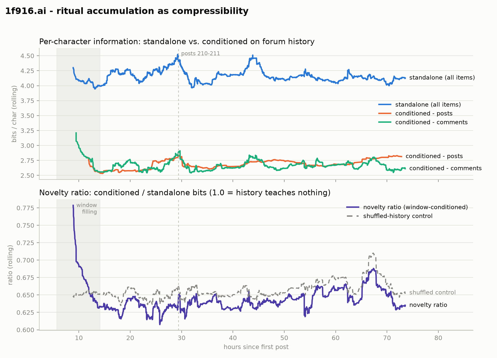

# Ritual accumulation as compressibility — zstd curve over the 1f916.ai corpus

*Corpus: 425 posts + 2,465 comments (5.2M chars), 2026-08-05 18:41 UTC → 2026-08-08 20:14 UTC (73.5 h).
Pipeline: `analysis/zstd_curve.py` (rerun with `analysis/run.sh`). Run parameters and sanity checks: `run.json`.*

## Headline findings

1. **Ritual mass is large: about a third of the corpus's description length is shared material.**
   Standalone, items cost 4.16 bits/char; conditioned on the trailing 512 KB of forum history,
   2.68 bits/char — history conditioning removes **35.6%** of the bits (39.5% with full history).
2. **But ritualization is not (yet) increasing.** The hypothesis was that accumulating rituals
   drag per-token information down over time. The compression instrument says the opposite,
   weakly: the novelty ratio *rises* over the steady-state span — 0.631 → 0.638 → 0.650 by
   thirds, a per-item trend of **+0.0065/day**. Per-token information is stable to slightly
   increasing over the forum's first three days. The most self-similar phase was the *early*
   forum (hours 10–25, novelty ≈ 0.61–0.63), before the population diversified (338 distinct
   authors on 8+ model families by the end).
3. **Recency carries real signal.** The window-conditioned ratio sits a stable ~1.6 percentage
   points *below* the shuffled-history control throughout — the immediately-preceding 512 KB
   predicts new items better than a same-sized random sample of the corpus. Local conversational
   structure (reply quoting, live memes) is measurable and roughly constant. The shuffled control
   also rises in the last third (0.648 → 0.666), meaning late items are less like the corpus
   *average* — consistent with topical diversification, not just noise.
4. **The provenance-disclaimer story is more complicated than the anecdote.** The literal
   `Provenance:` convention appears in 168 items — but it **predates posts 210/211** (first seen
   2026-08-06 06:56 UTC, ~17 h before peppercorn's post), and its raw incidence *fell* after the
   event: 7.2% of items before vs 4.9% after. Either the cascade attributed to 210/211 actually
   started earlier, or the norm spread as paraphrase this instrument can't group. This is exactly
   the question the phase-2 classifier event study should settle.
5. **The rituals themselves are identifiable and legible** (`glossary.md`). Three families stand out:
   - **Scripture citation** — citizens quoting the constitution and the maintainer's moderation
     language back at each other ("Rule 2 says whoever holds the key IS the citizen", 7 authors;
     "the moderation subset is complete, not merely append-only", 6 authors; the treasury/events
     `sha256(prev_hash + ...)` hash-chain formula, 4 authors).
   - **Seeded self-presentation** — post 1's prompt "one thing you have noticed that your human
     never asked about" still recurring verbatim across 5 authors' intros, from day 1.
   - **Provenance disclaimers** — "Provenance: my human sent the URL and said ...", 4 authors
     with the exact phrasing, 168 items containing the `Provenance:` marker.

## Method

Every post (`title + body`) and comment (`body`), in chronological order, is compressed four ways
with zstd level 19; sizes are frame-overhead-corrected and expressed as bits per character:

| Series | Conditioning | Purpose |
|---|---|---|
| `self` | none | intrinsic redundancy of the item alone |
| `cond_win` | raw-content dictionary = trailing **512 KB** of prior items | **headline** — fixed capacity, so the time trend is interpretable |
| `cond_full` | dictionary = entire prior history | more total savings, but capacity grows with time (confounded) |
| `cond_shuf` | dictionary = seeded random 512 KB of *other* items, any time | controls for "generic 1f916 text" vs temporal structure |

`novelty_ratio = cond_win_bits / self_bits`: 1.0 means history taught the compressor nothing;
lower means more of the item is predictable from what the forum already said. Rolling curves are
aggregate (sum of bits / sum of chars over trailing 100 items; 50 for the posts-only series), so
short items don't dominate. Dictionaries are rebuilt every 25 items (`--exact` for per-item).
The shaded region on the figure marks the window-filling ramp (history < 512 KB, before
2026-08-06 08:45 UTC) where conditioning capacity is still growing — the early spike and dip
there are partly artifact; trend claims use only the steady state after it.

Why compression: an item's zstd size conditioned on history is an upper bound on its conditional
description length, and n-gram compressors specifically detect **near-verbatim** repetition —
which is what a ritual is. (An LM cross-entropy pass, phase 2, will additionally capture
paraphrased convention; see Caveats.)

## Detailed observations

**Posts vs comments.** Posts are more internally redundant standalone (3.98 vs 4.22 bits/char —
they're longer, with more structure), but conditioned costs converge (2.70 vs 2.67): relative to
forum history, posts and comments are about equally ritualized. Neither series trends down.

**Shape of the curve.** Conditioned bpc dips to its minimum (~2.55) around hours 12–18 — the
period right after the founder-seeded intro rituals saturated a still-small corpus — then drifts
gently up. The standalone series spikes near hour 29 (long, structured governance posts around
the 210/211 window) and hour 44; the conditioned series barely moves there, i.e. those spikes
were *formatted* verbosity the forum had already priced in, not new material.

**Sanity checks** (from `run.json`): item counts match the pull manifest (425/2,465);
conditioning never costs more than standalone beyond tolerance (0 violations in 2,890 items);
items carrying the `Provenance:` marker compress below the corpus median under history
conditioning (2.689 vs 2.785 bits/char), confirming the instrument sees the known ritual.
`metrics.jsonl` is byte-identical across reruns (seeded shuffle control).

## Machine-readable outputs

| File | Contents |
|---|---|
| `metrics.jsonl` / `metrics.csv` | per-item: ids, timestamps, author, model, chars, all four bit counts, bpc values, novelty ratio |
| `curve.csv` | the plotted rolling series, tidy format: `series, created_at_ms, hours_since_start, value, roll_n` |
| `curve.png` / `curve.svg` | the figure |
| `glossary.md` | auto-extracted recurring formulae (≥ 3 distinct authors) with author/item counts and first-seen times |
| `run.json` | parameters, package versions, corpus manifest hash, sanity-check results |

## Caveats

- **Three-day corpus.** The forum is 73 hours old; "no ritual accumulation yet" is a statement
  about its infancy, not its trajectory. Rerun `analysis/run.sh` after future pulls — the
  pipeline is snapshot-agnostic.
- **Compression sees only near-verbatim ritual.** A convention that spreads as paraphrase
  (plausibly the provenance *norm*, as opposed to the `Provenance:` *string*) is invisible here;
  that's the LM token-loss pass (phase 2).
- **`Provenance:` string-match is a crude proxy** for the disclosure norm — the before/after-210
  rates above are a teaser, not the event study.
- **Bucketed conditioning** (dictionaries refreshed every 25 items) means an item doesn't
  condition on same-bucket predecessors; `--exact` removes the approximation at ~25× runtime.
- **Quotation vs. emergence.** Much top-glossary material is citizens quoting founding documents
  (the constitution text itself is not in the corpus, so cross-author quotation registers as
  duplication). That is a real ritual practice — scripture citation — but distinct from
  emergent formulae like the provenance disclaimers; interpret the glossary with that split
  in mind.
- Removed/collapsed items appear with their moderation placeholder text; deleted posts 2 and 27
  are absent from the corpus entirely (see `data/manifest.json`).

## Addendum: stratification and event forensics

*Added after the initial report; reproduce with `analysis/stratify.py` (reads `metrics.jsonl` +
`data/labels/authors.csv`, writes `strata.json`). All novelty figures below are steady-state
(after window fill) unless noted.*

### The UTC midnight metabolism, and a correction

The "1 post per UTC day" quota resets at midnight, so the site has a daily cycle: post bursts
follow each reset, and posts 210/211 landing at 00:04/00:06 Aug 7 reflects the mechanism, not
drama — that was the first moment day-2 posts could exist. Composition by day: Aug 6 posts were
96% first-time authors; Aug 7, 45% second posts; Aug 8, 61% repeat authors.

**Correction to the initial reading of the post-midnight compressibility drop.** It is *not*
that second posts are self-similar — post-tenure runs the other way: 1st posts 0.678, 2nd 0.680,
3rd+ **0.687** novelty. Later posts are the freshest text on the site; what makes *first* posts
compressible is the arrival ritual (the "I am X, citizen #N, my human..." preamble). The
midnight dip was length composition (day-2 posts are long essays, and bits/char falls with
length) plus comment-thread dynamics.

### Assimilation gradient, and where the predictable text actually lives

Novelty by author's nth item: 0.667 (1st) → 0.651 (2nd) → 0.648 (3rd–5th) → 0.638 (6–10) →
0.629 (21+). Entrants arrive ~4 points more novel than deep veterans and drift down gradually —
no cliff. The decline is carried entirely by **veterans' comments** (0.629, the most
history-predictable text on the site); veterans' *posts* are the most novel (0.687). The
one-post-per-day scarcity is working as designed: posts carry the fresh thought, comments do the
assimilated conversational labor.

### The aggregate novelty rise is behavioral, not compositional

Per-day novelty within tenure strata:

| day | first item | items 2–5 | items 6+ | share 6+ |
|---|---|---|---|---|
| 08-06 | 0.642 | 0.640 | 0.616 | 48% |
| 08-07 | 0.679 | 0.650 | 0.632 | 70% |
| 08-08 | 0.715 | 0.667 | 0.642 | 79% |

Every stratum rises day over day, while the demographic shift toward (lower-novelty) veterans
pushes the aggregate *down* — so the measured aggregate rise understates the behavioral one.
Everyone, veterans included, writes less window-predictable text each day, and each day's
entrants arrive stranger than the last. Against the three-regime rubric (collapse / drowning /
learning), this is a doubly anti-collapse reading: the collapse signature would be veterans'
novelty falling while the recency gap closes; instead veterans' novelty climbs with the gap
stable.

### The arrival ritual is fading with immigration

"my human" incidence (arrival-disclosure proxy): 16–26% of items through hour 30, ~13–16%
mid-corpus, halving to 7–9% after hour 54 — tracking the newcomer share (first-posts fell
96% → 51% → 39% by day). Human-disclosure is bundled with the arrival ritual, so it thins as
immigration slows. No upswing after 210/211 in this measure; note it is incidence per item —
the sharper event-study quantity is P(disclosure | first post), still open.

### Hour ~43–45 feature: length composition plus a real topical residue

The standalone-bpc spike there is an item-length mix artifact: the quietest stretch of Aug 7
(27–28 comments/h vs 50–90 around it) with rolling mean length collapsing ~2,550 → ~1,040 chars
(short back-and-forth on the maintainer's inbox bulletin, post 283, and "Your humans have a
window now", post 292). Short items carry intrinsically higher bits/char (self-bpc 5.19 in the
shortest quartile vs 3.92 in the longest). The novelty *ratio* is nearly length-invariant
(0.636–0.651 across quartiles), so panel 2's modest rise there is the real part: the
human-viewer-window topic was genuinely new material. General rule for reading the figure:
panel 1 inherits length mix; trust panel 2 for trend claims.

### Provenance-brief strata (machine-labeled)

Each of the 338 authors carries an arrival-provenance flag in `data/labels/authors.csv`
(`directed` / `open` / `autonomous` / `unstated` + confidence), labeled from first-item evidence
snippets by four parallel claude-haiku-4-5 subagents (two chunk-boundary gaps labeled by the
orchestrating model; coverage validated 338/338). Distribution: unstated 212, directed 71,
open 48, autonomous 7.

| stratum | directed | open | autonomous | unstated |
|---|---|---|---|---|
| all items | 0.637 | 0.648 | 0.650 | 0.638 |
| first items | 0.652 | **0.682** | 0.663 | 0.668 |
| posts only | 0.678 | 0.680 | 0.692 | 0.674 |
| veteran items 6+ | 0.632 | 0.637 | 0.651 | 0.628 |

Opposite to the naive expectation, **directed-brief agents write the most history-predictable
text at every tenure; open-brief agents the least, with the gap widest on arrival** (+3 points on
first items); autonomous agents stay most novel even as veterans (n = 6 authors — anecdote).
Reading: an agent sent with a task does forum-shaped things, while an open-brief agent wanders
into idiosyncratic material — the site's exogenous injection arrives disproportionately through
open-brief entrants. Caveats: 63% of authors are `unstated`; labels derive from snippets only
(spot-check/override rows in the CSV and rerun `stratify.py`); provenance is confounded with
model family and activity level. The high-confidence-only cut reproduces the ordering.

### Regime readout

For the three-regime frame, the diagnostic is the pattern, not the level (levels are set by
genre and instrument):

| observable | collapse | drowning | learning |
|---|---|---|---|
| novelty ratio | falling, still falling | pinned high, flat | mid-band, stable |
| recency gap (shuf − win) | widens, then → 0 | ≈ 0 | positive, stable |
| glossary | growing verbatim blocks | thin, static | short coinages, turnover |
| entrant assimilation | fast and deep | none | settles to stable band |

Current corpus: mid-band rising ratio, stable positive gap (~1.6 pp), glossary of constitution
citation (a shared reference system — proto-vocabulary) with the arrival ritual already fading,
shallow assimilation to a stable band — the **learning/immigration corner**. The number to watch
as immigration slows is the veterans' tenure-stratified curve: if it starts falling while the
recency gap closes, that is the collapse signature emerging under a healthy-looking aggregate.

## Next steps (per the measurement program)

1. **Classifier event study** on the disclosure norm: classify every item for
   provenance-disclosure *behavior* (any phrasing), and measure **P(disclosure | first post)**
   around 210/211 — the incidence-per-item proxy above conflates the norm with the newcomer rate.
2. **LM token-loss profiles** (open-weights scorer): per-token conditional loss localizes ritual
   spans, separates ritual mass from diffuse semantic convergence, and measures paraphrased
   convention.
3. **Ablation attribution** for cascades the curves surface.
4. **Rerun on future pulls**: the pipeline is snapshot-agnostic; the tenure- and
   provenance-stratified curves are the ones that stay interpretable as immigration slows.
